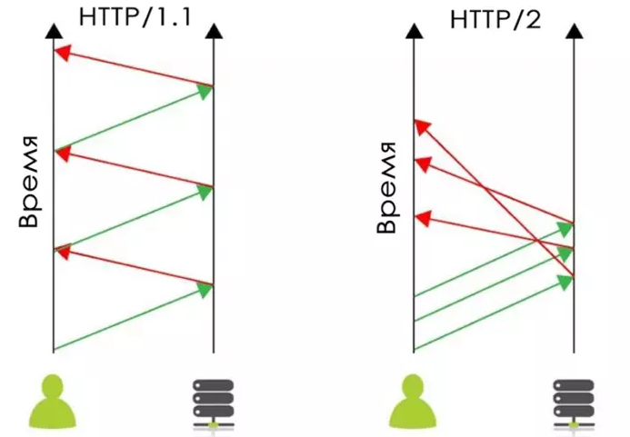
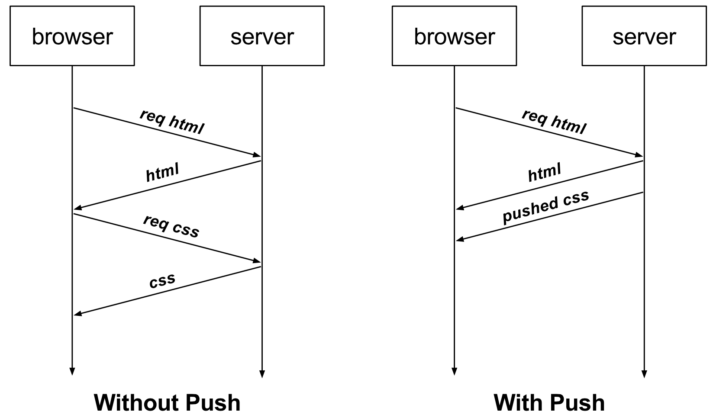

# Nginx

## Contents

[[_TOC_]]


## Chapter I

### Что такое Web-сервер?
Web-сервер — это компьютер, который хранит файлы сайта (HTML-документы, CSS-стили, JavaScript-файлы, картинки и другие) и доставляет их на устройство конечного пользователя (веб-браузер и т.д.). Он подключён к сети Интернет и может быть доступен через доменное имя, подобное mozilla.org.

С точки зрения ПО, веб-сервер включает в себя несколько компонентов, которые контролируют доступ веб-пользователей к размещённым на сервере файлам, как минимум — это HTTP-сервер. HTTP-сервер — это часть ПО, которая понимает URL-адреса (веб-адреса) и HTTP (протокол, который ваш браузер использует для просмотра веб-страниц).
<br/>

<br/>

### Nginx

**Nginx** [engine x] — это HTTP-сервер и обратный прокси-сервер, почтовый прокси-сервер, а также TCP/UDP прокси-сервер общего назначения, изначально написанный Игорем Сысоевым. Уже длительное время он обслуживает серверы многих высоконагруженных российских сайтов, таких как Яндекс, Mail.Ru, ВКонтакте и Рамблер. Согласно статистике Netcraft nginx обслуживал или проксировал 21.23% самых нагруженных сайтов в феврале 2023 года.

Основная функциональность HTTP-сервера

- Обслуживание статических запросов, индексных файлов, автоматическое создание списка файлов, кэш дескрипторов открытых файлов;
<br/>
- Акселерированное обратное проксирование с кэшированием, распределение нагрузки и отказоустойчивость;
<br/>
- Акселерированная поддержка FastCGI, uwsgi, SCGI и memcached серверов с кэшированием, распределение нагрузки и отказоустойчивость;
<br/>
- Модульность, фильтры, в том числе сжатие (gzip), byte-ranges (докачка), chunked ответы, XSLT-фильтр, SSI-фильтр, преобразование изображений;
<br/>
- Несколько подзапросов на одной странице, обрабатываемые в SSI-фильтре через прокси или FastCGI/uwsgi/SCGI, выполняются параллельно;
<br/>
- Поддержка SSL и расширения TLS SNI;
<br/>

- Поддержка HTTP/2 с приоритизацией на основе весов и зависимостей.

### Обратное Проксирование

Forward proxy (прямой прокси) работают от имени клиентов, то есть нам нужно настраивать браузер (клиент), чтобы тот ходил через прямой прокси сервер. Обратные же прокси работают от имени серверов, то есть клиент не знает, что он обращается на прокси сервер.

Reverse proxy принимает запросы от клиентов для того чтобы проксировать их на проксируемые web-сервера.

Проксирование в Nginx осуществляется путем обработки запроса, направленного на сервер Nginx, и передачи его другим серверам для фактической обработки. Результат запроса передается обратно на Nginx, который затем передает информацию клиенту. Другими серверами в этом случае могут быть удаленные компьютеры, локальные серверы или даже другие виртуальные серверы, определенные в настройке Nginx. Серверы, к которым обращается прокси Nginx, называются upstream серверами.

Пример файла конфигурации для настройки Nginx в качестве обратного прокси для HTTP-сервера:

```
server {
    listen 80;
    server_name www.example.com example.com;

    location /app {
       proxy_pass http://127.0.0.1:8080;
    }
}
```
URL-адрес проксируемого сервера устанавливается с proxy_pass директивы proxy_pass и может использовать HTTP или HTTPS качестве протокола, доменного имени или IP-адреса, а также необязательного порта и URI в качестве адреса.

Приведенная выше конфигурация указывает Nginx передавать все запросы в /app прокси-серверу по адресу http://127.0.0.1:8080.

### Кэширование 

**Кэширование** позволяет увеличивать производительность веб-приложений за счёт использования сохранённых ранее данных, вроде ответов на сетевые запросы или результатов вычислений. Благодаря кэшу, при очередном обращении клиента за одними и теми же данными, сервер может обслуживать запросы быстрее.

 Кэширование — эффективный архитектурный паттерн, так как большинство программ часто обращаются к одним и тем же данным и инструкциям. Эта технология присутствует на всех уровнях вычислительных систем. Кэши есть у процессоров, жёстких дисков, серверов, браузеров.

Веб-сервер можно настроить так, чтобы он кэшировал ответы, в результате ему не придётся постоянно отправлять серверному приложению похожие запросы. Похожим образом, основное приложение может кэшировать некоторые части собственных ответов на ресурсоёмкие запросы к базе данных или на часто встречающиеся запросы файлов.

Для включения базового кэширования в Nginx необходимы только две директивы: **proxy_cache_path** и **proxy_cache**. Директива **proxy_cache_path** устанавливает путь и конфигурацию кеша, и **proxy_cache** директива активирует его.
```
proxy_cache_path /path/to/cache levels=1:2 keys_zone=my_cache:10m max_size=10g inactive=60m use_temp_path=off;

server {
    # ...
    location / {
        proxy_cache my_cache;
        proxy_pass http://my_upstream;
    }
}
```

в данном примерезадается глобальная настройка для кэширования:

- var/cache/nginx — путь хранения кэша.

- levels — уровень вложенности каталогов. В данном примере мы задаем настройку, при которой в каталог с кэшем будет создан каталог, а в ней — еще один каталог.

- keys_zone — имя зоны в разделяемой памяти, где будет храниться кэш, а также ее размер.

- inactive — задает время, после которого кэш будет автоматически чиститься.

- max_size — максимальный размер данных под кэш. Когда место заканчивается, nginx сам удаляет устаревшие данные.


### Балансировка
**Балансировка** нагрузки подразумевает эффективное распределение входящего сетевого трафика между группой бэкенд-серверов. Задача же регулятора — распределить нагрузку между несколькими установленными бэкенд-серверами.

Балансировка нагрузки помогает масштабировать приложение, справляясь со скачками трафика без увеличения расходов на облако. Она также помогает устранить проблему единой точки отказа. Поскольку нагрузка является распределённой, то в случае сбоя одного из серверов — сервис всё равно продолжит работу.

**Настройка Nginx в качестве балансировщика нагрузки**
Методы балансировки нагрузки
В nginx поддерживаются следующие механизмы (или методы) балансировки нагрузки:

- round-robin — запросы к серверам приложений распределяются циклически

- least-connected — следующий запрос назначается серверу с наименьшим количеством активных подключений
- ip-hash — хеш-функция используется для определения того, какой сервер следует выбрать для следующего запроса (на основе IP-адреса клиента).

Простейшая конфигурация для балансировки нагрузки с помощью nginx может выглядеть следующим образом (по умолчанию будет использован метод round-robin):

```http {
    upstream myapp1 {
        server srv1.example.com;
        server srv2.example.com;
        server srv3.example.com;
    }

    server {
        listen 80;

        location / {
            proxy_pass http://myapp1;
        }
    }
}
```
Пример использования метода least-connected для балансировки:
```
upstream myapp1 {
        least_conn;
        server srv1.example.com;
        server srv2.example.com;
        server srv3.example.com;
    }
```

### Сжатие
Активация сжатия веб-страниц является простым и действенным способом увеличить скорость загрузки сайта. При активации GZIP-компрессора поток передаваемой от сервера браузеру информации перекодируется на лету. В результате браузер клиента получает трафик в сжатом виде (минимального объёма), который распаковывается им при получении.

**GZIP-сжатие** продуктивно применяется по отношению к текстовой информации, которой заполнено большинство веб-ресурсов (в том числе файлы с расширениями .html, .js, .css, .svg).

Общая конфигурация сжатия gzip может выглядеть следующим образом

```
server {
    gzip on;
    gzip_vary on;
    gzip_proxied any;
    gzip_comp_level 6;
    gzip_buffers 16 8k;
    gzip_http_version 1.1;
    gzip_min_length 1100;
    gzip_types text/plain text/css application/json application/x-javascript text/xml application/xml application/xml+rss text/javascript application/javascript application/vnd.ms-fontobject application/x-font-ttf font/opentype image/svg+xml image/x-icon;
    ...
}
```
- gzip on - включаем поддержку GZIP сжатия.

- gzip_disable "msie6" - исключаем IE6 из браузеров, которые будут получать сжатые файлы. (не поддерживает GZIP)

- gzip_buffers - задаёт число и размер буферов, в которые будет сжиматься ответ. По умолчанию размер одного буфера равен размеру страницы. В зависимости от платформы это или 4K, или 8K.

- gzip_proxied - сжимать данные ответов для proxy-серверов;

- gzip_vary on - включает добавление в ответ заголовка "Vary: Accept-Encoding", для IE4-6 это приведёт к не кешированию данных из-за бага.

- gzip_comp_level 6 - устанавливаем, сколько файлов будет сжато. Чем выше число, тем выше уровень сжатия и использование ресурсов. уровень сжатия, 1 - минимальное, 9 - максимальное;

- gzip_http_version 1.1 - директива используется для ограничения сжатия gzip для браузеров, поддерживающих протокол HTTP/1.1. Если браузер не поддерживает его, вероятно, что он не поддерживает и gzip.

- gzip_min_length 1100 - сообщаем NGINX не сжимать файлы размером менее 256 байт.

- gzip_types - отображает все типы MIME, которые будут сжаты. В этом случае список включает страницы HTML, таблицы стилей CSS, файлы Javascript и JSON, файлы XML, значки, изображения SVG и веб-шрифты.

### HTTPS, TLS, SSL 

Проблема протокола HTTP в том, что данные передаются по сети в открытом незашифрованном виде. Это позволяет злоумышленнику слушать передаваемые пакеты и извлекать любую информацию из параметров, заголовков и тела сообщения. Для устранения уязвимости был разработан **HTTPS** (S в конце значит Secure) - он, хоть не является отдельным протоколом, всего лишь HTTP поверх **SSL** (а позже **TLS**), позволяет безопасно обмениваться данными. В отличие от HTTP со стандартным TCP/IP портом 80, для **HTTPS** используется порт 443.

**SSL**

Secure Sockets Layer (SSL) - это криптографический протокол, обеспечивающий безопасное общение пользователя и сервера по небезопасной сети. Располагается между транспортным уровнем и уровнем программы-клиента (FTP, HTTP и т.п.). Впервые был представлен публике в 1995 году, однако с 2015 года признан полностью устаревшим. На основе спецификации SSL 3.0 в 1996 был разработан TLS 1.0.

**TLS**

Transport Layer Security - это развитие идей, заложенных в протоколе SSL. На данный момент актуальной является версия TLSv1.2, с августа 2018 активно вводится TLSv1.3, тогда как TLSv1.1, TLSv1.0, SSLv3.0, SSLv2.0, SSLv1.0 находятся в статусе deprecated. Протокол обеспечивает услуги: приватности (сокрытие передаваемой информации), целостности (обнаружение изменений), аутентификации (проверка авторства). Достигаются они за счет гибридного шифрования, то есть совместного использования ассиметричного и симметричного шифрования.

Чтобы настроить HTTPS-сервер, необходимо включить параметр ssl на слушающих сокетах в блоке server, а также указать местоположение файлов с сертификатом сервера и секретным ключом:
```
server {
    listen              443 ssl;
    server_name         www.example.com;
    ssl_certificate     www.example.com.crt;
    ssl_certificate_key www.example.com.key;
    ssl_protocols       TLSv1 TLSv1.1 TLSv1.2;
    ssl_ciphers         HIGH:!aNULL:!MD5;
    ...
}
```
Сертификат сервера является публичным. Он посылается каждому клиенту, соединяющемуся с сервером. Секретный ключ следует хранить в файле с ограниченным доступом (права доступа должны позволять главному процессу nginx читать этот файл). Секретный ключ можно также хранить в одном файле с сертификатом:

```
    ssl_certificate     www.example.com.cert;
    ssl_certificate_key www.example.com.cert;
```
при этом права доступа к файлу следует также ограничить. Несмотря на то, что и сертификат, и ключ хранятся в одном файле, клиенту посылается только сертификат.

С помощью директив ssl_protocols и ssl_ciphers можно ограничить соединения использованием только “сильных” версий и шифров SSL/TLS. По умолчанию nginx использует “ssl_protocols TLSv1 TLSv1.1 TLSv1.2” и “ssl_ciphers HIGH:!aNULL:!MD5”, поэтому их явная настройка в общем случае не требуется.

###  HTTP 2/0, ServerPush

HTTP/2
В 2014 году спецификация HTTP/2 была утверждена как стандарт, а с 2015 года получила поддержку во всех основных браузерах. Новые возможности включали:

- Мультиплексированная асинхронная передача данных: на одном соединении запросы разделяются на чередующиеся пакеты, сгруппированные в отдельные потоки.

- Запросы приоритизируются, благодаря чему снимается проблема с одновременной отправкой всех запросов.

- Реализовано сжатие HTTP-заголовков. Каждый отправленный заголовок содержит информацию об отправителе и получателе, а это – избыточные объёмы. Благодаря сжатию полная информация отправляется только в первом заголовке, в последующих отправленных заголовках такой информации уже нет.

- В отличие от текстового протокола HTTP, HTTP/2 - бинарный. Благодаря этому можно обрабатывать небольшие сообщения, из которых формируются более крупные.

- В HTTP/1.1. для быстрой передачи разных типов данных создавалось несколько параллельных TCP-соединений. В новой версии все данные могут передаваться с помощью одного соединения. Потребность устанавливать только одно соединение сильно сокращает время на доставку контента.

- Server Push. Если в версии HTTP/1 браузер должен был сначала получить домашнюю страницу, и лишь из неё понять, какие ресурсы ему необходимы для рендеринга, то HTTP/2 позволяет отправить все необходимые ресурсы сразу, при первичном обращении к серверу.

Благодаря этим свойствам стало возможным увеличить производительность без использования обходных путей и трюков.

Главное отличие этого протокола – использование двоичных данных вместо текстовых. Компьютерам сложнее работать с текстами, чем с двоичным протоколом. Кроме того, современный интернет уже сложно представить в исключительно текстовом формате.



**Подробнее про Server Push**

Доступ к веб-сайтам всегда осуществляется по шаблону «Запрос – ответ»: пользователь отправляет запрос на удалённый сервер, который с некоторой задержкой присылает ответ с запрошенным контентом.

В первоначальном запросе к веб-серверу обычно запрашивается HTML-документ. Сервер отвечает запрошенным HTML-ресурсом. Полученный HTML-документ анализируется браузером, в результате чего из него извлекаются ссылки на другие ресурсы, такие как таблицы стилей, скрипты и изображения. После их обнаружения браузер отправляет отдельный запрос для каждого ресурса и получает соответствующие ответы.

Проблема этого механизма заключается в том, что он заставляет пользователя ждать, пока браузер обнаружит и извлечёт необходимые ресурсы уже после того, как HTML- документ загружен. Это задерживает рендеринг и увеличивает время загрузки.

**Server Push** позволяет серверу превентивно «проталкивать» ресурсы веб-сайта клиенту, прежде чем пользователь запросит их явно. То есть мы можем заранее отправить то, что, как мы знаем, понадобится пользователю для запрашиваемой страницы.



**NGINX 1.13.9** выпущенный 20 февраля 2018 г. , включает поддержку HTTP/2-проталкивания на сервер. 
Чтобы отсылать ресурсы вместе с загрузкой страницы, используйте http2_push директиву следующим образом:

```
server {
    listen 443 ssl http2;

    ssl_certificate ssl/certificate.pem;
    ssl_certificate_key ssl/key.pem;

    root /var/www/html;

    # когда клиент запросит demo.html, также проталкивать
    # /style.css, /image1.jpg and /image2.jpg
    location = /demo.html {
        http2_push /style.css;
        http2_push /image1.jpg;
        http2_push /image2.jpg;
    }
}
```


## Chapter II

Теперь перейдём от теории к практике.

В данном блоке тебе необходимо:
1. Настроить обратное проксирование на порт своего приложения
2. Настроить Nginx для работы web-приложения в части маршрутизации:
2.1  Настроить маршрутизацию /api -> на /api/v1 разработанной тобой в блоке 2 API
2.2  По пути /api/v1 выдавать swagger
2.3  Настроить раздачу статики по пути /. В корне раздачи статики поместить 2 файла - index.html и image.png
2.4  Настроить /admin на pgAdmin - GUI СУБД POSTGRES
2.5  Настроить /status на отдачу страницы статуса сервера Nginx (nginx status)


3. Настроить Nginx в части балансировки: 
3.1 запустить еще 2 инстанса бэкенда на других портах с правами доступа в базу данных только на чтение и настроить балансировку GET запросов к /api/v1 (/api/v2) в NGINX на 3 бэкенда в соотношении 2:1:1, где первый - основной бэкенд-сервер. 

4. Настроить кеширование (для всех GET-запросов, кроме /api)
5. Настроить gzip-сжатие в Nginx. Сжатие не должно распространяться на медиа типы (jpeg, png и тд.)
6. Необходимо настроить HTTPS на локальном устройстве
6.1 Создать доменное имя в локальном DNS сервере. У каждого компьютера есть локальное DNS хранилище, в котором можно прописать собственное название сайта и по какому адресу этот адрес резолвится. Найти информацию по тому, как это сделать - не составит труда.
6.2 Создать самоподписанный сертификат с использованием openssl для созданного доменного имени и привязать его в Nginx конфиге.
6.3 Настроить reverse proxy на запущенное приложение

💡 [Нажми тут](https://forms.yandex.ru/cloud/6470530d73cee7130fc733b3/), **чтобы поделиться с нами обратной связью на этот проект**. Это анонимно и поможет команде Педаго сделать твоё обучение лучше.
