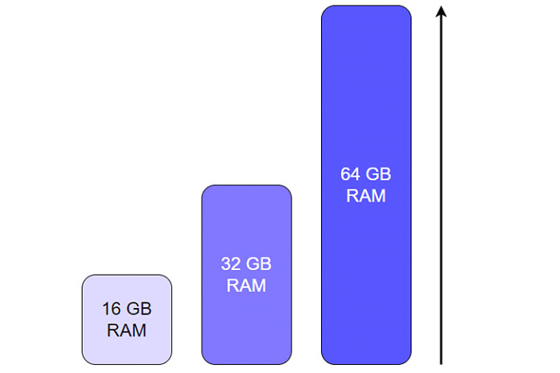
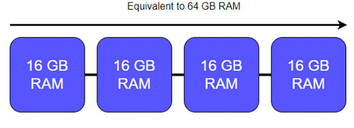
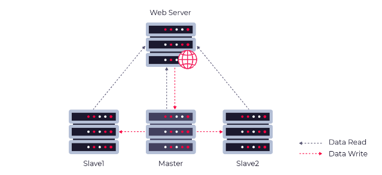
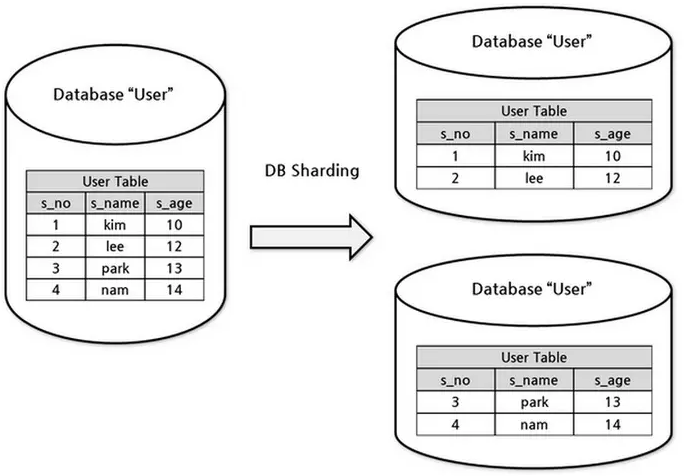
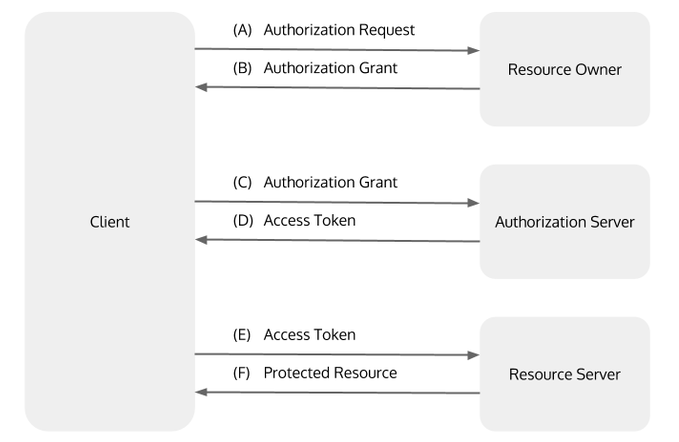

# Highload и глобальные интеграции

## Contents

[[_TOC_]]

## Chapter I

### **Что такое HighLoad?**
Точного определения данного термина нет. Чаще всего под ним имеют в виду:

1. **Высокую нагрузку как таковую**
2. **Приложения, инфраструктура которых предназначена для работы с высокой нагрузкой**

Также можно отметить следующие определения:

- **HighLoad** – это когда IT-система перестает справляться с текущей нагрузкой.

- **HighLoad** – это когда традиционных подходов к работе IT-инфраструктуры уже не хватает.

- **HighLoad** – это когда одного сервера становится мало для обслуживания клиентов.

- **HighLoad** – это когда "железо" не справляется с выросшими нагрузками.

 Самая высокая нагрузка  возникает ввиду:

 - большого количества одновременных пользователей;
 - большого объема обрабатываемых данных;
 - наличия многочисленных сложных расчетов и вычислений.

 «Большое количество запросов» — понятие относительное. Чёткой границы, после которой проект можно считать высоконагруженным, нет: это зависит от инфраструктуры. Часто границу высокой нагрузки проводят, если количество запросов в секунду превышает 100-1000. Тоже самое касается объемов данных и вычислений - зависит от требований возлагаемых на систему.

 Все вышеперечисленные факторы как вместе, так и по отдельности характеризуют высоконагруженное приложение. Для работы такой системе требуется много ресурсов.

### **Отличительные особенности высоконагруженных систем**

Highload-системы существенно отличаются от обычных по ряду причин:

1. **Масштабируемость** Высоконагруженная система должна обладать высокой масштабируемостью, так как нагрузка со временем будет расти. Потребуются дополнительные вычислительные мощности, дисковое пространство и другие ресурсы.

2. **Модульность** Проектируя Highload-систему, архитекторы составляют ее в виде модулей. Такой подход гарантирует возможность замены любого из компонентов в случае выхода его из строя. Другой вариант – расширение возможностей путем добавления новых модулей.

3. **Время отклика (Latency)** Данный параметр предполагает минимально возможное время ответа highload-системы на запрос пользователя. Чем ниже значение данного параметра, тем быстрее происходит реакция приложений.

4. **Уникальность** Highload-архитектура проектируется под каждую задачу индивидуально с учетом требований к производительности, нагрузке и масштабируемости. Не бывает двух полностью идентичных highload-систем.

5. **Отказоустойчивость** Критически важные компоненты высоконагруженной системы в обязательном порядке дублируются. Такой подход гарантирует, что в случае выхода из строя одного из узлов его автоматически заменит дублирующий без простоя.

Построение высоконагруженных систем зачастую требует тщательного проектирования, индивидуального подхода и опыта. 

Далее мы перейдем к основным способом достижения подобной инфраструктуры.

### **Что такое масштабируемость?**

Понятие масштабируемости относится к желательному атрибуту системы, сети или процесса, позволяющему вмещать все большее количество элементов или объектов, эффективно справляться с растущими объемами работы и иметь возможности для расширения. Другими словами, система является масштабируемой, если вам не нужно перепроектировать или дублировать ее для поддержания задержки при высокой нагрузке трафика.

Существует два способа масштабирования приложения: по **вертикали** и по **горизонтали**.

 **Вертикальное масштабирование** – увеличение производительности отдельных компонентов системы для повышения общей производительности. Достигается путем замены элементов, не справляющихся с работой, на более мощные и быстродействующие. Это самый простой тип масштабирования, не требующий внесения изменений в программу.

 Вертикальное масштабирование часто является самым простым решением, поскольку оно не требует рефакторинга кода или сложных конфигураций, оптимизирующих производительность. При вертикальном масштабировании вы просто увеличиваете доступную вычислительную мощность системы.

Вертикальное масштабирование имеет свои пределы, поэтому, когда речь идет о highload-системах, многие считают следующий подход более предпочтительным. 

 **Горизонтальное** – предполагает разделение системы на структурные компоненты, разнесенные по разным машинам, и увеличение числа серверов, параллельно выполняющих отдельные функции. Влечет за собой добавление в систему дополнительных узлов, работающих как единое целое, может потребовать внесение изменений в программу для эффективного использования возросшего количества ресурсов.

Горизонтальное масштабирование имеет значительно меньше физических и технологических ограничений. Гораздо проще добавить больше серверов и настроить дополнительные центры обработки данных, чем сделать один сервер чрезвычайно мощным. Таким образом, единственное практическое ограничение горизонтального масштабирования — количество имеющихся у вас ресурсов. Горизонтальное масштабирование также позволяет использовать динамическое масштабирование для эффективной обработки изменений трафика. Когда трафик растет, больше серверов подключено к сети, и меньше серверов подключено к сети, когда трафик падает для экономии ресурсов.

### **Репликация и Шардирование** 

**Репликация**

Этот термин связан с горизонтальным масштабированием и подразумевает копирование данных между серверами. При использовании такого метода выделяют два типа серверов: master и slave. Мастер используется для записи или изменения информации, слейвы — для копирования информации с мастера и её чтения. Чаще всего используется один мастер и несколько слейвов, так как обычно запросов на чтение больше, чем запросов на изменение. Главное преимущество репликации — большое количество копий данных. Так, если даже головной сервер выходит из строя, любой другой сможет его заменить. Однако как механизм масштабирования репликация не слишком удобна. Причина тому — рассинхронизация и задержки при передаче данных между серверами. Чаще всего репликация используется как средство для обеспечения отказоустойчивости вместе с другими методами масштабирования.

**Шардирование/шардинг/сегментирование**

Шардинг — это горизонтальное масштабирование данных, принцип проектирования базы данных, при котором части таблицы хранятся раздельно, на разных физических серверах. Шардинг является наиболее приемлемым решением для крупномасштабной деятельности, особенно если его использовать в паре с репликацией.В отличии от репликации, шардирование не дублирует данные, а разделяет их по разным серверам. Это может помочь обойти  технические ограничения:

- Если БД работает на пределе производительности — можно разбить ее на части и распределить запросы на чтение между ними.

- Ускорить доступ к данным для пользователей из конкретного региона. Например, международные соцсети могут хранить контент на русском языке на серверах ближе к России.

- Выполнить юридические требования. Например, хранить конфиденциальные данные на шарде, публичный доступ к которому отключен.
- Повысить доступность. Если БД находится на одном нешардированном хосте, то его выход из строя приведет к потере всех данных. Если же БД шардирована, то при отказе одного шарда все данные на других остаются доступными. Для шардов можно дополнительно настроить репликацию. Так вы обойдетесь без потерь, если сервер выйдет из строя. А размещение реплик шарда в разных зонах доступности даст вам отказоустойчивую систему.

- Ускорить запросы. Они могут выполняться медленнее из-за того, что конкурируют за ресурсы сервера. Шардирование устраняет конкуренцию, исполняя запросы параллельно на разных серверах.Каким бы замечательным шардирование ни было, у него есть и недостатки:

Шардирование бывает ручным и автоматизированным. Ручное - это когда разработчики сами выбирают по какому принципу происходит шардирование и сами его реализуют. А автоматизированное - когда СУБД умеет делать это из коробки (например MongoDb) и разработчикам только требуется включить его и настроить.

Правильно шардировать данные, т. е. разбить их на части — непростая задача. Если вы сделаете это неверно, то мощности серверов будут использоваться нерационально (например, потребуется много межсерверных запросов).

Из-за несбалансированного распределения данных между шардами появляются горячие точки — разделы БД, к которым идет намного больше обращений по сравнению с остальными. Запросы к горячим точкам обрабатываются заметно медленнее. 

### **OAuth 2.0**

OAuth 2.0 — протокол авторизации, позволяющий выдать одному сервису (приложению) права на доступ к ресурсам пользователя на другом сервисе. Протокол избавляет от необходимости доверять приложению логин и пароль, а также позволяет выдавать ограниченный набор прав, а не все сразу.

Спецификация OAuth 2.0 определяет протокол делегирования, который предоставляет клиентам безопасный доступ к ресурсам пользователя на сервисе-провайдере. Такой подход избавляет пользователя от необходимости вводить пароль за пределами сервиса-провайдера: весь процесс сводится к нажатию кнопки «Согласен предоставить доступ к ...». Идея в том, что имея один хорошо защищенный аккаунт, пользователь может использовать его для аутентификации на других сервисах, не раскрывая при этом своего пароля.

Общая схема OAuth 2.0 :

1. Клиент запрашивает авторизацию у владельца ресурса.
2. Клиент получает грант авторизации.
3. Клиент запрашивает токен доступа путем аутентификации с помощью сервера авторизации и предоставление гранта авторизации.
4. Сервер авторизации аутентифицирует клиента, проверяя грант авторизации и, если он действителен, выдает токен доступа (access token) и рефреш токен (refresh token).
5. Клиент запрашивает защищенный ресурс у провайдера и аутентифицируется, представляя токен доступа.
6. Провайдер проверяет токен доступа и, если он действителен, обслуживает запрос.

Итак, мы видим, что конечная цель — это получить access и refresh токены. Дальше клиент общается с провайдером данных, пока у access токена не кончится срок годности. Затем, чтобы получить доступ к данным провайдера снова, клиенту нужно воспользоваться refresh токеном и отправить запрос на генерацию новой пары access/refresh токенов.

**Преимущества и недостатки OAuth 2.0**

Из плюсов OAuth 2.0 протокола можно выделить следующее:

- Обращение к ресурсам происходит по HTTP/HTTPS с указанием токена в заголовках. Это позволяет использовать OAuth практически в любых решения: мобильных и десктоп приложениях, сайтах, и даже в плагинах для браузеров.

- Возможность авторизации пользователя.

- Популярность - большинство компаний используют его в своих API.

- Простота реализации и большое количество “литературы”.

- Наличие готовых решений, которые можно изменять под свои нужды.

Из минусов:

- Нет единого установленного формата, вследствие чего на каждый сервис нужно иметь отдельную реализацию.

- При аутентификации иногда приходится делать дополнительные запросы для получения даже минимальной информации о пользователе. Решается использованием jwt токена, но далеко не все сервисы его поддерживают.

- При краже токена у злоумышленника на какое-то время появляется доступ к защищенным данным. Для минимизации данного варианта можно используют токен с подписью.

## Chapter II

1. Необходимо вынести функционал по работе с фото в отдельный сервис.
1.1. Реализовать простейшее шардирование, благодаря которому нагрузку можно будет впоследствии разнести по 4-ем машинам. В конфиге у сервиса должно быть 4 строки подключения к разным базам постгреса (создать их пока на одном Postgres-сервере), в которые он равномерно должен раскладывать фото. Так как у фото идентификатор - UUID, то равномерность легко обеспечить используя анализ строкового представления UUID'a. Если UUID начинается с символа 0-3, то записываем или ищем UUID в первой базе, если 4-7 - во второй, 8-b - в третьей, с-f - соответственно в четвертой.
1.2. Наш Shop Api должен обращаться к этому сервису для получения нужного фото. (Реализация обращения может проходить как по http, gRPC так и через брокер сообщений. Подход выбрать можно самому), который также будет заниматься шардированием. 
2. Реализовать в Shop Api OAuth авторизацию с помощью Google API. Можно получать имя пользователя, почту и прочие данные, необходимые для хранения информации о пользователе.
2.1. По полученным данным необходимо создавать пользователя в локальной базе, однако credentials для него хранить не нужно, при дальнейшей авторизации пользователя, аутентификацию мы будем делегировать сервису OAuth от Google.
2.2. Доступ ко всем методам кроме регистрации и авторизации должны быть закрыты для публичного пользования как и прежде, причём авторизация, реализованная тобой ранее - остаётся.
2.3. Client_id и Client_secret необходимо получать из environment переменных.

💡 [Нажми тут](https://forms.yandex.ru/cloud/647065e6f47e7315751e762d/), **чтобы поделиться с нами обратной связью на этот проект**. Это анонимно и поможет команде Педаго сделать твоё обучение лучше.
