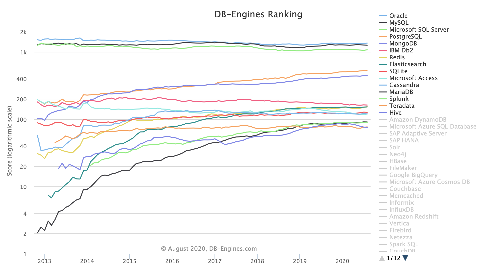

# Day 00 - Database Boot camp

 Relational Data Model Creation

*Resume: Today you will find out the construction principle of the database relational model with the help of using basic constructions of  SQL (DDL / DML)*

## Contents
1. [Chapter I](#chapter-i) \
    1.1. [Preamble](#preamble)
2. [Chapter II](#chapter-ii) \
    2.1. [General Rules](#general-rules)
3. [Chapter III](#chapter-iii) \
    3.1. [Rules of the day](#rules-of-the-day)
4. [Chapter IV](#chapter-iv) \
    4.1. [Exercise 00 - Database Model Creation](#exercise-00-database-model-creation)  
5. [Chapter V](#chapter-v) \
    5.1. [Exercise 01 - Data Generator for Model](#exercise-01-data-generator-for-model)  
6. [Chapter VI](#chapter-vi) \
    6.1. [Exercise 02 - Define Sequences](#exercise-02-define-sequences)
7. [Chapter VII](#chapter-vii) \
    7.1. [Exercise 03 - Add a chronological possibility](#exercise-03-add-a-chronological-possibility)
8. [Chapter VIII](#chapter-viii) \
    8.1. [Exercise 04 - Add check constraints](#exercise-04-add-check-constraints)

<h2 id="chapter-i" >Chapter I</h2>
<h2 id="preamble" >Preamble</h2>

Relational Theory as a Mathematical Model  was born in 1969. The father-founder of this science is **Edgar Frank Codd**. He described the World with relations and connections between them.  Codd mentioned 12 important rules for Relational Database, but reality is not just a straightforward Mathematical Model, business dictates different standards and, therefore, **none RDBMS** fully covers the whole Relational Model paradigm (except “Rel” database is completely based on TutorialD language).

Today (after 50 years!) Relational Databases have first 4 positions in the “DB-Engines Ranking” chart. Just ask yourself - how is it possible nowadays with BigData, Distributed Systems, Parallel Calculations and other modern ways? 

The answer is simple, **Edgar Frank Codd** prepared a powerful mathematical basement for us, which is working successfully after 50 years! Assuredly RDBMS companies / community leaders (Oracle, MySQL, PostgreSQL, MS SQL Server)  keep an eye on new IT waves and try to take best practices, algorithms, patterns and integrate into their RDBMS. The best example of this movement is XML / json integration into Relational Database.

<h2 id="chapter-ii">Chapter II</h2>
<h2 id="general-rules" >General Rules</h2>

- Use this page as the only reference. Do not listen to any rumors and speculations on how to prepare your solution.
- Please make sure you are using PostgreSQL 12.4.
- Please make sure you have installed and configured Flyway 6.x.x by Redgate.
- Please use our [internal SQL Naming Convention rules](https://docs.google.com/document/d/1IxIOFUeb-8Z8fBOfkXiy4SkN-J1mPIXveJZUCNZFdp8/edit?usp=sharing)
- Please use our [Terms and Definitions](https://docs.google.com/document/d/1_ZTDpHcfYMASZ5BtnldurQLF0fJygGF1yuTwik0DOqk/edit?usp=sharing) document
- That is completely OK if you are using IDE to write a source code (aka SQL script) and make a syntax check before migration at the final database solution by Flyway.
- Comments are also good in the SQL scripts. Anyway be careful with signs /*...*/ directly in SQL. These special symbols are used for Database Hints to improve SQL performance and these are not just comment marks :-).
- Pay attention to the permissions of your files and directories.
- To be assessed your solution must be in your GIT repository.
- Your solutions will be evaluated by your piscine mates.
- You should not leave in your directory any other file than those explicitly specified by the exercise instructions. It is recommended that you modify your .gitignore to avoid accidents.
- Do you have a question? Ask your neighbor on the right. Otherwise, try with your neighbor on the left.
- Your reference manual: mates / Internet / Google.
- Read the examples carefully. They may require things that are not otherwise specified in the subject.
- And may the SQL-Force be with you!
- Absolutely everything can be presented in SQL! Let’s start and have fun!

<h2 id="chapter-iii">Chapter III</h2>
<h2 id="rules-of-the-day">Rules of the day</h2>

- Please make sure you have a separated database “data” on your PostgreSQL cluster.
- Please make sure you have a database schema “data” in your “data” database.
- Please make sure you are working through database user “data” and password “data” with super admin permissions for your PostgreSQL cluster.
- Each exercise of the day needs a Flyway tool for right versioning of the “data” database through user “data”.
- Please make changes in your “flyway.conf” file (located in “~/flyway-6.x.x/conf” directory) directly to configure a right and stable connection to your PostgreSQL database.
    - flyway.url = jdbc:postgresql://hostname:port/data
        - where hostname is DNS / IP address of PostgreSQL server
        - where port is a port of PostgreSQL server , by default is 5432
(`jdbc:postgresql://localhost:5432/data` OR  `jdbc:postgresql://127.0.0.1:5432/data`)
    - flyway.user = data
    - flyway.password = data
    - flyway.schemas = data
    - flyway.defaultSchema = data
- Please use the command line for Flyway to migrate changes into the database and get information about the current version from the database.
- Please don’t append additional parameters for “flyway” in a command line, all needed parameters should be changed in “flyway.conf” file
- All tasks contain a list of Allowed and Denied sections with listed database options, database types, SQL constructions etc. Please have a look at the section before you start.

<h2 id="chapter-iv">Chapter IV</h2>
<h2 id="exercise-00-database-model-creation">Exercise 00 - Database Model Creation</h2>

Exercise 00: Database Model Creation ||
---|---
Turn-in directory|ex00
Files to turn-in|`V000__db_model_initiate.sql`
`V001__dictionaries_initiate.sql`
**Allowed**
Database types|TIMESTAMP, VARCHAR, NUMERIC, BIGINT, TIME, DATE
Operators|Standard DDL / DML operators to create / alter relations and to insert / update / delete / select data (CRUD operations)
Advanced operators|multiple INSERT statement
Database tables|Original Heap Tables
Database Naming Convention|[internal SQL Naming Convention rules](https://docs.google.com/document/d/1IxIOFUeb-8Z8fBOfkXiy4SkN-J1mPIXveJZUCNZFdp8/edit?usp=sharing)<ul><li>table naming and table structure</li><li>column pattern naming</li><li>primary key pattern naming</li><li>foreign key pattern naming</li><li>unique key pattern naming</li><li>pattern for check constraint naming</li></ul>
**Denied**
Data types | SERIAL
Database tables|Other types of database tables
Database objects|user defined anonymous blocks, functions and procedures
Database constructions|GENERATED [BY DEFAULT] AS IDENTITY

Based on quotation from Information Principle by Edgar Frank Codd - “All information in the database must be cast explicitly in terms of values in relations and in no other way”. Please use this principle to make a physical relational database model for the next exercise.

Aliens from Alpha Centauri need to know everything about us. They collected biological materials from the Earth and did a lot of research to know how to move on. But this information is not enough actually. They need to understand collaborations between humans, human economics, human possibilities and potential from a statistical point of view.

They understand this task is not so simple and aliens need to structure in a good manner a lot of information in the Aliens Database :-).  

So, they selected a Relational Database (the reason was in the strong mathematical  model from Edgar Frank Codd defined in 1969) named PostgreSQL. Another reason was in money, PostgreSQL, as you know, is an open-source database.

In the database, they need to store information about different **indicators** (or metrics) from any **country** of the Earth for different **periods** of time. This data is needed to control and operate react based on indicators' values for different aspects like human economics and ecology, human politics,   human wars and human epidemics. Other words, there is a specific database model pattern named “Entity-Attribute-Value” ~ EAV. Please take a look at this [link](https://en.wikipedia.org/wiki/Entity–attribute–value_model) before reading the text below.

The database model (Aliens decided to begin from a few separated ordinary database tables) has to satisfy a few points.

1. Database model has to include foreign, unique and primary keys with explicit names as a business rules for data.
2. A new human **indicator** can be added “*on-the-fly*” (in other words this is a *flexibility of model*) in the database without a new table creation or modification of existing tables.
3. They decided to add three human unique indicators during Beta Testing. Use a table name *indicator* for this dictionary table. \
     a. *Population of country* (unit: *human*) \
     b. *Unemployment rate* (unit: *percent*). Possible floating value. \
     c. *Infected humans COVID-19* (unit: *human*)
4. Please use the next NOT NULL columns for the indicator table: `{id, name, unit}` . Moreover, the attribute *name* must be unique.
5. Database model has to gather and store historical **indicator** values for each **country** and **period** of time for further analysis and make decisions in the future. Use a table name *country_indicator* for this transaction table. Please use the next columns for the `country_indicator` table: `{id, c_id, i_id, value, actual_date}`, where `c_id` is a link to `country.id`, `i_id` is a link to *indicator.id* and actual_date is timestamp of incoming *value*. The columns `{id, c_id, i_id, actual_date}` must have NOT NULL values. Moreover, there should be defined a unique rule for 3 included attributes `{c_id,i_id,actual_date}`. Don’t forget to add foreign keys for fields `c_id` and `i_id`!
6. Database model must include a dictionary of the official **195** Earth countries (please use this [link](https://docs.google.com/document/d/16gywmsWGlsT8ZVqPv2w_lEMdKtZ87iinEKXOpZEnTPY/edit?usp=sharing) to find all countries) in the hierarchical structure with continents. Use table name country for this dictionary table.
    - use the next columns for the *country* table: *`{id, name, par_id, object_type}`
    - store information about whether this is a **continent** or a **country**  for each row in a table  (default value should be “country”). Please use column name `object_type` for it.
    - columns `{id, name, object_type}` must have NOT NULL values
    - the pair of attributes `{name, object_type}` must be unique
    - add foreign key to make *self-join* between columns *par_id -> id*
7. Please help aliens to add a possibility to save in the database model values from each **country** based on listed **indicators** by any **period** of time.
8. Don’t forget to add comments for each created table and table columns

Aliens are highly organized creatures and therefore they are using a versioning tool “Flyway” from human company RedGate.| 
---|---

ALL DDL changes have to be presented in the SQL script with the name `V000__db_model_initiate.sql`

ALL DML changes have to be presented in the SQL script with the name `V001__dictionaries_initiate.sql`.

Working example of flyway for both SQL scripts:

    $ ./flyway migrate
      Flyway Community Edition 6.5.4 by Redgate
      Database: jdbc:postgresql://localhost:5432/data (PostgreSQL 12.4)
      Successfully validated 2 migrations (execution time 00:00.525s)
      Creating Schema History table "data"."flyway_schema_history" ...
      Current version of schema "data": << Empty Schema >>
      Migrating schema "data" to version 000 - db model initiate
      ...
      Migrating schema "data" to version 001 - dictionaries initiate
      ...
      Successfully applied 2 migrations to schema "data" (execution time 00:06.177s)

    $ ./flyway info
      Flyway Community Edition 6.5.4 by Redgate
      Database: jdbc:postgresql://localhost:5432/data (PostgreSQL 12.4)
      Schema version: 001

    +-----------+---------+-----------------------+------+---------------------+-------
    | Category  | Version | Description           | Type | Installed On        | State   
    +-----------+---------+-----------------------+------+---------------------+-------
    | Versioned | 000     | db model initiate     | SQL  | 2020-08-17 16:57:26 | Success
    | Versioned | 001     | dictionaries initiate | SQL  | 2020-08-17 16:57:29 | Success
    +-----------+---------+-----------------------+------+---------------------+--------

<h2 id="chapter-v">Chapter V</h2>
<h2 id="exercise-01-data-generator-for-model">Exercise 01 - Data Generator for Model</h2>

Exercise 01: Data Generator for Model||
---|---
Turn-in directory|ex01
Files to turn-in|`V010__data_model_generate.sql`
**Allowed**
Operators|Standard DDL / DML operators to create / alter relations and to insert / update / delete / select data (CRUD operations)
Advanced operators|<ul><li> multiple INSERT statement</li><li> string concatenation operator </li></ul>
Functions|generate_series(integer, integer),
generate_series(date, date, interval),
random()
lpad()
max()
Window Functions|--to generate an unique number of row of generated dataset
row_number( ) OVER ( )
**Denied**
Database objects|<ul><li>sequences</li><li>user defined anonymous blocks, functions and procedures</li>
Advanced operators|INSERT INTO … VALUES … ON CONFLICT DO ...
Static ID|Don’t use a static ID (red font) for SQL statements in exercise.

INSERT INTO country (name, object_type_id)  VALUES (‘Gibraltar’, **2**);
SELECT * FROM country WHERE par_id = **2**;
SELECT setval(‘seq_country’, **2**);

In these cases,  **2** is a static (hard-coded) value, use SQL subquery to get a dynamic ID value.

A “Closed World Assumption for Relational Model” principle says “If a tuple is presented in the relation variable that means there is a real fact about the world”.

Please help aliens to make a beta testing of database model. Write a SQL script to generate a data for each country from dictionary table for each of 3 existing human indicators based on this limitations:
1. “*Population of country*” for each 1st day of month 2019 year
(take a random value for this parameter from 0 to 1 000 000)
2. “*Unemployment rate*” for each 1st day of month 2019 year
(take a random value for this parameter from 0 to 100)
3. “*Infected humans COVID-19*”  for each day beginning from 1st of May 2020 to 31st of August 2020
(take a random value for this parameter from 0 to 50)

Working example of flyway for SQL script:

    $ ./flyway migrate
    Flyway Community Edition 6.5.4 by Redgate
    Database: jdbc:postgresql://localhost:5432/data (PostgreSQL 12.4)
    Successfully validated 3 migrations (execution time 00:00.317s)
    Current version of schema "data": 001
    Migrating schema "data" to version 010 - data model generate
    ...
    Successfully applied 1 migration to schema "data" (execution time 00:02.282s)

    $ ./flyway info
    Flyway Community Edition 6.5.4 by Redgate
    Database: jdbc:postgresql://localhost:5432/data (PostgreSQL 12.4)
    Schema version: 010

    +-----------+---------+-----------------------+------+---------------------+--------
    | Category  | Version | Description           | Type | Installed On        | State   
    +-----------+---------+-----------------------+------+---------------------+--------
    | Versioned | 000     | db model initiate     | SQL  | 2020-08-17 16:57:26 | Success
    | Versioned | 001     | dictionaries initiate | SQL  | 2020-08-17 16:57:29 | Success
    | Versioned | 010     | data model generate   | SQL  | 2020-08-17 18:13:17 | Success
    +-----------+---------+-----------------------+------+---------------------+--------

<h2 id="chapter-vi">Chapter VI</h2>
<h2 id="exercise-02-define-sequences">Exercise 02 - Define Sequences</h2>

Exercise 02: Define Sequences||
---|---
Turn-in directory|ex02
Files to turn-in|`V020__create_sequences.sql`
**Allowed**
Operators|Standard DDL / DML operators to create / alter relations and to insert / update / delete / select data (CRUD operations)
SQL built-in functions|setval(...)
nextval(...)
max(...)
SQL pattern construction |SQL subquery
Database Naming Convention | [internal SQL Naming Convention rules](https://docs.google.com/document/d/1IxIOFUeb-8Z8fBOfkXiy4SkN-J1mPIXveJZUCNZFdp8/edit?usp=sharing)<ul><li>pattern for sequences</li></ul>
**Denied**
Database Type|SERIAL
Database objects|user defined anonymous blocks, functions and procedures
Static ID|Don’t use a static ID (red font) for SQL statements in exercise.

INSERT INTO country (name, object_type_id)  VALUES (‘Gibraltar’, **2**);
SELECT * FROM country WHERE par_id = **2**;
SELECT setval(‘seq_country’, **2**);

In these cases,  **2** is a static (hard-coded) value, use SQL subquery to get a dynamic ID value.
Database constructions|GENERATED [BY DEFAULT] AS IDENTITY

Aliens decided to add a database sequence iterator for all database tables in their model. Need to attach a newly created database sequence (set increment step is 10) for ID column explicitly (other words , if table or column ID will be dropped then database sequence will be dropped as well) and set as a default value for column ID. Database sequence must be synced with the last value from a table. Other words, ID value must be generated automatically from database sequence for any INSERT statement (if we skip ID from column list) for any database table.

Provide a flyway SQL script for all described changes.

Working example of flyway for SQL script:

    $ ./flyway migrate
      Flyway Community Edition 6.5.4 by Redgate
      Database: jdbc:postgresql://localhost:5432/data (PostgreSQL 12.4)
      Successfully validated 4 migrations (execution time 00:00.419s)
      Current version of schema "data": 010
      Migrating schema "data" to version 020 - create sequences
      ...
      Successfully applied 1 migration to schema "data" (execution time 00:02.342s)

    $ ./flyway info
      Flyway Community Edition 6.5.4 by Redgate
      Database: jdbc:postgresql://localhost:5432/data (PostgreSQL 12.4)
      Schema version: 020

    +-----------+---------+-----------------------+------+---------------------+--------
    | Category  | Version | Description           | Type | Installed On        | State   
    +-----------+---------+-----------------------+------+---------------------+--------
    | Versioned | 000     | db model initiate     | SQL  | 2020-08-17 16:57:26 | Success
    | Versioned | 001     | dictionaries initiate | SQL  | 2020-08-17 16:57:29 | Success
    | Versioned | 010     | data model generate   | SQL  | 2020-08-17 18:13:17 | Success
    | Versioned | 020     | create sequences      | SQL  | 2020-08-17 18:38:02 | Success
    +-----------+---------+-----------------------+------+---------------------+--------

<h2 id="chapter-vi">Chapter VII</h2>
<h2 id="exercise-03-add-a-chronological-possibility">Exercise 03 - Add a chronological possibility</h2>

Exercise 03: Add a chronological possibility||
---|---
Turn-in directory|ex03
Files to turn-in|`V030__alter_table_to_chrono.sql`
**Allowed**
Operators|Standard DDL / DML operators to create / alter relations and to insert / update / delete / select data (CRUD operations)
Database types|TIMESTAMP
Database Naming Convention|[internal SQL Naming Convention rules](https://docs.google.com/document/d/1IxIOFUeb-8Z8fBOfkXiy4SkN-J1mPIXveJZUCNZFdp8/edit?usp=sharing)<ul><li>pattern for column naming</li></ul>
**Denied**
Database Type|INTERVAL

Aliens read about chronological models and decided to use this approach for all dictionary tables (*country* and *indicator*). Usually, there is an attribute “status” that shows the current record is “Opened / Closed” for front / back ends. Aliens want to go further and use time intervals for live time of table record. Live time will be characterized by time of beginning (`time_start`) and time of ending (`time_end`).

Let’s modify our dictionary tables (*indicator, country*) by adding new physical columns and set default values from the 1st of January 1972 (the first Alien’s contact with humanity) till the 1st of January 9999. In addition, to add a NOT NULL constraint for each newly created column.

Please don’t forget about comments for new columns!

Working example of flyway for SQL script:

    $ ./flyway migrate
      Flyway Community Edition 6.5.4 by Redgate
      Database: jdbc:postgresql://localhost:5432/data (PostgreSQL 12.4)
      Successfully validated 5 migrations (execution time 00:00.461s)
      Current version of schema "data": 020
      Migrating schema "data" to version 030 - alter table to chrono
      ...
      Successfully applied 1 migration to schema "data" (execution time 00:01.936s)

    $ ./flyway info
      Flyway Community Edition 6.5.4 by Redgate
      Database: jdbc:postgresql://localhost:5432/data (PostgreSQL 12.4)
      Schema version: 030

    +-----------+---------+-----------------------+------+---------------------+--------
    | Category  | Version | Description           | Type | Installed On        | State   
    +-----------+---------+-----------------------+------+---------------------+--------
    | Versioned | 000     | db model initiate     | SQL  | 2020-08-17 16:57:26 | Success
    | Versioned | 001     | dictionaries initiate | SQL  | 2020-08-17 16:57:29 | Success
    | Versioned | 010     | data model generate   | SQL  | 2020-08-17 18:13:17 | Success
    | Versioned | 020     | create sequences      | SQL  | 2020-08-17 18:38:02 | Success
    | Versioned | 030     | alter table to chrono | SQL  | 2020-08-17 18:56:34 | Success
    +-----------+---------+-----------------------+------+---------------------+--------

<h2 id="chapter-viii">Chapter VIII</h2>
<h2 id="exercise-04-add-check-constraints">Exercise 04 - Add check constraints</h2>

Exercise 04: Add check constraints||
---|---
Turn-in directory|ex04
Files to turn-in|`V040__alter_tables_by_cc.sql`
**Allowed**
Operators|Standard DDL / DML operators to create / alter relations and to insert / update / delete / select data (CRUD operations)
Database Naming Convention|[internal SQL Naming Convention rules](https://docs.google.com/document/d/1IxIOFUeb-8Z8fBOfkXiy4SkN-J1mPIXveJZUCNZFdp8/edit?usp=sharing)<ul><li>pattern for check constraints naming</li></ul>

After model creation, Aliens decided to add more data rules power by adding new database check constraints with explicit names. The reason of this action is to avoid data anomalies at the future on database level from business point of view

Let’s add in our dictionary tables (*indicator, country*) the next database check constraints:
1. Value of the column `time_start` must be >= 1st of January 1972
2. Value of the column `time_end` must be <= 1st of January 9999
3. Value of the column `unit` (*indicator* table) must be satisfied by the list of values(“*human*”, “*percent*”)
4. Value of the column `object_type` (*country* table) must be satisfied by the list of values(“country”, “continent”)

Let’s add in our transaction table (which stores values of human **indicators** for particular **period** of time by selecting **country**) the next database check constraint:
1. Value of the column *value* must be >= 0 and set NOT NULL
(if your column has not explicit check constraint with NOT NULL rule before this exercise)

Working example of flyway for SQL script:

    $ ./flyway migrate
      Flyway Community Edition 6.5.4 by Redgate
      Database: jdbc:postgresql://localhost:5432/data (PostgreSQL 12.4)
      Successfully validated 5 migrations (execution time 00:00.461s)
      Current version of schema "data": 030
      Migrating schema "data" to version 040 - alter tables by cc
      ...
      Successfully applied 1 migration to schema "data" (execution time 00:01.936s)

    $ ./flyway info
      Flyway Community Edition 6.5.4 by Redgate
      Database: jdbc:postgresql://localhost:5432/data (PostgreSQL 12.4)
      Schema version: 030

    +-----------+---------+-----------------------+------+---------------------+--------
    | Category  | Version | Description           | Type | Installed On        | State   
    +-----------+---------+-----------------------+------+---------------------+--------
    | Versioned | 000     | db model initiate     | SQL  | 2020-08-17 16:57:26 | Success
    | Versioned | 001     | dictionaries initiate | SQL  | 2020-08-17 16:57:29 | Success
    | Versioned | 010     | data model generate   | SQL  | 2020-08-17 18:13:17 | Success
    | Versioned | 020     | create sequences      | SQL  | 2020-08-17 18:38:02 | Success
    | Versioned | 030     | alter table to chrono | SQL  | 2020-08-17 18:56:34 | Success
    | Versioned | 040     | alter tables by cc    | SQL  | 2020-08-17 19:11:05 | Success
    +-----------+---------+-----------------------+------+---------------------+--------
