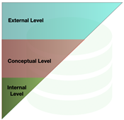
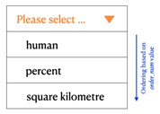

# Day 01 - Database boot camp

## _ANSI/SPARС architecture_

*Resume: Today you will find out the ANSI SPARC architecture principle of the database relational model with the help of using generic dictionary structure*

## Contents

1. [Chapter I](#chapter-i) \
    1.1. [Preamble](#preamble)
2. [Chapter II](#chapter-ii) \
    2.1. [General Rules](#general-rules)
3. [Chapter III](#chapter-iii) \
    3.1. [Rules of the day](#rules-of-the-day)  
4. [Chapter IV](#chapter-iv) \
    4.1. [Exercise 00 - Generic Dictionary Table](#exercise-00-generic-dictionary-table)  
5. [Chapter V](#chapter-v) \
    5.1. [Exercise 01 - Database View Lists](#exercise-01-database-view-lists)  
6. [Chapter VI](#chapter-vi) \
    6.1. [Exercise 02 - To get not actual rows from chrono model](#exercise-02-to-get-not-actual-rows-from-chrono-model)  

<h2 id="chapter-i" >Chapter I</h2>
<h2 id="preamble" >Preamble</h2> 

 

In 1975, an architectural design was proposed for dividing the areas of responsibility between engineers in the operation and maintenance of the database, as well as dividing the data itself between the users of the database.  This unrecognized standard was called ANSI / SPARC architecture (Standard Planning and Requirements Committee), however, this architecture design pattern is quite common.

The proposed way of dividing the levels in the database was one of the factors in the development of the separate roles of engineers working with databases.
- DBA
- SQL Developer Engineer
- SQL Performance Tuning Engineer
- SQL Analyst
- Data Engineer
- Data Science Engineer
- Database Functional Engineer
- etc

Moreover, large companies that develop their databases have introduced a gradation of certifications and roles played.  For example, Oracle Corporation has a whole stack of competency development based on certifications.

- Oracle Database Administrator
- Oracle Database RAC Administrator
- Oracle Database PL/SQL Developer
- Oracle Database SQL Developer
- Oracle Database Performance Tuning 

On the other hand, the three-tier partitioning of the relational database brought a lot of functionality to the core of the system, such as the ability to share data between user groups based on Database Views.

<h2 id="chapter-ii">Chapter II</h2>
<h2 id="general-rules" >General Rules</h2>

- Use this page as the only reference. Do not listen to any rumors and speculations on how to prepare your solution.
- Please make sure you are using the latest version of PostgreSQL.
- Please make sure you have installed and configured the latest version of Flyway by Redgate.
- Please use our [internal SQL Naming Convention rules](https://docs.google.com/document/d/1IxIOFUeb-8Z8fBOfkXiy4SkN-J1mPIXveJZUCNZFdp8/edit?usp=sharing)
- Please use our [Terms and Definitions](https://docs.google.com/document/d/1_ZTDpHcfYMASZ5BtnldurQLF0fJygGF1yuTwik0DOqk/edit?usp=sharing) document 
- That is completely OK if you are using IDE to write a source code (aka SQL script) and make a syntax check before migration at the final database solution by Flyway.
- Comments are also good in the SQL scripts. Anyway be careful with signs /*...*/ directly in SQL. These special symbols are used for Database Hints to improve SQL performance and these are not just comment marks :-).
- Pay attention to the permissions of your files and directories.
- To be assessed your solution must be in your GIT repository.
- Your solutions will be evaluated by your piscine mates.
- You should not leave in your directory any other file than those explicitly specified by the exercise instructions. It is recommended that you modify your .gitignore to avoid accidents.
- Do you have a question? Ask your neighbor on the right. Otherwise, try with your neighbor on the left.
- Your reference manual: mates / Internet / Google. 
- Read the examples carefully. They may require things that are not otherwise specified in the subject.
- And may the SQL-Force be with you!
- Absolutely everything can be presented in SQL! Let’s start and have fun!

<h2 id="chapter-iii">Chapter III</h2>
<h2 id="rules-of-the-day">Rules of the day</h2>

- Please make sure you have a separated database “data” on your PostgreSQL cluster. 
- Please make sure you have a database schema “data” in your “data” database.
- Please make sure you are working through database user “data” and password “data” with super admin permissions for your PostgreSQL cluster. 
- Each exercise of the day needs a Flyway tool for right versioning of the “data” database through user “data”.
- Please make changes in your “flyway.conf” file (located in “~/flyway-6.x.x/conf” directory) directly to configure a right and stable connection to your PostgreSQL database.
- Please use the command line for Flyway to migrate changes into the database and get information about the current version from the database.
- Please don’t append additional parameters for “flyway” in a command line, all needed parameters should be changed in “flyway.conf” file
- All tasks contain a list of Allowed and Denied sections with listed database options, database types, SQL constructions etc. Please have a look at the section before you start.

<h2 id="chapter-iv">Chapter IV</h2>
<h2 id="exercise-00-generic-dictionary-table">Exercise 00 - Generic Dictionary Table</h2>

| Exercise 00: Generic Dictionary Table |                                                                                                                          |
|---------------------------------------|--------------------------------------------------------------------------------------------------------------------------|
| Turn-in directory                     | ex00                                                                                                                     |
| Files to turn-in                      | `V050__generic_dictionary_refactor_db.sql`                                                                                 |
| **Allowed**                               |                                                                                                                          |
| Database types                        | TIMESTAMP, VARCHAR, NUMERIC, BIGINT, TIME, DATE, INTEGER                                                                                              |
| Operators                             | Standard DDL / DML operators to create / alter relations and to insert / update / delete / select data (CRUD operations) |
| Database tables                       | Original Heap Tables                                                                                                     |
| Database Naming Convention            | [internal SQL Naming Convention rules](https://docs.google.com/document/d/1IxIOFUeb-8Z8fBOfkXiy4SkN-J1mPIXveJZUCNZFdp8/edit?usp=sharing)<ul><li>table naming and table structure</li><li>column pattern naming</li><li>primary key pattern naming</li><li>foreign key pattern naming</li><li>unique key pattern naming                                                                                     |
| **Denied**                                |                                                                                                                          |
| Database types                        | SERIAL                                                                                                                   |
| Database tables                       | Other types of database tables                                                                                           |
| Database objects                      |<ul><li>sequences</li><li>user defined anonymous blocks, functions and procedures</li></ul>                                                       |
| Static ID                             | Don’t use a static ID (red font) for SQL statements in exercise.

INSERT INTO country (name, `object_type_id`)  VALUES (‘Gibraltar’, **2**);
SELECT `*` FROM country WHERE `par_id` = **2**;
SELECT setval(`seq_country`, **2**);

In these cases,  **2** is a static (hard-coded) value, use SQL subquery to get a dynamic ID value.                                                                              |

The Aliens were puzzled to calculate the average population density per square meter of the state.  To do this, you need to enter a new indicator into the model.
-	 _Area of the land_ (unit: _square kilometer_)

The problem is that there is a strict limitation on the values of the field “units of measurement” of the table *indicator* (at the moment as you remember these are values from the *[human, percent]* list).  Having thought and acknowledged the fact that the indicators will only increase and, accordingly, new “units of measurement” will appear, they decided to write a general system dictionary table for such list states with the condition of the already used chronological model for other reference dictionaries in the database.

Please help Aliens to handle with the following system refactoring

1.	Create a general table called *dictionary* that will store information on all kinds of list values with the following conditions below
    - chronological structure condition with information about `time_start / time_end` with necessary check constraints
    - condition for dividing list sub-dictionaries in the general table *dictionary*. Please use the `dic_name` column name for it and the *value* column to store a particular value from the list.
    - condition of the specified sorting of rows in case of receiving data on the frontend with default value 0. Please use the `order_num` column name for it. For this case, that’s OK if you use static values for the INSERT statement for column `order_num`.
    - For example, the column `order_num` in the front-end application can be used in combo boxes (or special components on user-interface). 
    
    

    - *dictionary* must has a primary key 
    - composite unique constraint must be added for values of the columns *dic_name* and *value*
    - don’t forget about comments for new created table and each column

2.	Fill in the *dictionary* with data on the “units of measure” of the *indicator* table.  Specify the name of the list of values (~ sub-dictionary) as “*unit*” in the *dictionary*.

3.	Fill in the *dictionary* with data on the “object types” of the *country* table.  Set the name of the list of values (~ sub-dictionary) as “*land*” in the dictionary. 

4.	Add a new unit of measure “square kilometer” into the sub-dictionary “*unit*” of *dictionary* table.

5.	Modify (without deleting) the field *unit* of the *indicator* table as a foreign key to the corresponding entry in the *dictionary*.  The given refactoring of the structure seemed very difficult for Aliens and they decided to get a hint from Michael Stonebraker.  Unfortunately the steps of the clue have been mixed up.
    - change field type to bigint for column *unit*
    - apply updating the field value based on new IDs from the *dictionary*
    - remove existing check constraint on the field *unit*
    - rename column from *unit* to `unit_id` in *indicator* table
    - create a foreign key to the *dictionary* table with the rules for limiting deletion (ON DELETE RESTRICT option) and updating when cascading update or delete of parent records (ON UPDATE RESTRICT option)
 

6.	Add a new indicator “*Area of the land*” into the indicator table using knowledge about the unit of measure with name  “*square kilometer*” from *dictionary* table. (Please use subquery to get value for your INSERT statement)

7.	Modify (without deleting) the `object_type` field of the country table as a foreign key to the corresponding *dictionary* entry.  Thanks Michael Stonebraker!
    - change field type to bigint for column `object_type`
    - apply updating the field value based on new IDs from the dictionary
    - remove existing check constraint on the field `object_type`
    - rename column from `object_type` to `object_type_id` in *country* table
    - create a foreign key to the *dictionary* table with the rules for limiting deletion (ON DELETE RESTRICT option) and updating when cascading update or delete of parent records (ON UPDATE RESTRICT option)
    - remove default value for column `object_type`

<h2 id="chapter-v">Chapter V</h2>
<h2 id="exercise-01-database-view-lists">Exercise 01 - Database View Lists</h2>

| Exercise 01: Database View Lists |                                                                                                                          |
|----------------------------------|--------------------------------------------------------------------------------------------------------------------------|
| Turn-in directory                | ex01                                                                                                                     |
| Files to turn-in                 | `V060__create_first_views.sql`                                                                                            |
| **Allowed**                          |                                                                                                                          |
| Operators                        | Standard DDL / DML operators to create / alter relations and to insert / update / delete / select data (CRUD operations) |
| Database Objects                 | views                                                                                                                    |
| Database Naming Convention       | [internal SQL Naming Convention rules](https://docs.google.com/document/d/1IxIOFUeb-8Z8fBOfkXiy4SkN-J1mPIXveJZUCNZFdp8/edit?usp=sharing) <ul><li>pattern for view</li></ul>                                                                                              |
| Functions                        | now()
current_timestamp                                                                                                        |
| **Denied**                           |                                                                                                                          |
| Database objects                 | materialized views                                                                                                       |

Aliens decided to use the separation of information and areas of responsibility for working with the database among themselves.  To do this, they decided to turn to ANSI / SPARC architecture and create two database views named `“v_dictionary_unit”`, `“v_dictionary_land”` that return data
`{id, “value of the sub-dictionary”}` of the corresponding list of the *dictionary* in the ordered order specified in the table (`order_num` column) and corresponding to the actual  records (means actual records are in time interval `[time_start, time_end]` ) of the chronological model. 
Don’t forget about comments for new database views and columns!

<h2 id="chapter-vi">Chapter VI</h2>
<h2 id="exercise-02-to-get-not-actual-rows-from-chrono-model">Exercise 02 - To get not actual rows from chrono model</h2>

| Exercise 02: To get not actual rows from chrono model |                                                                                                                          |
|-------------------------------------------------------|--------------------------------------------------------------------------------------------------------------------------|
| Turn-in directory                                     | ex02                                                                                                                     |
| Files to turn-in                                      | `V070__get_outdated_chrono_rows.sql                 `                                                                      |
| **Allowed**                                               |                                                                                                                          |
| Operators                                             | Standard DDL / DML operators to create / alter relations and to insert / update / delete / select data (CRUD operations) |
| Database Objects                                      | views                                                                                                                    |
| Database Naming Convention                            | [internal SQL Naming Convention rules](https://docs.google.com/document/d/1IxIOFUeb-8Z8fBOfkXiy4SkN-J1mPIXveJZUCNZFdp8/edit?usp=sharing) <ul><li>pattern for view</li></ul>                                                                                               |
| Functions                                             | now()
current_timestamp
random()
max(...)
round(...)
cast(... AS … )                                                                                                          |
| SQL pattern construction                              | SQL subquery                                                                                                             |
| **Denied**                                                |                                                                                                                          |
| Database objects                                      | materialized views                                                                                                       |
| Static ID                                             | Don’t use a static ID (red font) for SQL statements in exercise.

INSERT INTO country (name, `object_type_id`)  VALUES (‘Gibraltar’, **2**);
SELECT `*` FROM country WHERE `par_id` = **2**;
SELECT setval(`seq_country`, **2**);

In these cases,  **2** is a static (hard-coded) value, use SQL subquery to get a dynamic ID value.                                                                              |

Aliens want to know all obsolete strings with a list of columns `{id, name, time_start, time_end}` of *indicator, country* tables and the list of the fields `{id, dic_name, value, time_start, time_end}` for *dictionary* table.  To do this, they created the corresponding database views with the names `“v_outdated_indicator”`, `“v_outdated_country”`, `“v_outdated_dictionary”` with the results sorted in descending order of the *id* field.
Please help them create the appropriate script for each database view. Don’t forget about comments for new database views and columns! ;-)

Aliens remembered about the new added indicator *“Area of the land”* in the *indicator* table. 
Let’s use it in our goal! 

-	Please generate *“Area of the land”* values for the 1st of May 2020 for each country (except type continent or parent row of child rows )
	(take a random value for this parameter from 10 000 to 10 010 000). 
Remember, there is a special database sequence `seq_country_indicator` like an iterator for
the default value for the ID column of `country_indicator` table!

-	Add a new database view `v_average_humans_per_country` with the logic below.

    -	database view should return 2 columns for each country from *country* table
    *{country name, ratio between “Population of country” and “Area of the land” rounded to 3 signs}*, sorted by country name in ascending mode.

    -	the SQL pattern of the incoming database view must satisfy the form below

            SELECT t1.name, 
                    your_formula AS value 
            FROM (SELECT name, 
                        (SELECT value FROM country_indicator ...) AS area,  
                        (SELECT value FROM country_indicator ...) AS population  
                    FROM country 
                  WHERE ... ) AS t1 
            ORDER BY ...

    -	use subqueries in the SELECT clause to get each indicator with explicitly *actual_date* values (the 1st of May 2020 for “*Area of the land*”  and the 1st of May 2019 for “*Population of country*”)

    -	the sample of the result (must contain 195 rows) from `v_average_humans_per_country` database view is presented below

    
    -	please pay attention to your formula, don’t forget about explicit transformation INTEGER into NUMERIC type by using CAST function or by using the construction “*value*::NUMERIC”. Otherwise you are getting all 0 for the resulting column *value*.

        | name      | value |
        |-----------|-------|
        | ...       | ...   |
        | Chile     | 0.532 |
        | Guyana    | 0.073 |
        | ...       | ...   |
        | Venezuela | 0.095 |
        | ...       | ...   |
