# Day 02 - Databases boot camp

**Introduction into Structured Query Language.**

*Resume: Today you will find out the different possibilities , techniques and practices how to speak with  database on one SQL language* 

## Contents

1. [Chapter I](#chapter-i) \
    1.1. [Preamble](#preamble)
2. [Chapter II](#chapter-ii) \
    2.1. [General Rules](#general-rules)
3. [Chapter III](#chapter-iii) \
    3.1. [Rules of the day](#rules-of-the-day)  
4. [Chapter IV](#chapter-iv) \
    4.1. [Exercise 00 - Experiments with Sets in SQ](#exercise-00-experiments-with-sets-in-sq)  
5. [Chapter V](#chapter-v) \
    5.1. [Exercise 01 - JOINs in SQL](#exercise-01-joins-in-sql)  
6. [Chapter VI](#chapter-vi) \
    6.1. [Exercise 02 - CTE (Common Table Expressions)](#exercise-02-cte-common-table-expressions)  
7. [Chapter VII](#chapter-vii) \
    7.1. [Exercise 03 - NOT EXISTS or NOT IN that is the question](#exercise-03-not-exists-or-not-in-that-is-the-question)  
8. [Chapter VIII](#chapter-viii) \
    8.1. [Exercise 04 - New Table is going to born](#exercise-04-new-table-is-going-to-born)  

<h2 id="chapter-i" >Chapter I</h2>
<h2 id="preamble" >Preamble</h2>

|Edgar Frank Codd formulated 12 ground rules for RDBMS, which are 12 postulates of relational database theory. 
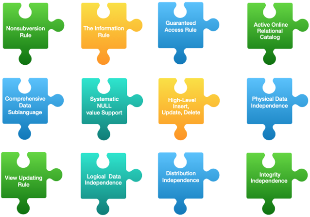
---|---

Based on these 12 postulates and the theory of relational databases, the following fundamental properties of mathematical theory can be distinguished (compared with the real requirements that the business brought based on their needs and requirements)

| Mathematical model (in theory) | Business requirements (in real life) |
|--------------------------------|------------------------------------------------------------------|
| 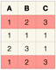 It is not possible to have duplicates in relation! | 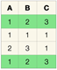 There may be duplicates in relation                              |
| 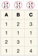 There is no concept of data ordering in relation!  | 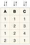 The ordering of data in relation is one of the main requirements |
| 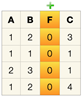 There is no concept of ordering attributes in relation! | 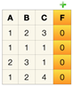 There is a specific order of attributes for a physical table     |
| 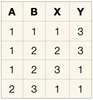 Relation attribute value must be atomic and indivisible! | 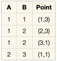 Relation attribute value can be complex structure                |
|  The attribute name must be explicitly set! | 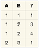 Attribute name relationship may not be defined                   |
| 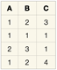 Duplicate attribute names are not allowed! | 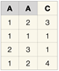 It is possible to duplicate attribute names of a relation        |
| 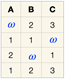 NULL value means missing or inapplicable information | 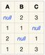 NULL value means 3rd state of logic with True and False          |

<h2 id="chapter-ii">Chapter II</h2>
<h2 id="general-rules" >General Rules</h2>

- Use this page as the only reference. Do not listen to any rumors and speculations on how to prepare your solution.
- Please make sure you are using the latest version of PostgreSQL.
- Please make sure you have installed and configured the latest version of Flyway by Redgate.
- Please use our [internal SQL Naming Convention rules](https://docs.google.com/document/d/1IxIOFUeb-8Z8fBOfkXiy4SkN-J1mPIXveJZUCNZFdp8/edit?usp=sharing)
- Please use our [Terms and Definitions](https://docs.google.com/document/d/1_ZTDpHcfYMASZ5BtnldurQLF0fJygGF1yuTwik0DOqk/edit?usp=sharing) document 
- That is completely OK if you are using IDE to write a source code (aka SQL script) and make a syntax check before migration at the final database solution by Flyway.
- Comments are also good in the SQL scripts. Anyway be careful with signs /*...*/ directly in SQL. These special symbols are used for Database Hints to improve SQL performance and these are not just comment marks :-).
- Pay attention to the permissions of your files and directories.
- To be assessed your solution must be in your GIT repository.
- Your solutions will be evaluated by your piscine mates.
- You should not leave in your directory any other file than those explicitly specified by the exercise instructions. It is recommended that you modify your .gitignore to avoid accidents.
- Do you have a question? Ask your neighbor on the right. Otherwise, try with your neighbor on the left.
- Your reference manual: mates / Internet / Google. 
- Read the examples carefully. They may require things that are not otherwise specified in the subject.
- And may the SQL-Force be with you!
- Absolutely everything can be presented in SQL! Let’s start and have fun!

<h2 id="chapter-iii">Chapter III</h2>
<h2 id="rules-of-the-day">Rules of the day</h2>

- Please make sure you have a separated database “data” on your PostgreSQL cluster. 
- Please make sure you have a database schema “data” in your “data” database.
- Please make sure you are working through database user “data” and password “data” with super admin permissions for your PostgreSQL cluster. 
- Each exercise of the day needs a Flyway tool for right versioning of the “data” database through user “data”.
- Please make changes in your “flyway.conf” file (located in “~/flyway-6.x.x/conf” directory) directly to configure a right and stable connection to your PostgreSQL database.

    - flyway.url = jdbc:postgresql://hostname:5432/data 
        - where hostname is DNS / IP address of PostgreSQL server 
        - where port is a port of PostgreSQL server , by default is 5432
        (`jdbc:postgresql://localhost:5432/data` OR  `jdbc:postgresql://127.0.0.1:5432/data`)
    - flyway.user = data
    - flyway.password = data
    - flyway.schemas = data
    - flyway.defaultSchema = data
- Please use the command line for Flyway to migrate changes into the database and get information about the current version from the database.
- Please don’t append additional parameters for “flyway” in a command line, all needed parameters should be changed in “flyway.conf” file
- All tasks contain a list of Allowed and Denied sections with listed database options, database types, SQL constructions etc. Please have a look at the section before you start.

<h2 id="chapter-iv">Chapter IV</h2>
<h2 id="exercise-00-experiments-with-sets-in-sq">Exercise 00 - Experiments with Sets in SQ</h2>

| Exercise 00: Experiments with Sets in SQL |                                                                                                                          |
|-------------------------------------------|--------------------------------------------------------------------------------------------------------------------------|
| Turn-in directory                         | ex00                                                                                                                     |
| Files to turn-in                          | `V080__create_dictionary_view.sql`                                                                                         |
| **Allowed**                                   |                                                                                                                          |
| Operators                                 | Standard DDL / DML operators to create / alter relations and to insert / update / delete / select data (CRUD operations) |
| Database objects                          | Database Views                                                                                                           |
| **Denied**                                    |                                                                                                                          |
| Database Commands                         | CREATE OR REPLACE VIEW ...                                                                                               |
| SQL Keywords                              | ALL in commands are<ul><li>UNION ALL</li><li>INTERSECT ALL</li><li>EXCEPT ALL</li></ul>                                                                                                    |

Aliens want a generic view of the data from their `v_dictionary_unit` and `v_dictionary_land` database views.
- create a database view `v_dictionary` which is obtained by combining (UNION) the two specified views in ascending order for the *value* column.

After verifying the release in detail, Aliens concluded that data retrieval based on the union of two database views, `v_dictionary_unit` and `v_dictionary_land`, is incorrect because  they want to retrieve the entirety of the dictionary table data.
- create a new database view `v_dictionary_all` with the fields `{id, dic_name, value}` based on direct access to all rows from the *dictionary* table (just ignore chronological model)  and define ascending sorting within the sub-dictionary (`dic_name` column) and by the *value* column.

Help Aliens write some additional database views based on existing objects and information
- Create a database view `v_dictionary_minus` using the subtract (EXCEPT) SQL operation.  Find the difference between `v_dictionary_all` and `v_dictionary_land` with three fields `{id, dic_name, value}` as a result.
- 	Create a database view v_dictionary_intersect using the intersection (INTERSECT) operation.  Find the intersection of the three database views `v_dictionary_all`, `v_dictionary_land`, and `v_dictionary_unit` (in that order) with the result of the three fields `{id, dic_name, value}`.
- 	Create a database view `v_dictionary_symmetric_minus` using the Symmetric Difference formula of two sets(`AΔB=(A∪B)\(A∩B)`), calculate the result of its execution for A=`v_dictionary_all` and B=`v_dictionary_land`.

Please don’t forget comments for each database view and column! :-)

<h2 id="chapter-v">Chapter V</h2>
<h2 id="exercise-01-joins-in-sql">Exercise 01 - JOINs in SQL</h2>

| Exercise 01: JOINs in SQL |                                                                                                                          |
|---------------------------|--------------------------------------------------------------------------------------------------------------------------|
| Turn-in directory         | ex01                                                                                                                     |
| Files to turn-in          | `V090__new_additional_views.sql`                                                                                           |
| **Allowed**                   |                                                                                                                          |
| Operators                 | Standard DDL / DML operators to create / alter relations and to insert / update / delete / select data (CRUD operations) |
| Database objects          | Database Views                                                                                                           |
| Database Commands         | CREATE OR REPLACE VIEW ...                                                                                               |
| Functions                 | <ul><li>round(...)</li><li>coalesce(...)</li></ul>                                                                                                 |
| **Denied**                    |                                                                                                                          |
| Static ID                 | Don’t use a static ID (red font) for SQL statements in exercise.

INSERT INTO country (name, `object_type_id`)  VALUES (‘Gibraltar’, **2**);
SELECT `*` FROM country WHERE `par_id` = **2**;
SELECT setval(`seq_country`, **2**);

In these cases,  **2** is a static (hard-coded) value, use SQL subquery to get a dynamic ID value.                                                                              |

Aliens finally want to see the results of their work, having received data from the `country`, `indicator` and `country_indicator` tables for the corresponding date
-	Using INNER JOIN construction, help Aliens create a database view `v_country_indicator` with fields `{country_name, indicator_name, value, actual_date}` and sorted by indicator name, country name and indicator value date in descending mode.
-	The sample result of database view `v_country_indicator` is below

| country_name | indicator_name           | value   | actual_date                |
|--------------|--------------------------|---------|----------------------------|
| Afghanistan  | Area of the land         | 6999740 | 2020-01-05 00:00:00.000000 |
| Afghanistan  | Infected humans COVID-19 | 34      | 2020-08-31 00:00:00.000000 |
| Afghanistan  | Infected humans COVID-19 | 39      | 2020-08-30 00:00:00.000000 |
| ...          | ...                      | ...     | ...                        |

In order to understand which country belongs to which territory (SELF JOIN) - Aliens are trying to create a relationship that describes this dependence.
-	Create a database view `v_continent_country` with columns `{continent_name, country_name}` sorted by continent and country.
-	The sample result of database view `v_continent_country` (must return 195 rows) is below

| continent_name | country_name |
|----------------|--------------|
| Africa         | Algeria      |
| Africa         | Angola       |
| ...            | ...          |
| South America  | Uruguay      |

Please don’t forget comments for each database view and column! 

In order to set up monitoring over critical data in the database, it was decided to check the presence of the “Infected humans COVID-19” indicator values for all records of the country table (including continents) as of May 1, 2020.
-	Using LEFT JOIN construction create a database view `v_check_country_01_05_2020_COVID` with columns *{name, value}* that returns all countries (please use all content country table without filtering for *country / continent* types), (*country* table is on the LEFT side of JOIN), with the current “*Infected humans COVID-19*” indicator and *null* if no corresponding value exists.
-	The sample result of database view `v_check_country_01_05_2020_COVID` is below
Please pay attention to the return result. We have to get  all rows with an empty *value* (other words null value) column only for `country_indicator` table! If indicator value is presented for a row then we don’t show this row in the resulting dataset.

| name       | value |
|------------|-------|
| Europe     | null  |
| Africa     | null  |
| Antarctica | null  |
| Asia       | null  |

Aliens want to change SQL syntax of existing database view `v_average_humans_per_country` (in other words, need to create a semantic equivalent of existing SQL query). Please recreate (use CREATE OR REPLACE VIEW statement) a view `v_average_humans_per_country` by using LEFT JOIN and INNER JOIN constructions instead of all subqueries.

-	the new SQL pattern of the database view `v_average_humans_per_country` must satisfy the form below

        SELECT c.name,
                some_formula AS value
        FROM country c
             … JOIN …
             … JOIN …
             … JOIN …
        ...

-	the sample of the result (must contain 195 rows again) from `v_average_humans_per_country` database view is presented below (must be semantic equivalent as a previous version of database view `v_average_humans_per_country`)

| name   | value |
|--------|-------|
| ...    | ...   |
| Chile  | 0.532 |
| Guyana | 0.073 |
| ...    | ...   |

<h2 id="chapter-vi">Chapter VI</h2>
<h2 id="exercise-02-cte-common-table-expressions">Exercise 02 - CTE (Common Table Expressions)</h2>

| Exercise 02: CTE (Common Table Expressions) |                                                                                                                          |
|---------------------------------------------|--------------------------------------------------------------------------------------------------------------------------|
| Turn-in directory                           | ex02                                                                                                                     |
| Files to turn-in                            | `V100__cte_view.sql    `                                                                                                   |
| **Allowed**                                     |                                                                                                                          |
| Operators                                   | Standard DDL / DML operators to create / alter relations and to insert / update / delete / select data (CRUD operations) |
| Database objects                            | Database Views                                                                                                           |
| Functions                                   | coalesce(...)                                                                                                            |
| Database commands                           | WITH cte_name AS (...) ...                                                                                               |
| **Denied**                                      |                                                                                                                          |
| Database Commands                           | CREATE OR REPLACE VIEW ...                                                                                               |

The query code for the database view `"v_check_country_01_05_2020_COVID"` which turned out to be hard to read  in the previous step for the Aliens Support Team. Therefore it was decided to rewrite it using the SQL CTE (Common Table Expressions) approach.  Create a database view `"v_check_country_01_05_2020_COVID_cte"` which must satisfy the following rules 
-	Create a separate SQL CTE named `"id_indicator_infected_humans_COVID"` - getting ID from the “*indicator*” table named “*Infected humans COVID-19*” indicator
-	Create a separate SQL CTE named `"country_indicator_by_id"` - getting a list of all rows from the table `"country_indicator"` based on filtering by the nested CTE `"id_indicator_infected_humans_COVID"`
-	The body of the main query must also contain a LEFT JOIN with columns {name, value}, which returns all records from the reference list of the countries (including continents),  (country table is on the LEFT side of JOIN) with the current value of the "*Infected humans COVID-19*" indicator and null if no corresponding value exists.
Please pay attention to the return result. We have to get  all rows with an empty value (other words null value) column only for `country_indicator` table! If indicator value is presented for a row then we don’t show this row in the resulting dataset.
-	Please don’t forget comments for each database view and column! 

Aliens need to be sure about equality of returned data of both existing database views `v_check_country_01_05_2020_COVID` and `v_check_country_01_05_2020_COVID_cte`.
-	Create a new database view `v_check_country_01_05_2020_COVID_check` with columns `{name_cte, name_previous, check_row}` which checks returned data of both database views and compares (FULL JOIN) rows between them. 
-	The formula of column `check_row` must return True | False. (True if values are equal and False in other cases). The `name_cte` column corresponds to the name column of database view `v_check_country_01_05_2020_COVID_cte`. The `name_previous` column corresponds to the name column of database view `v_check_country_01_05_2020_COVID`. 
-	The result must be sorted by `name_cte`, `name_previos`  columns (use NULLS FIRST construction for each sorted column)
-	Anyway please don’t forget comments for each database view and column! 
-	The sample of the result from `v_check_country_01_05_2020_COVID_check` database view is presented below 

| name_cte      | name_previos  | check_row |
|---------------|---------------|-----------|
| Europe        | Europe        | true      |
| Africa        | Africa        | true      |
| ...           | ...           | ...       |
| South America | South America | true      |

<h2 id="chapter-vii">Chapter VII</h2>
<h2 id="exercise-03-not-exists-or-not-in-that-is-the-question">Exercise 03 - NOT EXISTS or NOT IN that is the question</h2>

| Exercise 03: NOT EXISTS or NOT IN that is the question |                                                                                                                          |
|--------------------------------------------------------|--------------------------------------------------------------------------------------------------------------------------|
| Turn-in directory                                      | ex03                                                                                                                     |
| Files to turn-in                                       | `V110__views_in_exists.sql`                                                                                                |
| **Allowed**                                                |                                                                                                                          |
| Operators                                              | Standard DDL / DML operators to create / alter relations and to insert / update / delete / select data (CRUD operations) |
| Database objects                                       | Database Views                                                                                                           |

Aliens want to understand which indicators that exist in the system are not being used.  But since they have a SQL Performance Engineer in their team, who wants to compare the performance of the [NOT] EXISTS / [NOT] IN command.  In this regard, it was decided to create 2 semantically equivalent (but syntactically different) database views with the following rules for obtaining data
-	get all rows of the indicator table that are not involved in any way in storing the values of the indicator and country linkage.  Here you need to use the SQL keyword NOT EXISTS and specify the name database view `v_missing_indicators_exists`
-	get all rows of the indicator table that are not involved in any way in storing the values of the indicator and country linkage.  Here you need to use the SQL keyword NOT IN and specify the database view name `v_missing_indicators_in`
-	please don’t forget comments for each database view and column! 

<h2 id="chapter-viii">Chapter VIII</h2>
<h2 id="exercise-04-new-table-is-going-to-born">Exercise 04 - New Table is going to born</h2>

| Exercise 04: New Table is going to born |                                                                                                                          |
|-----------------------------------------|--------------------------------------------------------------------------------------------------------------------------|
| Turn-in directory                       | ex04                                                                                                                     |
| Files to turn-in                        | `V120__create_copy_table.sql       `                                                                                       |
| **Allowed**                                 |                                                                                                                          |
| Operators                               | Standard DDL / DML operators to create / alter relations and to insert / update / delete / select data (CRUD operations) |
| Database objects                        | Database Views                                                                                                           |
| Database commands                       | <ul><li>CREATE TABLE … (LIKE … INCLUDING ALL)</li><li>INSERT INTO …  SELECT ...</li></ul>                                                                                     |
| Database tables                         | Original Heap Tables                                                                                                     |
| **Denied**                                  |                                                                                                                          |
| Database tables                         | Other types of database tables                                                                                           |
| Database objects                        | -          user defined anonymous blocks, functions and procedures                                                       |

A separate Aliens team has appeared which oversees the countries of the continent “*North America*”.  This separate command asked to create a copy of the country table based on the following rules
-	the table must be Heap Table and named `country_north_america`
-	the table must include all the declared constraints / unique / primary keys of the original *country* table
-	the table should only contain rows that correspond to the continent "North America"
-	this change in the database should **only consist of two** SQL commands as maximum
    -	CREATE TABLE … 
    -	INSERT is on based on SELECT statement
-	please don’t forget to change the comments for a new table and columns! Because we copy comments from the source table!  
