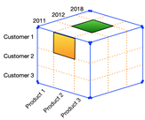

# Day 04 - Databases boot camp

Introduction into an OLAP

*Resume: Today you will find out  techniques and practices how to take aggregated data based on SQL language*

## Contents

1. [Chapter I](#chapter-i) \
    1.1. [Preamble](#preamble)
2. [Chapter II](#chapter-ii) \
    2.1. [General Rules](#general-rules)
3. [Chapter III](#chapter-iii) \
    3.1. [Rules of the day](#rules-of-the-day)  
4. [Chapter IV](#chapter-iv) \
    4.1. [Exercise 00 - Aggregating Day!](#exercise-00-aggregating-day)  
5. [Chapter V](#chapter-v) \
    5.1. [Exercise 01 - Aggregating Day! Part II](#exercise-01-aggregating-day-part-ii)  
6. [Chapter VI](#chapter-vi) \
    6.1. [Exercise 02 - Everything is material in this world](#exercise-02-everything-is-material-in-this-world)  
7. [Chapter VII](#chapter-vii) \
    7.1. [Exercise 03 - One transaction means one deal!](#exercise-03-one-transaction-means-one-deal)  

<h2 id="chapter-i" >Chapter I</h2>
<h2 id="preamble" >Preamble</h2>

Interstellar Movie bookshelf episode

What do you think - what does a multidimensional space look like containing so many planes?  It is hard to imagine? I absolutely agree with you. But it's easy to imagine them in relational databases!

Before diving into multidimensional space, two concepts of relational databases need to be introduced
- **OLTP** (**O**n**L**ine **T**ransactional **P**rocessing)
it is a type of database with fast change requests and data retrieval
- **OLAP** (**O**n**L**ine **A**nalytical **P**rocessing)
it is a type of database with heavy (in terms of resources and execution time) queries on data aggregations.

Let's take a closer look at OLAP.  Basically we have a fact table (green square) in the middle and a lot of blue squares that connect to the fact table based on foreign keys.  For example the “Star” model contains the topology on the right.  There is also the "Snowflake" model - the difference is that it contains several levels of reference tables.

In other words, we have a convolution of planes, but what if we “glue” these planes and… voila, we get the same n-dimensional space or n-dimensional cube!

Turning this n-dimensional cube in different planes, we always see a new face in front of us, containing new coordinates.  In relational databases, rotating an n-dimensional cube is nothing more than a GROUP BY operation along the coordinate axes.

Possible operations on OLAP cube:
- Rotate
- Drill Up
- Drill Down

<h2 id="chapter-ii">Chapter II</h2>
<h2 id="general-rules" >General Rules</h2>

- Use this page as the only reference. Do not listen to any rumors and speculations on how to prepare your solution.
- Please make sure you are using the latest version of PostgreSQL.
- Please make sure you have installed and configured the latest version of Flyway by Redgate.
- Please use our [internal SQL Naming Convention rules](https://docs.google.com/document/d/1IxIOFUeb-8Z8fBOfkXiy4SkN-J1mPIXveJZUCNZFdp8/edit?usp=sharing)
- Please use our [Terms and Definitions](https://docs.google.com/document/d/1_ZTDpHcfYMASZ5BtnldurQLF0fJygGF1yuTwik0DOqk/edit?usp=sharing) document
- That is completely OK if you are using IDE to write a source code (aka SQL script) and make a syntax check before migration at the final database solution by Flyway.
- Comments are also good in the SQL scripts. Anyway be careful with signs /\*...\*/ directly in SQL. These special symbols are used for Database Hints to improve SQL performance and these are not just comment marks :-).
- Pay attention to the permissions of your files and directories.
- To be assessed your solution must be in your GIT repository.
- Your solutions will be evaluated by your piscine mates.
- You should not leave in your directory any other file than those explicitly specified by the exercise instructions. It is recommended that you modify your .gitignore to avoid accidents.
- Do you have a question? Ask your neighbor on the right. Otherwise, try with your neighbor on the left.
- Your reference manual: mates / Internet / Google.
- Read the examples carefully. They may require things that are not otherwise specified in the subject.
- And may the SQL-Force be with you!
- Absolutely everything can be presented in SQL! Let’s start and have fun!

<h2 id="chapter-iii">Chapter III</h2>
<h2 id="rules-of-the-day">Rules of the day</h2>

- Please make sure you have a separated database “data” on your PostgreSQL cluster. 
- Please make sure you have a database schema “data” in your “data” database.
- Please make sure you are working through database user “data” and password “data” with super admin permissions for your PostgreSQL cluster. 
- Each exercise of the day needs a Flyway tool for right versioning of the “data” database through user “data”.
- Please make changes in your “flyway.conf” file (located in “~/flyway-6.x.x/conf” directory) directly to configure a right and stable connection to your PostgreSQL database.

    - flyway.url = jdbc:postgresql://hostname:5432/data 
        - where hostname is DNS / IP address of PostgreSQL server 
        - where port is a port of PostgreSQL server , by default is 5432
        (jdbc:postgresql://localhost:5432/data OR  jdbc:postgresql://127.0.0.1:5432/data)
    - flyway.user = data
    - flyway.password = data
    - flyway.schemas = data
    - flyway.defaultSchema = data
- Please use the command line for Flyway to migrate changes into the database and get information about the current version from the database.
- Please don’t append additional parameters for “flyway” in a command line, all needed parameters should be changed in “flyway.conf” file
- All tasks contain a list of Allowed and Denied sections with listed database options, database types, SQL constructions etc. Please have a look at the section before you start.

<h2 id="chapter-iv">Chapter IV</h2>
<h2 id="exercise-00-generic-dictionary-table">Exercise 00 - Aggregating Day!</h2>

|Exercise 00: Aggregating Day!||
---|---
Turn-in directory|ex00|
Files to turn-in| `V190__aggregating_views.sql`|
**Allowed**||
Operators| Standard DDL / DML operators to create / alter relations and to insert / update / delete / select data (CRUD operations) |
SQL keywords| <ul><li>GROUP BY</li><li>HAVING</li><li>DISTINCT</li></ul>|
SQL aggregating built-in functions | <ul><li>count(...)</li></ul>
Database Naming Convention | [internal SQL Naming Convention rules](https://docs.google.com/document/d/1IxIOFUeb-8Z8fBOfkXiy4SkN-J1mPIXveJZUCNZFdp8/edit?usp=sharing)<ul><li>pattern for view</li></ul>
Database objects | views
**Denied** |
Database objects | user defined anonymous blocks, functions and procedures

Aliens decided to analyse the collected data based on the aggregations offered by relational databases.

- Using the result returned by database view `v_continent_country`, create a database view `v_country_groupped` that returns data in aggregated order by country / continent name and sorted by the first column in the format below.

`continent_name` | cnt
---|---
Africa|54
Asia|43
...|...
South America|12
United Kingdom|2

- using the result returned by database view `v_continent_country`, create a database view `v_country_groupped_having_50` that returns data in aggregated order by country / continent name, provided that the number of subordinate records is greater than 50 (use the HAVING construction). Please take a look at the sample below.

`continent_name`|cnt
---|---
Africa|54

- using the country table and HAVING construct, create a database view `v_country_name_duplicates` that returns all the duplicate values ​​of the name column in one query.

`name`|
---|
Australia|

- using the `country_indicator` table and the **DISTINCT** construct, create a database view `v_unique_actual_dates` that returns unique values ​​(not duplicates) of the `actual_date` column in a single query sorted by the returned column.      
The sample of output is shown below:

 
`actual_date`|
|---|
2019-01-01 00:00:00.000000
2019-02-01 00:00:00.000000
...
2020-08-30 00:00:00.000000
2020-08-31 00:00:00.000000

Don’t forget about comments for new database views and columns!

<h2 id="chapter-v">Chapter V</h2>
<h2 id="exercise-01-aggregating-day-part-ii">Exercise 01 - Aggregating Day! Part II</h2>

Exercise 00: Aggregating Day! Part II||
---|---
Turn-in directory|ex01
Files to turn-in|`V200__new_aggregating_views.sql`
**Allowed**
Operators|Standard DDL / DML operators to create / alter relations and to insert / update / delete / select data (CRUD operations)
SQL keywords|<ul><li>GROUP BY</li><li>HAVING DISTINCT</li><li>LIMIT</li><li>ORDER BY</li></ul>
SQL aggregating built-in functions|<ul><li>sum(...)</li><li>max(...)</li><li>min(...) <li>count(...)</li><li>avg(...)</li></ul>
SQL built-in functions|<ul><li>round(...)</li></ul>		
Database Naming Convention| [internal SQL Naming Convention rules](https://docs.google.com/document/d/1IxIOFUeb-8Z8fBOfkXiy4SkN-J1mPIXveJZUCNZFdp8/edit?usp=sharing)<ul><li>pattern for view</li></ul>
**Denied**||
Static ID | Don’t use a static ID (red font) for SQL statements in exercise.
`INSERT INTO country (name, object_type_id) VALUES (‘Gibraltar’, 2);`
`SELECT  *  FROM  country  WHERE  par_id = 2;`
 `SELECT  setval(‘seq_country’, 2);`

In these cases, 2 is a static (hard-coded) value,use SQL subquery to get a dynamic ID value.|
Database objects|user defined anonymous blocks, functions and procedures

Aliens decided to analyse the received (as you remember recently recovered after sabotage) data into the `country_indicator` table.

-	Create a database view `v_country_indicator_unemployment_rate` that returns countries (in one query) from the `country_indicator` table with information on the “*Unemployment rate*” indicator (use subquery to get ID by indicator name) for all the periods presented in the format country / territory name, *maximum value, minimum value, average  value* (rounded to two decimal places), count of rows for each record, and range (which is calculated using the formula *maximum value - minimum value*).  Sorting data by country name.  The sample of the output is below (note the naming of the columns - they must be explicitly specified).

| name        | maximum | minimum | average   | amount | range  |
|-------------|---------|---------|-----------|--------|--------|
| Afghanistan | 868529  | 52205   | 541122.58 | 12     | 816324 |
| ...         | ...     | ...     | ...       | ...    | ...    |
| Zimbabwe    | 999055  | 351614  | 643669.42 | 12     | 647441 |

-	Create a database view `v_country_indicator_infected_humans_covid` which returns TOP-10 countries (with one query) from the `country_indicator` table with information on the “*Infected humans COVID-19*” indicator (use subquery to get ID by indicator name) for all the periods presented in the format country / territory name, *maximum  value, minimum value, average value* (rounded to two decimal places), count of rows for each record, and *summarize value*.  Sorting data by the column sum of values by country in descending order.  The sample of displaying TOP-10 countries by the number of infected for all indicated periods is below (pay attention to the naming of the columns - they must be explicitly indicated).

| name                     | maximum | minimum | average | amount | total |
|--------------------------|---------|---------|---------|--------|-------|
| Burundi                  | 100     | 1       | 56.93   | 123    | 7002  |
| Malta                    | 98      | 0       | 56.74   | 123    | 6979  |
| Argentina                | 99      | 1       | 55.47   | 123    | 6823  |
| Japan                    | 100     | 0       | 55.39   | 123    | 6813  |
| United States of America | 100     | 0       | 54.98   | 123    | 6763  |
| Croatia                  | 99      | 5       | 54.94   | 123    | 6758  |
| Grenada                  | 99      | 3       | 54.93   | 123    | 6757  |
| Guyana                   | 99      | 0       | 54.83   | 123    | 6744  |
| Malawi                   | 99      | 1       | 54.57   | 123    | 6712  |
| Brazil                   | 98      | 0       | 53.96   | 123    | 6637  |

Don’t forget about comments for new database views and columns! 

<h2 id="chapter-vi">Chapter VI</h2>
<h2 id="exercise-02-everything-is-material-in-this-world">Exercise 02 - Everything is material in this world</h2>

| Exercise 02: Everything is material in this world |                                                                                                                          |
|---------------------------------------------------|--------------------------------------------------------------------------------------------------------------------------|
| Turn-in directory                                 | ex02                                                                                                                     |
| Files to turn-in                                  | `V300__create_materialized_view.sql`
`V310__refresh_materialized_view.sql`                                                                                      |
| **Allowed**                                           |                                                                                                                          |
| Operators                                         | Standard DDL / DML operators to create / alter relations and to insert / update / delete / select data (CRUD operations) |
| Database objects                                  | materialized view                                                                                                        |
| Database Naming Convention                        | [internal SQL Naming Convention rules](https://docs.google.com/document/d/1IxIOFUeb-8Z8fBOfkXiy4SkN-J1mPIXveJZUCNZFdp8/edit?usp=sharing)<ul><li>pattern for materialized view</li></ul>                                                                                 |
| **Denied**                                            |                                                                                                                          |
| Database objects                                  | <ul><li>views</li><li>user defined anonymous blocks, functions and procedures</li></ul>                                                       |

Alien Database Architect suggested using a materialized view concept to prepare aggregated data for replication to another orbital station.  His proposal was based on not receiving data directly from a table or database view, since this can have consequences on server resources, but to prepare them by making data snapshots with a certain period of data refresh time.

-	Create a materialized view `mv_country_indicator_infected_humans_covid` with the option NO DATA option (this means that initially the data will not be present in the materialized view and the materialized view itself will not be initialized). Don’t forget about comments for materialized database view and columns! 
To create a materialized view, use the `V300__create_materialized_view.sql` file
-	Initialize the materialized view `mv_country_indicator_infected_humans_covid` by data.  For this step use the file `V310__refresh_materialized_view.sql`

<h2 id="chapter-vii">Chapter VII</h2>
<h2 id="exercise-03-one-transaction-means-one-deal">Exercise 03 - One transaction means one deal!</h2>

| Exercise 03: One transaction means one deal! |                                                                                                                          |
|----------------------------------------------|--------------------------------------------------------------------------------------------------------------------------|
| Turn-in directory                            | ex03                                                                                                                     |
| Files to turn-in                             | `V400__update_content_value_austria.sql`                                                                                   |
| **Allowed**                                      |                                                                                                                          |
| Operators                                    | Standard DDL / DML operators to create / alter relations and to insert / update / delete / select data (CRUD operations) |
| **Denied**                                       |                                                                                                                          |
| SQL statements                               | UPDATE as original SQL statement                                                                                         |
| Static ID                                    | Don’t use a static ID (red font) for SQL statements in exercise.
`INSERT INTO country (name, object_type_id)  VALUES (‘Gibraltar’, 2);`
`SELECT * FROM country WHERE par_id = 2;`
`SELECT setval(‘seq_country’, 2);`
In these cases,  2 is a static (hard-coded) value, use SQL subquery to get a dynamic ID value.

Aliens began to receive new data on the “Infected humans COVID-19” indicator, and it was noticed that the sent data may contain values for past periods, and since the `country_indicator` table has a unique key = `{country, indicator, actual_date}`, errors will appear for insertion.

-	write UPSERT - a SQL statement (INSERT ON CONFLICT) that will insert a row (if there is no such data) presented in the table, otherwise it should update the value based on the existing unique key

| country | value    | `actual_date` |
|---------|----------|-------------|
| Austria | 31415926 | 01.05.2020  |

-	After that, refresh data in our materialized view `mv_country_indicator_infected_humans_covid` to get a fresher data after this UPSERT.
