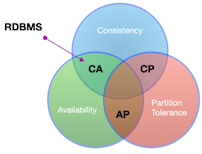
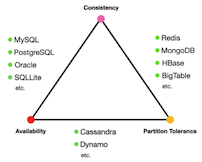

# Day 06 - Database Boot camp

Push a trigger on your gun

*Resume: Today you will learn how to store modified data in a database and how to share data between inherited tables*

## Contents

1. [Chapter I](#chapter-i) \
    1.1. [Preamble](#preamble)
2. [Chapter II](#chapter-ii) \
    2.1. [General Rules](#general-rules)
3. [Chapter III](#chapter-iii) \
    3.1. [Rules of the day](#rules-of-the-day)  
4. [Chapter IV](#chapter-iv) \
    4.1. [Exercise 00 - Let’s log a critical dictionary data!](#exercise-00-log-critical-dictionary-data)  
5. [Chapter V](#chapter-v) \
    5.1. [Exercise 01 - Need to set crazy hours](#exercise-01-need-set-crazy-hours)
6. [Chapter VI](#chapter-vi) \
    6.1. [Exercise 02 - Someone is out of rules](#exercise-02-someone-out-of-rules)    
7. [Chapter VI](#chapter-vi) \
    6.1. [Exercise 03 - Let’s distribute our data](#exercise-03-lets-distribute-our-data)    

<h2 id="chapter-i" >Chapter I</h2>
<h2 id="preamble" >Preamble</h2>

Στοιχεῖα

“Elementa” is the main work of Euclid which was written around 300 BC.  There he gives various aspects of planimetry, stereometry, arithmetics, number theory and much more including initial definitions of geometric shapes:
- “The point is something that has no parts”
- “Line is the length without width”
- etc.

You agree that everything is very logical and simple!  And what about Euclid's theorem?
 
- “There are infinitely many prime numbers”

A brief statement which is one of the cornerstones for mathematicians so that they can rely on it to develop mathematics as a science further.

Database theory also has definitions, axioms, theorems.  For example, one of them is called the CAP theorem (or Brewer’s theorem) which says “it’s impossible for a distributed data store to provide more than 2 rules from **Consistency**, **Availability** and **Partition tolerance**”.

This should be understood as follows.  We can choose only two letters `{CA, CP, AP}` out of three possible in order for the database to fit a certain purpose (or project).  Agree that it looks like a multiverse and relational databases (RDBMS) occupy only one part of it. Is it worth thinking about?

And this magic triangle on the left demonstrates already specific databases suitable for a combination of characters.
Does it look like a conspiracy of the Masonic order with their All-Seeing Eye emblem?  :-)

<h2 id="chapter-ii">Chapter II</h2>
<h2 id="general-rules" >General Rules</h2>

- Use this page as the only reference. Do not listen to any rumors and speculations on how to prepare your solution.
- Please make sure you are using the latest version of PostgreSQL.
- Please make sure you have installed and configured the latest version of Flyway by Redgate.
- Please use our [internal SQL Naming Convention rules](https://docs.google.com/document/d/1IxIOFUeb-8Z8fBOfkXiy4SkN-J1mPIXveJZUCNZFdp8/edit?usp=sharing)
- Please use our [Terms and Definitions](https://docs.google.com/document/d/1_ZTDpHcfYMASZ5BtnldurQLF0fJygGF1yuTwik0DOqk/edit?usp=sharing) document
- That is completely OK if you are using IDE to write a source code (aka SQL script) and make a syntax check before migration at the final database solution by Flyway.
- Comments are also good in the SQL scripts. Anyway be careful with signs /\*...\*/ directly in SQL. These special symbols are used for Database Hints to improve SQL performance and these are not just comment marks :-).
- Pay attention to the permissions of your files and directories.
- To be assessed your solution must be in your GIT repository.
- Your solutions will be evaluated by your piscine mates.
- You should not leave in your directory any other file than those explicitly specified by the exercise instructions. It is recommended that you modify your .gitignore to avoid accidents.
- Do you have a question? Ask your neighbor on the right. Otherwise, try with your neighbor on the left.
- Your reference manual: mates / Internet / Google.
- Read the examples carefully. They may require things that are not otherwise specified in the subject.
- And may the SQL-Force be with you!
- Absolutely everything can be presented in SQL! Let’s start and have fun!

<h2 id="chapter-iii">Chapter III</h2>
<h2 id="rules-of-the-day">Rules of the day</h2>

- Please make sure you have a separated database “data” on your PostgreSQL cluster. 
- Please make sure you have a database schema “data” in your “data” database.
- Please make sure you are working through database user “data” and password “data” with super admin permissions for your PostgreSQL cluster. 
- Each exercise of the day needs a Flyway tool for right versioning of the “data” database through user “data”.
- Please make changes in your “flyway.conf” file (located in “~/flyway-6.x.x/conf” directory) directly to configure a right and stable connection to your PostgreSQL database.

    - flyway.url = jdbc:postgresql://hostname:5432/data 
        - where hostname is DNS / IP address of PostgreSQL server 
        - where port is a port of PostgreSQL server , by default is 5432
        (jdbc:postgresql://localhost:5432/data OR  jdbc:postgresql://127.0.0.1:5432/data)
    - flyway.user = data
    - flyway.password = data
    - flyway.schemas = data
    - flyway.defaultSchema = data
- Please use the command line for Flyway to migrate changes into the database and get information about the current version from the database.
- Please don’t append additional parameters for “flyway” in a command line, all needed parameters should be changed in “flyway.conf” file
- All tasks contain a list of Allowed and Denied sections with listed database options, database types, SQL constructions etc. Please have a look at the section before you start.

<h2 id="chapter-iv">Chapter IV</h2>
<h2 id="exercise-00-log-critical-dictionary-data">Exercise 00 - Let’s log a critical dictionary data!</h2>

| Exercise 00: Let’s log a critical dictionary data! |                                                                                                                          |
|----------------------------------------------|--------------------------------------------------------------------------------------------------------------------------|
| Turn-in directory                            | ex00                                                                                                                     |
| Files to turn-in                             | `V800__dictionary_triggers.sql`                                                                                   |
| **Allowed**                                      |                                                                                                                          |
|Operators                                    | Standard DDL / DML operators to create / alter relations and to insert / update / delete / select data (CRUD operations) |
|Built-in functions| `user` |

Aliens decided to introduce the concept of data logging into their model, for this they decided to add database triggers for the dictionary table.  The trigger must work `AFTER UPDATE OR INSERT OR DELETE` events and save history of the change to a table with a structure that completely coincides with the structure of the dictionary table.

Help out with this task and complete the following points:
- Create table `dictionary_history`, with the columns shown below

| Column Name | Type | Description |
| ------ | ------ | ------ |
| id | SERIAL | Primary Key |
| time_modified | TIMESTAMP | Time of modified row.
NOT NULL 
DEFAULT current_timestamp()|
| action_type | CHAR(1) | Type of action
(“I” = INSERT,
“U” = UPDATE,
“D” = DELETE)
NOT NULL|
| user_modified | VARCHAR(50) | User name whose applied any change
NOT NULL|
| row_id | BIGINT | It’s a ID value from original dictionary table 
NOT NULL|
| dic_name | VARCHAR | NOT NULL |
| value | VARCHAR | NOT NULL |
| order_num | INTEGER | NOT NULL |
| time_start | TIMESTAMP | NOT NULL |
| time_end | TIMESTAMP |  NOT NULL |

- Don’t forget about comments for the new database table and for the columns!
- Add Check Constraint with name `ch_dictionary_history_action_type` to the `action_type` column which can only take three values `( … IN (‘I’, ‘U’, ‘D’) )`
- Create a trigger function named `zfnc_trg_change_dictionaryz` that uses NEW / OLD aliases that should save the fact of the  changing data from dictionary table to the `dictionary_history` table according to the rules below.
    - during INSERT operation the entire inserted row (NEW trigger alias) is saved
    - during DELETE operation save the deleted row (OLD trigger alias)
    - during UPDATE operation save the entire updated row (NEW trigger alias)
- Create a trigger named `trg_change_dictionary` with FOR EACH ROW type and processed events `AFTER UPDATE OR INSERT OR DELETE`
- Check the operability of the trigger function and trigger using SQL commands below like a final test your trigger (must be performed in the same order)
    - `INSERT INTO dictionary (id, dic_name, value) VALUES (20000, 'test', 'test');`
    - `UPDATE dictionary SET value = 'new_value'  WHERE id = 20000;`
    - `DELETE FROM dictionary WHERE id = 20000;`
If you checked your database trigger before the final test please truncate data from the `dictionary_history` table and repeat the final test.
Please use flyway file `V800__dictionary_triggers.sql` to write DDL for creation of a new table, trigger function and trigger itself.

<h2 id="chapter-v">Chapter V</h2>
<h2 id="exercise-01-need-set-crazy-hours">Exercise 01 - Need to set crazy hours</h2>

| Exercise 01: Need set crazy hours|                                                                                                                          |
|----------------------------------------------|--------------------------------------------------------------------------------------------------------------------------|
| Turn-in directory                            | ex01                                                                                                                     |
| Files to turn-in                             | `V900__working_hours_trigger.sql`                                                                                   |
| **Allowed**                                      |                                                                                                                          |
|Operators                                    | Standard DDL / DML operators to create / alter relations and to insert / update / delete / select data (CRUD operations) |
|Built-in functions| `current_time` |

Aliens decided to make a ban on changes to the data in the dictionary table during daily hours (except one second at midnight) in order to further protect themselves.  Please help out to cope with this task based on the points listed below
- you need to create a trigger function `fnc_trg_dictionary_check_working_hours` which should check that the current time should not be in the interval from 00:00 to 23:59 (or from 12 AM to 11:59 PM), in this case EXCEPTION should be raised with the text “Changing data is impossible! You have 1 second at midnight to make a change!”
- you need to create only one trigger named `trg_dictionary_check_working_hours` with FOR EACH ROW type and BEFORE UPDATE OR INSERT OR UPDATE processed events. Please pay attention to the return value in a trigger function, it depends on the processed event and then play with OLD and NEW aliases in a correct way.

<h2 id="chapter-vi">Chapter VI</h2>
<h2 id="exercise-02-someone-out-of-rules">Exercise 02 - Someone is out of rules</h2>

| Exercise 02: Someone is out of rules|                                                                                                                          |
|----------------------------------------------|--------------------------------------------------------------------------------------------------------------------------|
| Turn-in directory                            | ex02                                                                                                                     |
| Files to turn-in                             | `V1000__context_variable.sql`                                                                                   |
| **Allowed**                                      |                                                                                                                          |
|Operators                                    | Standard DDL / DML operators to create / alter relations and to insert / update / delete / select data (CRUD operations) |
|Built-in functions| `current_setting` |

Aliens faced the problem that senior DBA and Data Architect must control the data and the database itself around the clock and 24x7.  An obstacle arose for them based on the `fnc_trg_dictionary_check_working_hours` function trigger under a possible change in the data in the dictionary table.  On the other hand, the verification for changes during “crazy hours” is also very important.  A way was found to work around this limitation through context variables.

Modify the `fnc_trg_dictionary_check_working_hours` code with additional verification in the trigger body for the “SECRET” (in upper case) value for the context variable named “aliens.pass”. Be aware of exceptional situation if the “aliens.pass” variable is not defined in the user session. Actually, don’t need to modify the trigger `trg_dictionary_check_working_hours`.

In other words, if the DBA or Data Architect knows the word “SECRET” then engineer can use this knowledge in the following successful case for their session in the database at any time:

`...`

`SET aliens.pass = 'SECRET';`

`INSERT INTO dictionary (id, dic_name, value) VALUES (1000, 'test', 'test', 0);`

`...`

This approach should circumvent the “crazy hours” restriction for Aliens who are aware of this feature.

<h2 id="chapter-vii">Chapter VII</h2>
<h2 id="exercise-03-lets-distribute-our-data">Exercise 03 - Let’s distribute our data</h2>

| Exercise 03: Let’s distribute our data |                                                                                                                          |
|----------------------------------------------|--------------------------------------------------------------------------------------------------------------------------|
| Turn-in directory                            | ex03                                                                                                                     |
| Files to turn-in                             | `V1100__table_inheritance.sql`                                                                                   |
| **Allowed**                                      |                                                                                                                          |
| Operators                                    | Standard DDL / DML operators to create / alter relations and to insert / update / delete / select data (CRUD operations) |
| PostgreSQL function | `format` |
| **Denied**                                       |                                                                                                                          |
| PostgreSQL extensions                                    | `pg_partman` |
| SQL command                                    | `create table country_indicator_master (like country_indicator [including all]);` |
| SQL Pattern                                    | Do not create Child Inherited Tables in advance “by hands”! Everything should be automated! |

Data is growing fast!  Aliens received a monolithic and huge `country_indicator` table not to face unmanageable data volumes. It was decided to distribute data between smaller tables based on the Inherited Table approach.

Please help out with this task based on the points below.

- Create the `country_indicator_master` table based on the regular CREATE TABLE command with the  columns on appropriate types, check constraints, unique keys, foreign keys and of course, comments as in the `country_indicator` table and an explicit SERIAL type for the Primary Key.
- Only INSERT traffic for `country_indicator_master` table is supposed to be.
- Create a trigger function named `fnc_trg_inherited_country_indicator_master` that should check for the existence of a Child Inherited Table with a pattern named `country_indicator_master_c_id` (where `c_id` is the value of the `country_indicator_master` column).  If the table named `country_indicator_master_c_id` does not exist, then using Dynamic SQL in the trigger function you should create one before inserting the data.  You also need to create next objects for each child inherited table.
    - a dynamic check constraint named `ch_country_indicator_master_c_id` with the rule `(... CHECK (c_id = concrete_value) )`
    - a dynamic unique index named `uk_country_indicator_master_c_id` with the uniqueness of column values `{c_id, i_id, actual_date}`

**HINT**: In our case, table `country_indicator_master` plays a role of Router. Other words, our incoming traffic is balancing between Child Tables. Therefore, the `country_indicator_master` table must be empty anyway after loading data!

- Create a trigger named `trg_inherited_country_indicator_master` with FOR EACH ROW type and BEFORE INSERT processed events for `country_indicator_master` table
- Copy data into the `country_indicator_master` table from country_indicator table (except value for id column, because we have a separated sequence object)

Please use flyway file `V1100__table_inheritance.sql` for all steps.
