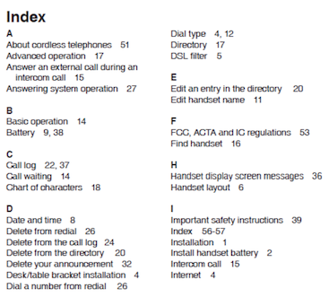
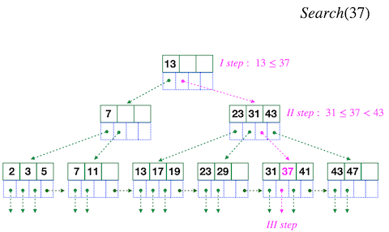
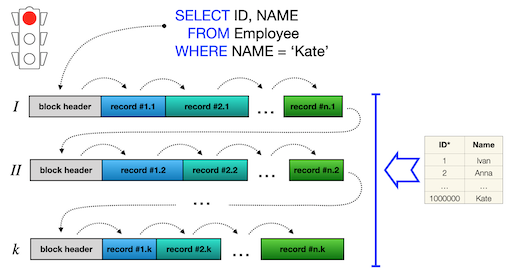
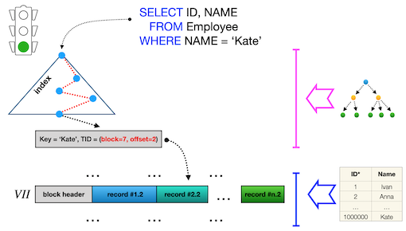
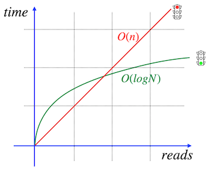
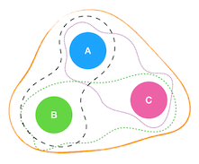
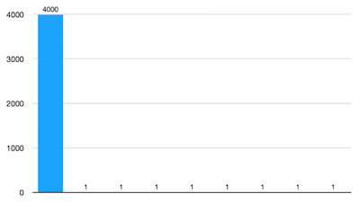

# Day 07 - Database Boot camp

Need For Speed

*Resume: Today you will learn how to speed up SQL queries based on specific indices-structures*

## Contents

1. [Chapter I](#chapter-i) \
    1.1. [Preamble](#preamble)
2. [Chapter II](#chapter-ii) \
    2.1. [General Rules](#general-rules)
3. [Chapter III](#chapter-iii) \
    3.1. [Rules of the day](#rules-of-the-day)  
4. [Chapter IV](#chapter-iv) \
    4.1. [Exercise 00 - Which index is the best for us?](#exercise-00-which-index-is-the-best-for-us)  
5. [Chapter V](#chapter-v) \
    5.1. [Exercise 01 - Special BTree index for special cases](#exercise-01-special-btree-index-for-special-cases)  
6. [Chapter VI](#chapter-vi) \
    6.1. [Exercise 02 - Partial data uniqueness](#exercise-02-partial-data-uniqueness)

<h2 id="chapter-i" >Chapter I</h2>
<h2 id="preamble" >Preamble</h2>

How to represent the index logically?  And why does it help in finding data based on conditions in SQL query?  The easiest way to "visualize" it is the Index chapter, which can be found at the end of any encyclopedia or reference book. The most basic property of this section is a sorted alphabetical list of terms with an indication of the book page.

The physical index almost coincides with the concept of Book Index.
- there is also a sorted list
- there are  also addresses in Tree Leaves (pointers) where data is physically located on disk / memory
But there are also some differences:
- data representation is described by B-Tree structure
- functioning of the structure is described in “Lehman & Yao Algorithm

If we compare how the same query works with or without an index, this can be seen in the visualization below.

Without an index we do sequential scan of the entire table and we greatly lose in the speed of query execution. (To be honest it depends on the data amount in the table. Sometimes more efficient to make sequential scan of a small table then use additional BTree index structure) 

It is much better with the pre-built index!  Here the Database determines the point addresses of finding strings on disk / memory and returns the result using essentially 2 structures (index and table).

The mathematical explanation of the complexity of the brute force approach (~ sequential scan) and the B-Tree search algorithm is very simple.
For example, if you are looking for the information on 1,000,000 rows and presumably it takes 1 second to process one row by the database, then we get the following
- Brute Force: 1 000 000 seconds
- B-Tree: log(1 000 000) or round to 14 seconds

<h2 id="chapter-ii">Chapter II</h2>
<h2 id="general-rules" >General Rules</h2>

- Use this page as the only reference. Do not listen to any rumors and speculations on how to prepare your solution.
- Please make sure you are using the latest version of PostgreSQL.
- Please make sure you have installed and configured the latest version of Flyway by Redgate.
- Please use our [internal SQL Naming Convention rules](https://docs.google.com/document/d/1IxIOFUeb-8Z8fBOfkXiy4SkN-J1mPIXveJZUCNZFdp8/edit?usp=sharing)
- Please use our [Terms and Definitions](https://docs.google.com/document/d/1_ZTDpHcfYMASZ5BtnldurQLF0fJygGF1yuTwik0DOqk/edit?usp=sharing) document 
- That is completely OK if you are using IDE to write a source code (aka SQL script) and make a syntax check before migration at the final database solution by Flyway.
- Comments are also good in the SQL scripts. Anyway be careful with signs /*...*/ directly in SQL. These special symbols are used for Database Hints to improve SQL performance and these are not just comment marks :-).
- Pay attention to the permissions of your files and directories.
- To be assessed your solution must be in your GIT repository.
- Your solutions will be evaluated by your piscine mates.
- You should not leave in your directory any other file than those explicitly specified by the exercise instructions. It is recommended that you modify your .gitignore to avoid accidents.
- Do you have a question? Ask your neighbor on the right. Otherwise, try with your neighbor on the left.
- Your reference manual: mates / Internet / Google. 
- Read the examples carefully. They may require things that are not otherwise specified in the subject.
- And may the SQL-Force be with you!
- Absolutely everything can be presented in SQL! Let’s start and have fun!

<h2 id="chapter-iii">Chapter III</h2>
<h2 id="rules-of-the-day">Rules of the day</h2>

- Please make sure you have a separated database “data” on your PostgreSQL cluster. 
- Please make sure you have a database schema “data” in your “data” database.
- Please make sure you are working through database user “data” and password “data” with super admin permissions for your PostgreSQL cluster. 
- Each exercise of the day needs a Flyway tool for right versioning of the “data” database through user “data”.
- Please make changes in your “flyway.conf” file (located in “~/flyway-6.x.x/conf” directory) directly to configure a right and stable connection to your PostgreSQL database.

    - flyway.url = jdbc:postgresql://hostname:5432/data 
        - where hostname is DNS / IP address of PostgreSQL server 
        - where port is a port of PostgreSQL server , by default is 5432
        (jdbc:postgresql://localhost:5432/data OR  jdbc:postgresql://127.0.0.1:5432/data)
    - flyway.user = data
    - flyway.password = data
    - flyway.schemas = data
    - flyway.defaultSchema = data
- Please use the command line for Flyway to migrate changes into the database and get information about the current version from the database.
- Please don’t append additional parameters for “flyway” in a command line, all needed parameters should be changed in “flyway.conf” file
- All tasks contain a list of Allowed and Denied sections with listed database options, database types, SQL constructions etc. Please have a look at the section before you start.

<h2 id="chapter-iv">Chapter IV</h2>
<h2 id="exercise-00-which-index-is-the-best-for-us">Exercise 00 - Which index is the best for us?</h2>

| Exercise 00: Which index is the best for us? |                                                                                                                          |
|----------------------------------------------|--------------------------------------------------------------------------------------------------------------------------|
| Turn-in directory                            | ex00                                                                                                                     |
| Files to turn-in                             | `V1200__index_coverage.sql`
`V1201__mv_index_coverage.sql`
custom pgbench script `bench_experiment01.sql`
screenshot with pgbench output results for a benchmark|
| **Allowed**                                      |                                                                                                                          |
| Operators                                    | Standard DDL / DML operators to create / alter relations and to insert / update / delete / select data (CRUD operations) |
| **Denied**                                       |                                                                                                                          |
| Type                                    | `SERIAL` |
| Database objects                                    | sequence
anonymous functional block
user defined procedures
user defined functions|

The Alien SQL Performance Engineer decided to test how the indices work before integrating them into the existing working model.  For this,  he conceived the following experiment.

- it is necessary to create a table `experiment_01` with columns with the appropriate types and with generation rules

| Name | Type | Generating Rules |
| ------ | ------ | ------ |
| A | BIGINT | Generated values must be in incremental ordering, please begin value from 1 by increment 1. |
| B | VARCHAR(100) | Random string of characters with maximum length |
| C | TIMESTAMP | Random timestamps in wide range (including hours / minutes) in 2020 year |
| D | BIGINT | Generated values must be in range `[100, 300]` |

- It is necessary to create all possible ones / pairs / triples / fours of B-Tree non-unique indices combinations (with the naming pattern `idx_column_list` where `column_list` is a list of columns that are used to form the index) for this experimental table in ascending mode for each involved column.  Each column from table `experiment_01` must appear exactly once in the index definition.

**HINT**: Mainly Index structure has a rule `Index(X, Y) ≠ Index(Y, X)` , where X, Y are table columns.

For example, on the left there is a graphical index coverage for a 3-column table (A, B, C), which corresponds to the following possible combinations for individual indices:
- Index(A)
- Index(B)
- Index(C)
- Index(A, B)
- Index(B, A)
- ...
- Index(A, B, C)
- Index(B, C, A)
- ...

- fill the table with 300 000 rows based on the `generate_series` data generation function

Prepare flyway file `V1200__index_coverage.sql` for these tasks above.

- please take a measure of the presented SQL below (this SQL is a small spoiler for a new course  “Advanced techniques in RDBMS” ;-) ) to get index coverage statistics. Prepare a custom benchmark for the pgbench tool based on presented SQL. Don’t forget about random value for benchmarking and set range from 1 to 10 000 000 for ID1, we do not care that it should match the existing A value from the table. Our goal is to load the database as maximum as possible. Actually, please pay attention to the constraint rule ID1 < ID2.

`SELECT row_number( ) OVER ( )  AS row_num,`

`      min(D) OVER(PARTITION BY max(A) ORDER BY min(C)`

`             ROWS BETWEEN UNBOUNDED PRECEDING AND UNBOUNDED FOLLOWING) AS min_amount,`

`      D,`

`      count(DISTINCT C) AS amount`

`   FROM data.experiment_01`

`WHERE A BETWEEN :ID1 AND :ID2`

`GROUP BY D`

`ORDER BY min_amount;`

- use pgbench tool for your custom script `bench_experiment01.sql` with the following keys
    - indicating your custom script (`-f path_to_file`)
    - indicating the benchmark running time of 180 seconds (-T 180)
    - number of concurrent users 10 (-c 10)
    - detailed output of average execution time in ms for each operation from user file (-r)

An example of pgbench usage from the command line:

`pgbench -h localhost -p 5432 -U data -f /opt/scripts/sql/my_test.sql -c 5 -r -T 180 data`

- show which indices from the previously created set of all possible indices are used after the benchmark.  For this task, create a materialized view `mv_experiment01_index_coverage` (add WITH DATA option) based on an SQL query to load indices (as part of the `experiment_01` information only), sorted by index name (**HINT**: find out how we can use metadata database layer in this case).  For preparation of `mv_experiment01_index_coverage` use flyway file `V1201__mv_index_coverage.sql`

The example of the output format is shown below.

**HINT**: Please don’t add | execute `REFRESH MATERIALIZED VIEW` command

| Index Name | Total Amount of Index Scans | Count of returned values during Index Scan | Count of returned live values during Index Scan | Index Size in KB/MB |
| ------ | ------ | ------ | ------ | ------ |
| idx_A | 0 | 0 | 0 | 8 KB |
| ... | ... | ... | ... | ... |
| idx_ABC | 100 | 10000 | 10000 | 128 MB |
| ... | ... | ... | ... | ... |

<h2 id="chapter-v">Chapter V</h2>
<h2 id="exercise-01-special-btree-index-for-special-cases">Exercise 01 - Special BTree index for special cases</h2>

| Exercise 01: Special BTree index for special cases |                                                                                                                          |
|----------------------------------------------|--------------------------------------------------------------------------------------------------------------------------|
| Turn-in directory                            | ex01                                                                                                                     |
| Files to turn-in                             | `V1300__ldap_users.sql`
`V1301__ldap_index.sql`
`bench_before.png`
`bench_after.png`|
| **Allowed**                                      |                                                                                                                          |
| Operators                                    | Standard DDL / DML operators to create / alter relations and to insert / update / delete / select data (CRUD operations) |
| **Denied**                                       |                                                                                                                          |
| Type                                    | `SERIAL` |
| Database objects                                    | sequence
anonymous functional block
user defined procedures
user defined functions|
| Database Indexes| `GIN`
`GIST`|

Alien engineer wants to migrate LDAP users into an existing database model. He created a table `ldap_users` with structure below

| Name | Type | Description | 
| ------ | ------ | ------ |
| username | VARCHAR(100) | Username from LDAP catalogue | 
| created_at | TIMESTAMP | Timestamp of inserted row. Default value is current_timestamp |

Before starting a real data migration, he has written a SQL to generate random names in different upper / lower cases. The main purpose of this check is to be sure that SQL query will be optimized to find rows in different upper / lower cases for symbols.

Please use this SQL to generate 10 000 random rows (like random Alien usernames) to save them into `ldap_users` table. For this task use flyway file `V1300__ldap_users.sql` to describe the steps below
- `ldap_users` table creation script
- generate 10 000 rows based on SQL below into ldap_users table.

`SELECT(`

`SELECT concat_ws(' ',name_first, name_last) as generated`

`FROM (`

`SELECT string_agg(x,'')`

`FROM (`

`   select start_arr[ 1 + ( (random() * 25)::int) % 16 ]`

`   FROM`

`   (`

`       select '{Co,gE,For,So,cO,GiM,Se,Cv,Gw,CA,FRA,gaC,qE,hA,FrO,gla}'::text[] as start_arr`

`   ) syllarr,`

`   generate_series(1, 3 + (generator*0))`

`) AS comp3syl(x)`

`) AS comp_name_1st(name_first),`

`(`

`SELECT x[ 1 + ( (random() * 25)::int) % 14 ]`

`FROM (`

`   select '{Co,gE,For,So,cO,GiM,Se,Cv,Gw,CA,FRA,gaC,qE,hA,FrO,gla,20,30}'::text[]`

`) AS z2(x)`

`) AS comp_name_last(name_last)`

`)`

`FROM generate_series(1,10000) as generator`

So, as you can see, the problem of searching here is in the existing capital and small letters in different positions of username. Try to find a special index structure which helps us to optimize SQL query below and save it into flyway file `V1301__ldap_index.sql`. Please use the name `idx_ldap_users` for the new index.

`select *`

`from ldap_users`

`where upper(username) = 'ALIEN USERNAME IN UPPER CASE';`

Please provide a proof of performance optimizing SQL query by running 2 benchmarks before  and after index creation with next parameters for pgbench tool
- indicating your custom script (`-f path_to_file`)
- indicating the benchmark running time of 180 seconds (-T 180)
- number of concurrent users 1 (-c 1)
- detailed output of average execution time in ms for each operation from user file (-r)
The  benchmark results please attach like `bench_before.png` and `bench_after.png` files for this exercise.

<h2 id="chapter-vi">Chapter VI</h2>
<h2 id="exercise-02-partial-data-uniqueness">Exercise 02 - Partial data uniqueness</h2>

| Exercise 02: Partial data uniqueness |                                                                                                                          |
|----------------------------------------------|--------------------------------------------------------------------------------------------------------------------------|
| Turn-in directory                            | ex02                                                                                                                     |
| Files to turn-in                             | `V1400__alter_ldap_users.sql`
`V1401__part_unique_ldap_users.sql`
`query.txt`|
| **Allowed**                                      |                                                                                                                          |
| Operators                                    | Standard DDL / DML operators to create / alter relations and to insert / update / delete / select data (CRUD operations) |
| SQL keywords | `row_number()` |
| **Denied**                                       |                                                                                                                          |
| Type                                    | `SERIAL` |
| Database objects                                    | anonymous functional block
user defined procedures
user defined functions|

The new task is coming for Alien DataEngineer. The HR department wants to split all usernames in `ldap_users`  table by setting a special internal number for a group of users.

Please alter `ldap_users` table by adding a new column `user_group` with type INTEGER. After that, assign value = 100 in the `user_group` column for any 4000-5000 users. The rest of rows must have unique numbers for the `user_group` column. Other words, the data histogram for `user_group` column looks like below (4000 rows has the same value , the rest of data has unique number)

**HINT**: Just separate 4000 rows in one SQL and the rest of rows in other one
use the CTE (Common Table Expression) block to return 4000 rows and then make UPDATE statement with number 100 in one SQL statement.

For this action please create a flyway file `V1400__alter_ldap_users.sql`.

So, the next step is to create a partially unique constraint (with name `idx_part_ldap_users`) on the user_group column for `value ≠ 100`.
Please use flyway file `V1401__part_unique_ldap_users.sql` for that.
Please provide any SQL statement example which will be covered by this index in `query.txt`
