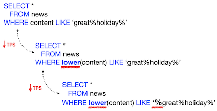

# Day 08 - Database Boot camp

Full Text Search

*Resume: Today you will learn how to speed up SQL queries based on full text search approach*

## Contents

1. [Chapter I](#chapter-i) \
    1.1. [Preamble](#preamble)
2. [Chapter II](#chapter-ii) \
    2.1. [General Rules](#general-rules)
3. [Chapter III](#chapter-iii) \
    3.1. [Rules of the day](#rules-of-the-day)  
4. [Chapter IV](#chapter-iv) \
    4.1. [Exercise 00 - How to find out and speed up a query in UPPER / LOWER cases?](#exercise-00-how-to-find-out-and-speed-up-query)  
5. [Chapter V](#chapter-v) \
    5.1. [Exercise 01 - What is about special data types?](#exercise-01-what-is-about-special-data-types)

<h2 id="chapter-i" >Chapter I</h2>
<h2 id="preamble" >Preamble</h2>

image source: freepik.com

How great it would be to search for data quickly and cheaply!  B-tree indexes allow us to do this, until we do not face the task of Full Text Search.  Here, B-tree indexes are not that efficient anymore.  But why? The point is that the B-Tree index indexes the entire value of the specified column / columns, but not tokens inside the field value.

Full Text Search problem is quite commonly occurred in the following search tasks:
- news content
- workflow
- system log files
- log files of system user actions
- audit files
- etc

If you describe the task using a SQL query, it looks like a sequential change in the SQL code on the one hand and a deterioration in search performance on the other.

Let's assume we want to find the occurrence of the words “great holiday” in the set of submitted documents.
Our query will be modified by us each time to cover the search boundary conditions.  In other words, we improve the search itself, but there is a degradation in the query performance.

In order to solve such problems effectively there are specialized databases for this, for example ElasticSearch engine.  Instead of tables, this database uses the concept of indices, which, as structures, are already effectively used by searching for the occurrence of a word.  But this base refers to post-relational or noSQL databases.   But what does the relational database world have to offer?  ;-)

<h2 id="chapter-ii">Chapter II</h2>
<h2 id="general-rules" >General Rules</h2>

- Use this page as the only reference. Do not listen to any rumors and speculations on how to prepare your solution.
- Please make sure you are using the latest version of PostgreSQL.
- Please make sure you have installed and configured the latest version of Flyway by Redgate.
- Please use our [internal SQL Naming Convention rules](https://docs.google.com/document/d/1IxIOFUeb-8Z8fBOfkXiy4SkN-J1mPIXveJZUCNZFdp8/edit?usp=sharing)
- Please use our [Terms and Definitions](https://docs.google.com/document/d/1_ZTDpHcfYMASZ5BtnldurQLF0fJygGF1yuTwik0DOqk/edit?usp=sharing) document
- That is completely OK if you are using IDE to write a source code (aka SQL script) and make a syntax check before migration at the final database solution by Flyway.
- Comments are also good in the SQL scripts. Anyway be careful with signs /\*...\*/ directly in SQL. These special symbols are used for Database Hints to improve SQL performance and these are not just comment marks :-).
- Pay attention to the permissions of your files and directories.
- To be assessed your solution must be in your GIT repository.
- Your solutions will be evaluated by your piscine mates.
- You should not leave in your directory any other file than those explicitly specified by the exercise instructions. It is recommended that you modify your .gitignore to avoid accidents.
- Do you have a question? Ask your neighbor on the right. Otherwise, try with your neighbor on the left.
- Your reference manual: mates / Internet / Google.
- Read the examples carefully. They may require things that are not otherwise specified in the subject.
- And may the SQL-Force be with you!
- Absolutely everything can be presented in SQL! Let’s start and have fun!

<h2 id="chapter-iii">Chapter III</h2>
<h2 id="rules-of-the-day">Rules of the day</h2>

- Please make sure you have a separated database “data” on your PostgreSQL cluster. 
- Please make sure you have a database schema “data” in your “data” database.
- Please make sure you are working through database user “data” and password “data” with super admin permissions for your PostgreSQL cluster. 
- Each exercise of the day needs a Flyway tool for right versioning of the “data” database through user “data”.
- Please make changes in your “flyway.conf” file (located in “~/flyway-6.x.x/conf” directory) directly to configure a right and stable connection to your PostgreSQL database.

    - flyway.url = jdbc:postgresql://hostname:5432/data 
        - where hostname is DNS / IP address of PostgreSQL server 
        - where port is a port of PostgreSQL server , by default is 5432
        (jdbc:postgresql://localhost:5432/data OR  jdbc:postgresql://127.0.0.1:5432/data)
    - flyway.user = data
    - flyway.password = data
    - flyway.schemas = data
    - flyway.defaultSchema = data
- Please use the command line for Flyway to migrate changes into the database and get information about the current version from the database.
- Please don’t append additional parameters for “flyway” in a command line, all needed parameters should be changed in “flyway.conf” file
- All tasks contain a list of Allowed and Denied sections with listed database options, database types, SQL constructions etc. Please have a look at the section before you start.

<h2 id="chapter-iv">Chapter IV</h2>
<h2 id="exercise-00-how-to-find-out-and-speed-up-query">Exercise 00 - How to find out and speed up a query in UPPER / LOWER cases?</h2>

| Exercise 00: How to find out and speed up a query in UPPER / LOWER cases?|                                                                                                                          |
|----------------------------------------------|--------------------------------------------------------------------------------------------------------------------------|
| Turn-in directory                            | ex00                                                                                                                     |
| Files to turn-in                             | `V1500__speedup_search.sql`
`V1501__gin_index_trigram.sql`
`query.txt`
`explain_before.txt`
`explain_after.txt`
screenshot `bench_before.png` with pgbench output results
screenshot `bench_after.png` with pgbench output results                                                                                   |
| **Allowed**                                      |                                                                                                                          |
|Operators                                    | Standard DDL / DML operators to create / alter relations and to insert / update / delete / select data (CRUD operations) |
| **Denied**  
|Type                                    | `SERIAL` |
|Database objects                                    | `sequence`
`anonymous functional block`
`user defined procedures`
`user defined functions`
				 |
| Database Commands | `LIKE`
`NOT LIKE`
`UPPER`
`LOWER`
`~~`
`~~*`
|

The aliens decided to make their own internal service that will allow them to aggregate news from different Internet resources of planet Earth into a model.  To do this, they decided to create the `news_from_earth` table with the structure described below.

| Name | Type | Business Description | 
| ------ | ------ | ------ |
| content | TEXT | news content | 
| source_name | VARCHAR(100) | a source of information from where the news came from the Earth |
| title | VARCHAR | news heading | 
| created_at | TIMESTAMP | The loaded news date into the aliens table.
Default value is current_timestamp|

Before running the model on real data, the chief DataOps engineer decided to test the performance of several query options that would have to solve the problem of finding aliens in the news content of earthlings.  To do this, he decided to use a [file](https://docs.google.com/document/d/1mjlUgo3iqCwef5dF3ptSCF7lktLs_jw-0Gi4gE5AK38/edit?usp=sharing) to download 4 sports news and 1 blog on the algorithm.  The data turned out to be too small and DataOps decided to make duplicates of the presented news to end up with exactly 950 lines.

Please help DataOps alien prepare flyway script `V1500__speedup_search.sql` to create a table, load 5 initial news stories as a series of INSERT statements and then duplicate these 5 news stories within SQL statement (s) so that you end up with 950 lines.

The main query pattern that will be used in the search is presented below.

`SELECT content, source_name, title`

`   FROM news_from_earth`

`WHERE <clause>`

Please, instead of the word `<clause>`, specify a filter that will search for the specified word (:word) **in any symbols' register**, located anywhere in the content (at the beginning / middle / end).  Please pay attention on denied commands for this task.  Attach the result of your query to the task as a `query.txt` file

DataOps engineer analysed the submitted request and realised that it is necessary to optimize the data retrieval.
Help to prove to the DataOps engineer that this query is ineffective and uses a brute force enumeration of rows and each word in the news content of each row

- To do this use the `EXPLAIN ANALYZE` command. Attach the result of your analysis to the task as a file `explain_before.txt`
- run pgbench for main SQL script with the following keys
    - indicating your custom script (`-f path_to_file`)
    - indicating the benchmark running time of 180 seconds (-T 180)
    - number of concurrent users 1 (-c 1)
    - detailed output of average execution time in ms for each operation from user file (-r)
Attach the result of benchmark execution as `bench_before.png` file to the task

The alien engineer has learned that there is a special index for full-text search called the GIN index, as well as a trigram search method which is represented by a special **EXTENSION** called `pg_trgm`.

Provide please, within the flyway file `V1501__gin_index_trigram.sql`, a script for creating **EXTENSION** `pg_trgm` and a script for GIN index named `idx_news_from_earth_gin` on the content column and using `gin_trgm_ops` as a family of operators.

Help demonstrate to the DataOps engineer that the original query has become efficient and uses the Bitmap Heap Scan.  Attach the result of your analysis to the task as the `explain_after.txt` file

- To do this use the EXPLAIN ANALYZE command. Attach the result of your analysis to the task as a file `explain_after.txt`
- run pgbench for main SQL script with the following keys
    - indicating your custom script (`-f path_to_file`)
    - indicating the benchmark running time of 180 seconds (-T 180)
    - number of concurrent users 1 (-c 1)
    - detailed output of average execution time in ms for each operation from user file (-r)
Attach the result of benchmark execution as `bench_after.png` file to the task

<h2 id="chapter-v">Chapter V</h2>
<h2 id="exercise-01-what-is-about-special-data-types">Exercise 01 - What is about special data types?</h2>

| Exercise 01: What is about special data types?|                                                                                                                          |
|----------------------------------------------|--------------------------------------------------------------------------------------------------------------------------|
| Turn-in directory                            | ex01                                                                                                                     |
| Files to turn-in                             | `V1600__add_tsquery.sql`
`V1601__add_sync_tsquery.sql`
`V1602__add_gin_tsquery.sql`
`query.txt`
screenshot `bench_before.png` with pgbench output results
screenshot `bench_after.png` with pgbench output results                                                                                   |
| **Allowed**                                      |                                                                                                                          |
|Operators                                    | Standard DDL / DML operators to create / alter relations and to insert / update / delete / select data (CRUD operations) |
| **Denied**  
|Type                                    | `SERIAL` |
|Database objects                                    | `sequence`
`anonymous functional block`
`database rules`	 |

DataOps engineer after carefully reading the documentation, concluded that for a better search, you can use the specialized **tsquery** / **tsvector** data types.  But in order to fully use them, it is necessary to modify the existing `news_from_earth` table.

Please create a flyway file `V1600__add_tsquery.sql` which should add new column `content_vector with type **tsvector**
do the initialization of the values ​​of the `content_vector` column based on the conversion of the original value of the content column to the **tsvector** type

It is supposed to constantly receive news from the planet Earth, in this case the `content_vector` field must be synchronized with the updated value of the content field.

Please ensure that the `content` and `content_vector` fields are synchronized as part of the content field update by adding a custom database object for this case.  Describe this object using the flyway script `V1601__add_sync_tsquery.sql`.

To test the functionality of your solution, please execute the series of DML commands within the flyway file `V1601__add_sync_tsquery.sql`

`INSERT INTO news_from_earth (content, source_name, title) `

`VALUES ('Many men, many minds', 'Test#1', 'Test#1');`

`INSERT INTO news_from_earth (content, source_name, title) `

`VALUES ('', 'Test#2', 'Test#2');`

`UPDATE news_from_earth `

`SET content = 'It is never too late to learn' `

`WHERE title = 'Test#2';`

Create an SQL query based on the pattern 

`SELECT content, source_name, title`

`   FROM news_from_earth`

`WHERE <clause>`

which will use “@”-annotation instead of `<clause>` to find the occurrence of the specified word in the `news_from_earth` table.  Attach the result of your query to the task as a `query.txt` file

- run pgbench for new SQL script with the following keys
    - indicating your custom script (`-f path_to_file`)
    - indicating the benchmark running time of 180 seconds (-T 180)
    - number of concurrent users 1 (-c 1)
    - detailed output of average execution time in ms for each operation from user file (-r)

Attach the result of benchmark execution as `bench_before.png` file to the task.
Create a standard GIN index named `idx_gin_news_from_earth` on the `content_vector` field within the flyway of the `V1602__add_gin_tsquery.sql` file

- run pgbench again for new SQL script with the following keys
    - indicating your custom script (`-f path_to_file`)
    - indicating the benchmark running time of 180 seconds (-T 180)
    - number of concurrent users 1 (-c 1)
    - detailed output of average execution time in ms for each operation from user file (-r)

Attach the result of benchmark execution as `bench_after.png` file to the task.
