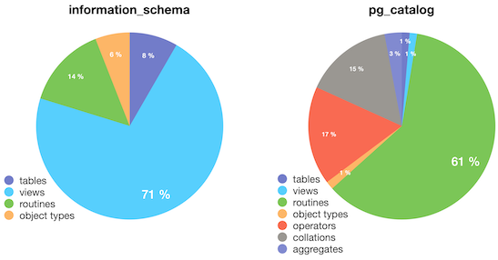

# Day 09 - Database boot camp

Let’s make a functional code!

*Resume: Today you will get acquainted with the functional code that is called using the stored functions / procedures of the database.*

## Contents

1. [Chapter I](#chapter-i) \
    1.1. [Preamble](#preamble)
2. [Chapter II](#chapter-ii) \
    2.1. [General Rules](#general-rules)
3. [Chapter III](#chapter-iii) \
    3.1. [Rules of the day](#rules-of-the-day)  
4. [Chapter IV](#chapter-iv) \
    4.1. [Exercise 00 - Stored function to generate Alien usernames](#exercise-00-stored-function-to-generate-alien-usernames)  
5. [Chapter V](#chapter-v) \
    5.1. [Exercise 01 - ANSI/SPARC in terms of stored functions](#exercise-01-ansispark-in-terms-of-stored-functions)
6. [Chapter VI](#chapter-vi) \
    6.1. [Exercise 02 - SQL vs PL/pgSQL](#exercise-02-sql-vs-plpgsql)  
7. [Chapter VII](#chapter-vii) \
    7.1. [Exercise 03 - Check Isolation Levels for stored SQL-function](#exercise-03-check-isolation-levels-for-stored-sql-function)

<h2 id="chapter-i" >Chapter I</h2>
<h2 id="preamble" >Preamble</h2>

Do you know why the term “stored procedure” has a word “stored”? Why didn't engineers name them just  procedure, function or method like in ordinary programming languages? That’s interesting and the word “stored” means more than just a term.

Historically the standard for describing the possibility of using user-defined stored procedures / functions is SQL / PSM (Persistent Stored Modules), the standard of which was published in 1992 as an extension of another well-known standard SQL: 1999.

But different relational databases have different approaches to the way of ensuring the standard, for example, Oracle Corporation has a very powerful Object-Oriented Language (PL/SQL), on the basis of which you can create not only stored procedures, but also your own classes with methods and properties, create class objects and manipulate them like rows from tables.  The PostgreSQL community took a different path - namely, providing easy integration of different programming languages ​​to the kernel level, for example, here is a list of languages ​​that PostgreSQL currently supports: PL/pgSQL, PL/Perl, PL/Python, PL/Java, PL/R  etc.

However the question still remains open - why is the word “stored” used in the names of these objects?  The point is that stored functions / procedures are all just...  rows in the metadata table, in other words, you can see the code of this object by making a query to the table!  (in other words, they are stored as table rows) And moreover, having made the correct UPDATE, you can modify the code directly without recompiling the stored function!  (but please don't allow yourself to break the database in any way!)
Here is an example query to get the source code from the metadata for an Oracle database:

`SELECT text`

`FROM all_source`

`WHERE name = <your_function_name>`

`ORDER BY line;`

And here is an example for PostgreSQL:

`SELECT prosrc`

`FROM pg_proc`

`WHERE proname = <your_function_name>`

Hold on but if stored procedures / functions are just rows in a table, then recompiling this object (`CREATE OR REPLACE FUNCTION ...`) is just a series of INSERT / UPDATE expressions into the metadata table!  And when a user calls this stored object, it must be interpreted on the fly by the database, wow!  and you are talking about the Python language with its interpreter!  (in fact, relational databases preload the stored function / procedures code into a special area of ​​memory to optimize their calls).

Here is a statistic of the total number of objects in the PostgreSQL database of the two metadata layer schemas (`information_schema` and `pg_catalog`).

Routines in this case also contain built-in / user stored functions / procedures, are you sure you know all of them?  ;-)

<h2 id="chapter-ii">Chapter II</h2>
<h2 id="general-rules" >General Rules</h2>

- Use this page as the only reference. Do not listen to any rumors and speculations on how to prepare your solution.
- Please make sure you are using the latest version of PostgreSQL.
- Please make sure you have installed and configured the latest version of Flyway by Redgate.
- Please use our [internal SQL Naming Convention rules](https://docs.google.com/document/d/1IxIOFUeb-8Z8fBOfkXiy4SkN-J1mPIXveJZUCNZFdp8/edit?usp=sharing)
- Please use our [Terms and Definitions](https://docs.google.com/document/d/1_ZTDpHcfYMASZ5BtnldurQLF0fJygGF1yuTwik0DOqk/edit?usp=sharing) document
- That is completely OK if you are using IDE to write a source code (aka SQL script) and make a syntax check before migration at the final database solution by Flyway.
- Comments are also good in the SQL scripts. Anyway be careful with signs /\*...\*/ directly in SQL. These special symbols are used for Database Hints to improve SQL performance and these are not just comment marks :-).
- Pay attention to the permissions of your files and directories.
- To be assessed your solution must be in your GIT repository.
- Your solutions will be evaluated by your piscine mates.
- You should not leave in your directory any other file than those explicitly specified by the exercise instructions. It is recommended that you modify your .gitignore to avoid accidents.
- Do you have a question? Ask your neighbor on the right. Otherwise, try with your neighbor on the left.
- Your reference manual: mates / Internet / Google.
- Read the examples carefully. They may require things that are not otherwise specified in the subject.
- And may the SQL-Force be with you!
- Absolutely everything can be presented in SQL! Let’s start and have fun!

<h2 id="chapter-iii">Chapter III</h2>
<h2 id="rules-of-the-day">Rules of the day</h2>

- Please make sure you have a separated database “data” on your PostgreSQL cluster. 
- Please make sure you have a database schema “data” in your “data” database.
- Please make sure you are working through database user “data” and password “data” with super admin permissions for your PostgreSQL cluster. 
- Each exercise of the day needs a Flyway tool for right versioning of the “data” database through user “data”.
- Please make changes in your “flyway.conf” file (located in “~/flyway-6.x.x/conf” directory) directly to configure a right and stable connection to your PostgreSQL database.

    - flyway.url = jdbc:postgresql://hostname:5432/data 
        - where hostname is DNS / IP address of PostgreSQL server 
        - where port is a port of PostgreSQL server , by default is 5432
        (jdbc:postgresql://localhost:5432/data OR  jdbc:postgresql://127.0.0.1:5432/data)
    - flyway.user = data
    - flyway.password = data
    - flyway.schemas = data
    - flyway.defaultSchema = data
- Please use the command line for Flyway to migrate changes into the database and get information about the current version from the database.
- Please don’t append additional parameters for “flyway” in a command line, all needed parameters should be changed in “flyway.conf” file
- All tasks contain a list of Allowed and Denied sections with listed database options, database types, SQL constructions etc. Please have a look at the section before you start.

<h2 id="chapter-iv">Chapter IV</h2>
<h2 id="exercise-00-stored-function-to-generate-alien-usernames">Exercise 00 - Stored function to generate Alien usernames</h2>

| Exercise 00: Stored function to generate Alien usernames|                                                                                                                          |
|----------------------------------------------|--------------------------------------------------------------------------------------------------------------------------|
| Turn-in directory                            | ex00                                                                                                                     |
| Files to turn-in                             | `V1700__stored_function.sql`                                                                                  |
| **Allowed**                                      |                                                                                                                          |
|Operators                                    | Standard DDL / DML operators to create / alter relations and to insert / update / delete / select data (CRUD operations) |
| **Denied**  
| Type                                    | `SERIAL` |
| Language for stored function | `PL/pgSQL`|

As you remember from the previous day's exercise  there was a SQL command which generated a set of LDAP aliens usernames. Please take a look on this SQL command below again 

`SELECT(`

`SELECT concat_ws(' ',name_first, name_last) as generated`

`FROM (`

`SELECT string_agg(x,'')`

`FROM (`

`   select start_arr[ 1 + ( (random() * 25)::int) % 16 ]`

`   FROM`

`   (`

`       select '{Co,gE,For,So,cO,GiM,Se,Cv,Gw,CA,FRA,gaC,qE,hA,FrO,gla}'::text[] as start_arr`

`   ) syllarr,`

`   generate_series(1, 3 + (generator*0))`

`) AS comp3syl(x)`

`) AS comp_name_1st(name_first),`

`(`

`SELECT x[ 1 + ( (random() * 25)::int) % 14 ]`

`FROM (`

`   select '{Co,gE,For,So,cO,GiM,Se,Cv,Gw,CA,FRA,gaC,qE,hA,FrO,gla,20,30}'::text[]`

`) AS z2(x)`

`) AS comp_name_last(name_last)`

`)`

`FROM generate_series(1,10000) as generator;`

DataOps engineer decides to create a stored SQL-function `fnc_generate_ldap_usernames` without any in-parameters which should return a generated dataset on the fly. Other words, the SQL statement below 

`SELECT *`

`FROM fnc_generate_ldap_usernames()`

should return a generated dataset like a table view below

| username | 
| ------ | 
| hACvhA CA | 
| hACACA Gw | 
| ... |
| GwcOFor gE |

Please create a new flyway file `V1700__stored_function.sql` which contains stored SQL-function definition.

<h2 id="chapter-v">Chapter V</h2>
<h2 id="exercise-01-ansispark-in-terms-of-stored-functions">Exercise 01 - ANSI/SPARC in terms of stored functions</h2>

| Exercise 01: ANSI/SPARC in terms of stored functions|                                                                                                                          |
|----------------------------------------------|--------------------------------------------------------------------------------------------------------------------------|
| Turn-in directory                            | ex01                                                                                                                     |
| Files to turn-in                             | `V1800__ansisparc_for_data.sql`                                                                                  |
| **Allowed**                                      |                                                                                                                          |
|Operators                                    | Standard DDL / DML operators to create / alter relations and to insert / update / delete / select data (CRUD operations) |
| **Denied**  
| Type                                    | `SERIAL` |
| Language for stored function | `PL/pgSQL`|

So, let’s recall our Day00 and ANSI/SPARC architecture. The main idea of ANSI/SPARC is to create a virtual layer (external layer) of database views which are needed to provide a possibility to read and modify data for underlying database tables.
Actually there is one negative moment, we can’t pass needed parameters into our database view. Other words we can use only static SQL query inside view with predefined WHERE-clause or call some magic with context database variables.
Aliens want to be more flexible with source code and decided to create a few stored SQL-functions which get incoming parameters and make some filtering for data inside a code.

Please help and create a new flyway file `V1800__ansisparc_for_data.sql` with stored SQL-function declaration inside. The function with name `fnc_sql_getting_news_for_word` should return the dataset based on SQL query below:

`SELECT content, source_name, title`

`  FROM news_from_earth`

`WHERE content LIKE '%'||pword||'%'`

where is `pword` is an incoming parameter which we need pass in stored SQL-function.

The result of SQL below

`SELECT *`

`FROM fnc_sql_getting_news_for_word('rows')`

looks like a table below

| content | source_name | title |
| ------ | ------ | ------ |
| ...we need to know how many UNIQUE row... | https://datalaboratory.one | Flajolet-Martin algorithm |
| ...we need to know how many UNIQUE row... | https://datalaboratory.one | Flajolet-Martin algorithm |
| ...we need to know how many UNIQUE row... | https://datalaboratory.one | Flajolet-Martin algorithm |
| ...we need to know how many UNIQUE row... | https://datalaboratory.one | Flajolet-Martin algorithm |

<h2 id="chapter-vi">Chapter VI</h2>
<h2 id="exercise-02-sql-vs-plpgsql">Exercise 02 - SQL vs PL/pgSQL</h2>

| Exercise 02: SQL vs PL/pgSQL|                                                                                                                          |
|----------------------------------------------|--------------------------------------------------------------------------------------------------------------------------|
| Turn-in directory                            | ex02                                                                                                                     |
| Files to turn-in                             | `V1900__ansisparc_for_data_plpgsql.sql`
`bench_plpgsql.png`
`bench_sql.png`                                                                                  |
| **Allowed**                                      |                                                                                                                          |
|Operators                                    | Standard DDL / DML operators to create / alter relations and to insert / update / delete / select data (CRUD operations) |
| **Denied**  
| Type                                    | `SERIAL` |
| Language for stored function | `SQL-function`|

Alien Performance DataEngineer decided to make a couple of benchmarks to choose a good approach for parameterized ANSI/SPARC stored functions.

For this task, he wants to create the stored Pl/PgSQL-function `fnc_plpgsql_getting_news_for_word` with the same logic like for the stored SQL-function from the previous exercise. Please use a flyway file `V1900__ansisparc_for_data_plpgsql.sql`

Please make a comparison between benchmark metrics TPS and latency for your defined SQL scripts.
The first one should use SQL below 

`select *`

`from fnc_plpgsql_getting_news_for_word(:pword);`

and another one 

`select *`

`from fnc_sql_getting_news_for_word(:pword);`

Where `:pword` is a random string value which need generate before SQL in a pgbench script

Please run pgbench for both cases with the following keys
    - indicating your custom script (`-f path_to_file`)
    - indicating the benchmark running time of 180 seconds (-T 180)
    - number of concurrent users 5 (-c 5)
    - detailed output of average execution time in ms for each operation from user file (-r)

and decide whether SQL or Pl/pgSQL is good for you ;-)
Please attach the result of both benchmarks execution as `bench_plpgsql.png` and `bench_sql.png` files to the task.

<h2 id="chapter-vii">Chapter VII</h2>
<h2 id="exercise-03-check-isolation-levels-for-stored-sql-function">Exercise 03 - Check Isolation Levels for stored SQL-function</h2>

| Exercise 03: Check Isolation Levels for stored SQL-function|                                                                                                                          |
|----------------------------------------------|--------------------------------------------------------------------------------------------------------------------------|
| Turn-in directory                            | ex03                                                                                                                     |
| Files to turn-in                             | `bench_serialization.png`
`bench_read_commited.png`                                                                             |
| **Allowed**                                      |                                                                                                                          |
|Operators                                    | Standard DDL / DML operators to create / alter relations and to insert / update / delete / select data (CRUD operations) |
| **Denied**  
| Type                                    | `SERIAL` |

Please make a comparison between isolation levels for benchmark metric TPS for the defined SQL script below.

`select *`

`from fnc_sql_getting_news_for_word(:pword);`

Where `:pword` is a random string value which need generate before SQL in a pgbench script
Alien data engineer wants to know difference in TPS between 2 isolation levels on benchmarks script level
- SERIALIZABLE
- READ COMMITTED

Please run pgbench with the following keys
    - indicating your custom script (`-f path_to_file`)
    - indicating the benchmark running time of 180 seconds (-T 180)
    - number of concurrent users 5 (-c 5)
    - detailed output of average execution time in ms for each operation from user file (-r)

Please attach the result of both benchmarks execution as `bench_serialization.png` and `bench_read_commited.png` files to the task.
