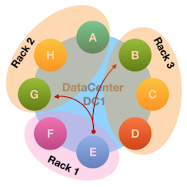
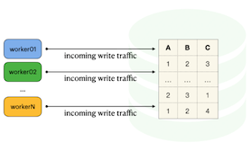
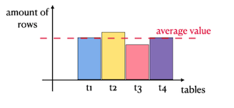
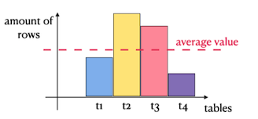
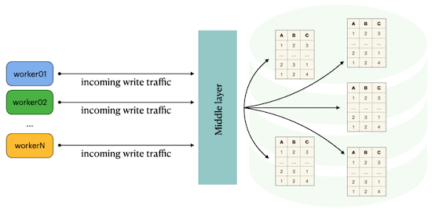
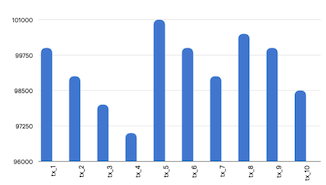
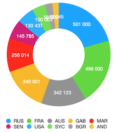

# Rush 00 - Database Boot camp

Divide et impera

*Resume: Today you will implementing splitting large incoming traffic to a relational database into multiple tables without using specific structures*

## Contents
1. [Chapter I](#chapter-i) \
    1.1. [Preamble](#preamble)
2. [Chapter II](#chapter-ii) \
    2.1. [General Rules](#general-rules)
3. [Chapter III](#chapter-iii) \
    3.1. [Rules of the day](#rules-of-the-day)
4. [Chapter IV](#chapter-iv) \
    4.1. [Exercise 00 - Divide et impera](#exercise-00-divide-et-impera)

<h2 id="chapter-i" >Chapter I</h2>
<h2 id="preamble" >Preamble</h2>

Interstellar Movie bookshelf episode

The term “Divide and Conquer” came to us from the distant depths of centuries, which as an action was used in political games and intrigues, as well as in military affairs. The warlord Julius Caesar won a military triumph in Galia, simply by sticking to the strategy voiced in the phrase “Divide et impera”!

But is this phrase so unfamiliar in the world of databases?  Absolutely not!
Distributed relational database systems based on Data Sharding / Data Partitioning technology, as well as distributed databases associated with Big Data processing and storage - they all use this principle! The example on the picture is data distribution in Cassandra Ring database.

Everything is very simple. We cannot store everything in one place on one server (architecture node). This could lead to bad consequences, ranging from data loss to unbalanced load for the operation of, for example, the MapReduce algorithm.

This principle gives us an opportunity to introduce the concept of a **microservice database architecture**. It means that we can distribute data not only physically between the architecture components (for example, Table Sharding), but also logically, focusing on the fact that one server will store system users, the other server stores  their audit by actions, etc.

<h2 id="chapter-ii">Chapter II</h2>
<h2 id="general-rules" >General Rules</h2>

- Use this page as the only reference. Do not listen to any rumors and speculations on how to prepare your solution.
- Please make sure you are using the latest version of PostgreSQL.
- Please make sure you have installed and configured the latest version of Flyway by Redgate.
- Please use our [internal SQL Naming Convention rules](https://docs.google.com/document/d/1IxIOFUeb-8Z8fBOfkXiy4SkN-J1mPIXveJZUCNZFdp8/edit?usp=sharing)
- Please use our [Terms and Definitions](https://docs.google.com/document/d/1_ZTDpHcfYMASZ5BtnldurQLF0fJygGF1yuTwik0DOqk/edit?usp=sharing) document
- That is completely OK if you are using IDE to write a source code (aka SQL script) and make a syntax check before migration at the final database solution by Flyway.
- Comments are also good in the SQL scripts. Anyway be careful with signs /\*...\*/ directly in SQL. These special symbols are used for Database Hints to improve SQL performance and these are not just comment marks :-).
- Pay attention to the permissions of your files and directories.
- To be assessed your solution must be in your GIT repository.
- Your solutions will be evaluated by your piscine mates.
- You should not leave in your directory any other file than those explicitly specified by the exercise instructions. It is recommended that you modify your .gitignore to avoid accidents.
- Do you have a question? Ask your neighbor on the right. Otherwise, try with your neighbor on the left.
- Your reference manual: mates / Internet / Google.
- Read the examples carefully. They may require things that are not otherwise specified in the subject.
- And may the SQL-Force be with you!
- Absolutely everything can be presented in SQL! Let’s start and have fun!

<h2 id="chapter-iii">Chapter III</h2>
<h2 id="rules-of-the-day">Rules of the day</h2>

- Please make sure you have a separated database “rush” on your PostgreSQL cluster. 
- Please make sure you have a database schema “rush00” in your “rush” database.
- Please make sure you are working through database user “rush” and password “rush” with super admin permissions for your PostgreSQL cluster. 
- Please execute the next statement for the “rush00” schema before the task.
  `CREATE EXTENSION "uuid-ossp";`
    - check availability of extension by SQL 
      `select extname, extrelocatable from pg_catalog.pg_extension where extname = 'uuid-ossp'`

- Each exercise of the day needs a Flyway tool for right versioning of the “rush” database through user “rush”.
- Please make changes in your “flyway.conf” file (located in “~/flyway-6.x.x/conf” directory) directly to configure a right and stable connection to your PostgreSQL database.

    - flyway.url = jdbc:postgresql://hostname:5432/rush 
        - where hostname is DNS / IP address of PostgreSQL server 
        - where port is a port of PostgreSQL server , by default is 5432
        (jdbc:postgresql://localhost:5432/rush OR  jdbc:postgresql://127.0.0.1:5432/rush)
    - flyway.user = rush
    - flyway.password = rush
    - flyway.schemas = rush00
    - flyway.defaultSchema = rush00
- Please use the command line for Flyway to migrate changes into the database and get information about the current version from the database.
- Please don’t append additional parameters for “flyway” in a command line, all needed parameters should be changed in “flyway.conf” file
- All tasks contain a list of Allowed and Denied sections with listed database options, database types, SQL constructions etc. Please have a look at the section before you start.

<h2 id="chapter-iv">Chapter IV</h2>
<h2 id="exercise-00-divide-et-impera">Exercise 00 - Divide et impera</h2>

|Exercise 00: Divide et impera||
---|---
Turn-in directory|ex00|
Files to turn-in| 3 new flyway scripts 
 `V001__rush00_tables.sql` 
 `V002__rush00_view_data_distribution.sql` 
 `V003__rush00_top10_countries.sql`
 3 visualizations (like a screenshots) about
 `final data loading through Middle Layer`
 `data distribution across all underlying tables`
`top 10 countries with maximum amount of transactions`
2 links for repositories
`Link to repository which describes your Middle Layer.`
`Link to repository which describes your Load Test with generating “closely” real data`|
**Allowed**||
Database Tables| Original Heap Tables |
Database objects| User defined procedures / functions|
Operators | Standard DDL / DML operators to create / alter relations and to insert / update / delete / select data (CRUD operations) |
**Denied** ||
Database Tables | Other types of database tables |
Database Types | Serial |
Database objects | triggers
trigger functions
database rules
PRIMARY KEY
generate_series(...) |

Before beginning please read the section “Rules of the day” about steps to create a  new database and schema inside for Rush! … and yes please don’t forget about comments for your tables / views / columns. Let’s make a world more clearly and understandable

So, how to work with a large transaction table in a relational database that is constantly loaded with data?  This is quite non-trivial, since a large mass (in our case, data or rows) creates big problems when changing the structure or massive deletions / updates of data.  In short, it all boils down to long transactions, pessimistic x-locks, massive deadlocks and, as a result, the table is unavailable.  Moreover, if you have replication to other servers in the current data center or configured geo-replication to a neighboring data center in another region on the Earth, then singularities and anomalies arise here.

Let's consider a fairly common architecture which consists of many microservices running in parallel with writing traffic to one transaction table.

An example of such behavior can be, for example, the following business cases:
- IoT (Internet of Things)
- Banking Transactions
- Mobile traffic
- etc.

Problems with such a table arise when you need to either clear it of the old data or make a change to the table, for example, by adding one simple column or let’s imagine, changing data type for a column.
Let's get away from this practice, and immediately lay the possibility of dividing data between smaller tables based on some criterion or key.

Let's have a look at the following model of prompt collection of the information from the work of an aggregator of banking transactions (suppose that we are a Federally designated bank regulator, which is obliged to pass transactions through itself, including individuals, and store this data with us).  Here I will immediately make a reservation that we do not pretend that relational databases are exactly those databases that are used to store such a huge array of information.  We are just learning :-).

You need to plan your database architecture not only from the business logic side and Entity Relationship logical model, but also from the traffic load side.  The load should be uniform on all system components, including tables.  The ideal case is when the data is evenly distributed.  Even distribution of data entails evenly distributed load.  It is that simple!

Situations should be avoided when making the distribution of the data you get a different distribution (for example, normal distribution or Gaussian distribution).  This will lead to a load on specific tables, which ultimately will result in a load on disks for writing / reading (IOPS monitoring metrics).

The logical description of the transaction table that stores incoming transactions of individuals (here there is a description of only the necessary attributes for the job).  Please use a pattern for the name of the physical table as `tx_XX` (this is an abbreviation from “transaction” word). The database-side tables are a set of ordinary Heap tables (there should be **30** tables) with the same structure.  The names of the tables correspond to the pattern `tx_XX`, where XX is the ordinal number of the table (for example, `tx_01`, `tx_02`,..., `tx_30`).

**Attention!** Please don’t use additional dictionary tables to describe lists of countries / currencies / statuses. That’s not needed for this exercise. Use a flyway script with name `V001__rush00_tables.sql` to determine all **30** database tables.

The structure of each of the `tx_XX` tables is presented below.

| Logical Column Name | Physical Column Name | Data Type | Description |
| ------ | ------ | ------ | ------ |
| Number of the bank card | card_number | VARCHAR(19)
NOT NULL | Please generate Card Numbers in a common pattern like `XXXX XXXX XXXX XXXX` where X is just random value |
| Card Holder | card_holder | VARCHAR(100)
NOT NULL | Bank card owner |
| Card Type | card_type | VARCHAR(50)
NOT NULL | Bank card type VISA, Maestro, MIR | 
| Valid To | card_valid_to | DATE
NOT NULL | Date of Expiration |
| Secret Pin Code | card_pin | VARCHAR(3)
NOT NULL | Pin code |
|Status Of Transaction | status_tx | VARCHAR(30)
NOT NULL
DEFAULT 'PROCESSING'| 3 possible statuses: 
DONE
PROCESSING
CANCELLED|
| Amount of Money for transaction| amount_money| NUMERIC(9,2)
NOT NULL
DEFAULT 0| The amount of money that was involved in the current transaction  |
|Currency |currency_name | VARCHAR(3)
NOT NULL| Currency [ISO code](https://en.wikipedia.org/wiki/List_of_circulating_currencies) of the transaction  |
|Country of Transaction| country_tx| VARCHAR(3)
NOT NULL|  The country [ISO code](https://en.wikipedia.org/wiki/ISO_3166-1_alpha-3#Officially_assigned_code_elements) |
| Transaction Number|internal_tx_number |UUID
NOT NULL
DEFAULT `uuid_generate_v4()` | The unique number of the transaction in the system|

Build the architecture of the following topology where “Middle Layer” is a layer that decides which small table to redirect incoming traffic from microservices.

- “Middle Layer” can lie inside the database and be DB function / DB procedure, parameters of which will serve as attributes for the transaction table `tx_XX`
- “Middle Layer” can lie out of the database and can act as a subsidiary service in Python / Java / Bash / Perl / Go that passes traffic through itself and, based on the criterion / key which sends it to the corresponding small table
- Select the table column / columns like a partitioning key and method by which you think that your traffic will be evenly distributed across all small tables. Let’s logically set a threshold for the difference between the amount of rows for each underlying table and average rows per table (in our case 100 000 rows per table) by absolute value. It **must be less** than 20 000 rows per each underlying table. Other words, the expression below returns TRUE value.
`select abs(count(*) - 100000) < 20000 from tx_xx`
- We consider that the incoming traffic for the task is only an INSERT statements (means not UPDATE / DELETE statements)
- Write a **load-test** in any programming or scripting language available to you that will generate a random stream of transactions (~ data streaming) and pass generated values through API / calls of **Middle Layer** to the database.
    - for sample:  `card_number : 1928 2919 1283 1234`
                   `card_holder: IVAN IVANOV` 
                   `country_tx: RUS`
- Run your test by making 3,000,000 inserts into your tables via your “Middle Layer”
- Achieve 3,000,000 data evenly spread across 30 Heap Tables (approximately 100,000 rows per table)
- Prove by creating one database view `v_get_data_distribution` that each table involved returns approximately the same number of records.  The example of the result of `v_get_data_distribution` is shown below. Please use a flyway script with name `V002__rush00_view_data_distribution.sql` to determine a new database view.

| Table Name | Amount of Rows |
| ------ | ------ |
| tx_1 | 110 000 |
| tx_2 | 99 000 |
| tx_2 | 98 400 |
| tx_2 | 105 000 |
| ... | ... |
| tx_30 | 97 000 |

- Create a database view `v_get_top10_tx_countries` which returns statistics about TOP 10 countries with the maximum amount of banking transactions per row from all 30 underlying database tables. The example of the result of `v_get_top10_tx_countries` is shown below. Please use a flyway script with name `V003__rush00_top10_countries.sql` to determine a new database view.

| Country | Amount of Transactions |
| ------ | ------ |
| RUS | 501 000 |
| FRA | 499 000 |
| AUS | 342 123 |
| GAB | 340 001 |
| MAR | 256 014 |
| SEN | 145 785 |
| USA | 130 437 |
| SYC | 100 003 |
| BGR | 56 000 |
| AND | 49 045 |

- Let’s try to visualize our solution! Integrate Grafana or Metabase for your incoming data and show 3 visualizations
    - graphic with data loading during your test (based on SQL query which takes a sum amount of rows of each small table) for each minute. The sample of traffic is shown below for first 10 minutes

    

    - data distribution between all 30 small tables based on database view `v_get_data_distribution`. The sample of distribution is shown below for 10 tables

    

    - data distribution (like a pie chart) between all 30 small tables based on database view `v_get_top10_tx_countries`. The sample of distribution is shown below.
    
