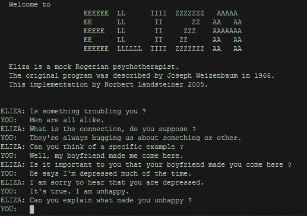

# Understanding customer.

## Intent Classification

_Summary:_ This project is an introduction to deep learning and NLP: recurrent neural nets (RNN), LSTM, Transformer,
BERT

## Contents

1. [Chapter I](#chapter-i) \
   1.1. [Preamble](#preamble)
2. [Chapter II](#chapter-ii) \
   2.1. [Introduction](#introduction)
3. [Chapter III](#chapter-iii) \
   3.1. [Rules of project](#rules-of-project)
4. [Chapter IV](#chapter-iv) \
   4.1. [Instructions](#instructions)
5. [Chapter V](#chapter-v) \
   5.1. [Mandatory part](#mandatory-part)
6. [Chapter VI](#chapter-vi) \
   6.1. [Bonus part](#bonus-part)

## Chapter I

### Preamble

The history of humans trying to create an AI-agent that can have a meaningful conversation with us started many years
ago. One of the prominent examples is ELIZA. It is an NLP computer program created in the mid 60s that simulated
conversations with a therapist.

The author of the program identified 5 most important problems that needed to be solved to create such a program: 1) the
identification of critical words, 2) the discovery of a minimal context, 3) the choice of appropriate transformations,

4) the generation of responses appropriate to the transformation or 5) in the absence of critical words and the
   provision of an ending capacity for ELIZA scripts. He solved them by a script of instructions on how to respond to
   inputs from users.

Nowadays, chatbots are ubiquitous, but the principles are still almost the same, if we talk about the chatbots that help
automate support. The first thing is we need to classify intent – what the user wants from us. The phrases can be
different: “What is the weather?” or “What is the temperature right now?” or “Is it raining?”, but the intent is still
the same – the user is interested in weather. The second thing is we need to generate a response
(or extract it from somewhere) and to send it back to the user.

## Chapter II

### Introduction

You are already familiar with the basics of NLP and neural nets. In this project, you will work with more advanced staff
– applying deep learning algorithms to an intent classification problem.

In deep learning we have special architectures for NLP tasks. Why is it so? Well, text is a different data structure
than ordinary tables. It is sequential. The order of words matters. It has context that may firstly appear in one
sentence and then be used in another. Generic architectures such as fully connected neural nets do not take it into
account.

One architecture that can help us solve NLP problems better is RNN (recurrent neural net). It is sequential. It can work
with text word by word or letter by letter. But it does not have any memory to store some useful context.

That is why another architecture was invented – [LSTM](https://colah.github.io/posts/2015-08-Understanding-LSTMs/) (long
short-term memory). It is even more complicated. What it does is it tries to find optimal weights for different gates
that are used to send the signal further, to store it, to stop it, etc.

Both architectures are time-consuming because of their sequential nature. And time matters – because the more iterations
you can do per time, the faster you achieve some good results.

The breakthrough came with Transformers and their attention
mechanism. [Trans-formers](https://medium.com/mlearning-ai/long-short-term-memory-networks-are-dying-whats-replacing-it-5ff3a99399fe)
do not use recursions. Instead of processing each word sequentially, Transformers process the entire sequence at once to
create an ‘attention matrix’, where each output is a weighted sum of the inputs. It is a faster architecture and it
works better with context.

The most prominent example of Transformer architecture is [BERT](https://jalammar.github.io/illustrated-bert/) (
Bidirectional En-coder Representations from Transformers). BERT’s key technical innovation is applying the bidirectional
training of Transformer to language modelling.

There are some other architectures that show some promising results, but for this project it will be out of scope.
Anyway, one fact that is worth mentioning is that to train such models can
be [quite expensive](https://syncedreview.com/2019/06/27/the-staggering-cost-of-training-sota-ai-models/). But there is
a way – transfer learning. You can use a pretrained model and finetune it on your dataset optimizing only a small
fraction of the weights. This lifehack can show shockingly good results.

It was a brief intro to deep learning and NLP. It covers all the important stuff from the helicopter-view. Now you know
where to start your own journey of mastering the skills and the knowledge of that field.

## Chapter III

### Rules of project

The goal of this project is to give you a first approach to Deep Learning algorithms applied to NLP tasks. You will try
to preprocess text data and train different architectures for intent classification: RNN, LSTM, BERT.

## Chapter IV

### Instructions

* This project will only be evaluated by humans. You are free to organize and name your files as you desire.
* Here and further we use Python 3 as the only correct version of Python.
* For training deep learning algorithms you can try [Google Colab](https://colab.research.google.com/). It offers
  kernels
  (Runtime) with GPU for free that are faster than CPU for such tasks.
* The norm is not applied to this project. Nevertheless, you are asked to be clear and structured in the conception of
  your source code.
* Store the datasets in the subfolder **data**

## Chapter V

### Mandatory part

#### a. Task

In this project, you will work on intent classification. This task might be a part of a bigger project of chat-bot or
virtual assistant creation. The problem is that people may use different phrases and words to ask for something that
actually is the same in terms of response. “Is it raining?” or “What is the temperature right now?” may lead to a
weather application or forecast. The better you classify intents, the more effect you can achieve with chat-bot or
virtual assistant.

In order to do this you will need to try different architectures:

1. RNN,
2. LSTM,
3. BERT.

#### b. Dataset

You will work with the dataset of intents that are used in a chat-bot of a bike shop. The phrases are labeled by intents
in the train file. And you will need to make predictions for the test file.

> **Note:** You can find the dataset in the project page:
> 1. intents_test.csv
> 2. intents_train.csv

#### c. Implementation

You can work in [Google Colab](https://colab.research.google.com/). It offers Jupyter Notebooks with GPU Runtime. GPU is
more efficient for Deep Learning tasks than CPU. You can install any additional packages right from the cells in
notebooks.

You can use any framework that you find convenient: PyTorch, TensorFlow, Keras, etc.

**Fallback Intent**

In the test file there are several phrases that are not from any intent from the train subset. In our hidden file they
have the label “Fallback Intent”. It is widely used in chat-bots. If your chat-bot “is not sure” about its prediction,
it is a good practice to return to the user something like “I couldn’t understand you. Please, rephrase.” or just to
redirect the request to a human. Keep it in mind, because the score of your predictions will depend on the fallback
intent as long as it exists in the test file.

**Research Diary**

You should keep a research diary. You will try different architectures with different weights, number of layers, etc. It
is easy to bury yourself in chaos and lose the direction of where your best solutions are. Your diary should have the
track of any changes you make: architecture, weights, preprocessing, number of layers, framework, etc. and of course the
metrics on train and validation subset.

#### d. Submission

Save your model in the pickle format. Your peer will load it and use it to make predictions for the test dataset once
again. The predictions should be stored in a file with the name intents.csv.

You need to achieve accuracy at least equal to 0.8 on the test dataset.

Your repository should contain one or several notebooks with your solutions.

## Chapter VI

### Bonus part

* Try to use CNNs for intent classification.
* Try to extend the train dataset by adding more different phrases and corresponding intents to achieve better scores.
* Try to achieve an even better accuracy on the test dataset – 0.873.
