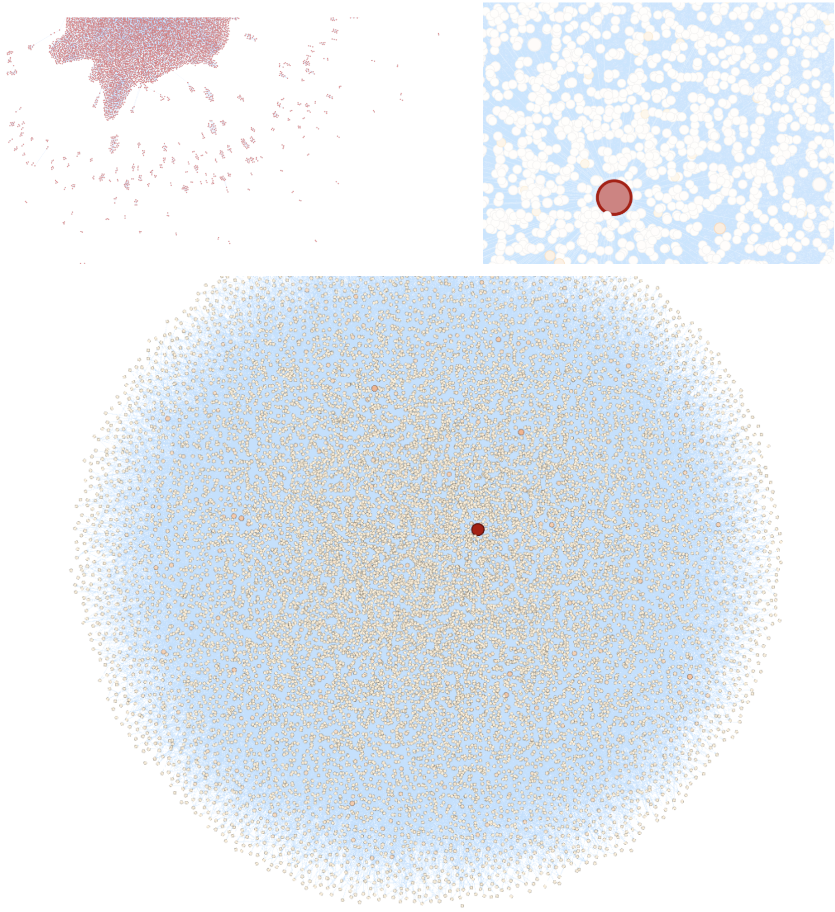

# Amazon

## Customers Who Bought This Item Also Bought

_Summary:_ This project is an introduction to Apache Spark (Python API) and network and graph analysis

## Contents

1. [Chapter I](#chapter-i) \
   1.1. [Preamble](#preamble)
2. [Chapter II](#chapter-ii) \
   2.1. [Introduction](#introduction)
3. [Chapter III](#chapter-iii) \
   3.1. [Goals](#goals)
4. [Chapter IV](#chapter-iv) \
   4.1. [General instructions](#general-instructions)
5. [Chapter V](#chapter-v) \
   5.1. [Mandatory part](#mandatory-part)
6. [Chapter VI](#chapter-vi) \
   6.1. [Bonus part](#bonus-part)
7. [Chapter VI](#chapter-vi) \
   7.1. [Submission and peer-correction](#submission-and-peer-correction)

## Chapter I

### Preamble

Big Data is an umbrella term that includes data itself, algorithms and technologies. Data should be big in terms of
volume (GB, TB, PB, ...). There should be some algorithms that extract knowledge from data and also technologies that
help store and process it.

We use data from ancient times. Most of the algorithms that we use nowadays were created in the XX century. And the
reason why so many companies want and are ready to use data and algorithms is the level of existing technologies. They
made the process of extracting value from data cheaper and simpler.

Before that moment we had been operating in the vertical scaling paradigm. We needed more and more productive computers.
In the end of this path we would need a supercomputer. It was and it is very expensive.

Then we realized that there is a way where we can combine commodity servers in a cluster and use them for distributed
storage and computing. That was the Big Bang of Big Data. Hadoop is the most famous ecosystem that includes many
different tools that help work with big data. HDFS – Hadoop Distributed File System. YARN – Yet Another Resource
Negotiator. HBase – a columnar database. MapReduce – paradigm and algorithm of distributed processing.

There was a problem in using Hadoop MapReduce (Hadoop Streaming) – it takes too long because it has to read from disk
and write data to disk many times during the process. Some guys decided – ok, let us create another tool that will solve
that problem:
we are going to compute as many things as possible in RAM. They called the tool Spark. Then it was added to Apache
Foundation accelerator. Since then it is Apache Spark.

Although it was a glitchy tool in the beginning when jobs would be failed due to out of memory errors (OOM) and nobody
would know why and what it is needed to solve that problem, since version it became stable enough to be used in
production mode in companies. Since version 2 it started being the central element of big data infrastructure: you could
use it for batch processing and real-time processing, for data engineering tasks and for data science tasks. It has
connectors to many popular tools and databases. Apache Spark is the king of Big Data now.

## Chapter II

### Introduction

Graph is a useful concept. It includes vertices and edges between them. It can be directed if you, for example, can go
from A to B and not the opposite. It can be weighted if there is a “distance” between the vertices. Graphs can be used
in geospatial analysis when we think about roads as edges. They can be used in social networks when we want to find the
most influential members or to recommend a friend. They can be used in recommender systems when we want to recommend
items frequently bought together. And actually Apache Spark uses DAG (directed acyclic graph) to create a plan of
computations and optimizations.

One can calculate different metrics that describe the graph (or subgraph) or the vertices individually. We are not
going to describe all of them to maintain the balance between acquiring skills of Apache Spark and graph analysis.

Metrics describing graph in general:

* maximum, minimum, average distance (different kinds) between vertices
* different metrics of connectivity in the graph
* different measures of centrality
* different measures of reciprocity (in directed graphs)

If we talk about vertices, the classic task is to calculate different measures of centrality and find the most central
or “influential” elements of the network.

## Chapter III

### Goals

The goal of this project is to give you a first approach to Apache Spark and graph analysis. You will try different
tasks to analyze Amazon’s recommender system – “Customers Who Bought This Item Also Bought”. It will help create some
other approaches to recommend goods.

## Chapter IV

### General instructions

* This project will only be evaluated by humans. You are free to organize and name your files as you desire.
* Here and further we use Python 3 as the only correct version of Python.
* The project was tested on Apache Spark 2.4.7 and GraphFrames 0.8.0. You can use fresher versions keeping that fact in
  mind.
* It is prohibited to use any Python libraries (Pandas, Scikit-learn, NumPy, Net- workX, etc.) except those that needed
  to visualize graphs. Everything else should be processed using Apache Spark and its 3rd-party libraries.
* The norm is not applied to this project. Nevertheless, you are asked to be clear and structured in the conception of
  your source code.
* Store the datasets in the subfolder **data**.

## Chapter V

### Mandatory part

#### a. Task

In this project, you will try to get some valuable insights about what kind of goods on Amazon were bought together.
Maybe it will help come up with new ideas of what and how to recommend.

Here are the tasks that you need to do:

* data preprocessing in Apache Spark and creating a graph using GraphFrames
* descriptive analysis of the dataset and the graph,
* creating bundles of goods to recommend,
* visualizing a strongly connected component of the graph,
* creating a new version of the recommender system creating 5 recommendations for each item in the dataset.

#### b. Dataset

You will work with the [dataset](./datasets/amazon-meta.txt.gz) of goods on Amazon. It contains ids of the items, their
titles, categories, sales ranks, ratings and also 5 items that were recommended by Ama- zon for that item in the section
“Customers Who Bought This Item Also Bought”.

> **Note:** You can find the dataset in the project page

#### c. Implementation

You can work in [Google Colab](https://colab.research.google.com/) or Jupyter Notebooks on your computer. The first task
is to understand how to install Apache Spark and GraphFrames and use them.

**Data Preprocessing**

1. Create a Spark Dataframe from the text file dataset. It does not have a clear and easy to read structure. It is a
   good opportunity to get your hands dirty with Apache Spark.

2. Create additional dataframes required to create a graph in GraphFrames.

3. Create the graph of how the goods were purchased together.

**Descriptive Analysis**

1. Calculate number of books, music and sport items (Group) in the dataset.

2. Calculate maximum number of out-edges for a vertice.

3. Calculate maximum number of in-edges for a vertice and the title corresponding to that item.

4. Calculate the fraction of connections that are reciprocal (from A to B and vice versa). In 7 decimal places.

5. Find all the triangles in the graph. Find the item (the title) that is included in the biggest number of triangles.

6. Find the most important item (the title) that has the biggest pagerank. It has links from other important items.
   Probability of resetting to a random vertex equals 0.1 and set maximum number of iterations to 10.

**Bundles and Collections**

1. Create bundles of 3 goods that are related to each other as follows: A is a recommendation for B, C is a
   recommendation for B, A and C are recommendations for each other. Calculate the number of those bundles

2. Create the same kind of bundles but only for the music group. Calculate the number of these bundles.

3. Create collections in the DVD group – items that are connected to each other not obligatory directly but through a
   chain of other items. It means that there is a path between them. The path should be reciprocal. Find the number of
   elements in the largest collection.

**Graph Visualization**

1. Visualize the graph of DVDs using any graph visualization tool or library that you find useful.

2. The requirements are:

   (a) the vertices and edges should be distinguishable by zooming-in and -out,

   (b) the color of vertices and edges should be different

   (c) it should be easy to find the vertices with the largest in-degree

   (d) use at least 3 different layouts.

Below are examples.

**New Recommender System**

1. Propose and realize 3 different ideas of how to recommend 5 items for each item in the dataset.

2. We are not going to assess your recommendations. There is no hidden data since there is no ground truth. We could
   test how close your 5 items to the 5 items used in Amazon, but who said that your recommendations are worse. The
   subtask is to describe the way you would test your recommendations in the real world.

#### d. Submission

Your repository should contain one or several notebooks with your solutions and visualizations. It should contain 3
CSV files with 5 recommendations corresponding to each item. You can download the template
from [here](./datasets/recomms.csv).

Also, it should contain the JSON file with the different measures and metrics you calculated earlier. You can download
it from [here](./datasets/measures.json) and fill it with your values.

## Chapter VI

### Bonus part

* Find 3 more ways of how to make 5 recommendations using graph and network measures and metrics. Save them into 3
  different files.

* Create an interactive web-page based on your graph visualization project.

## Chapter VII

### Submission and peer-correction

Submit your work on your Git repository as usual. Only the work on your repository will be graded. Here are the points
that your peer-corrector will have to check:

* if no prohibited Python libraries were used,
* if all the measures and metrics are calculated correctly,
* if there is a graph visualization,
* if there are the recommendations for each id from the dataset,
* if there is a written methodology of how to choose the best recommender algorithm when there is no hidden test data.
