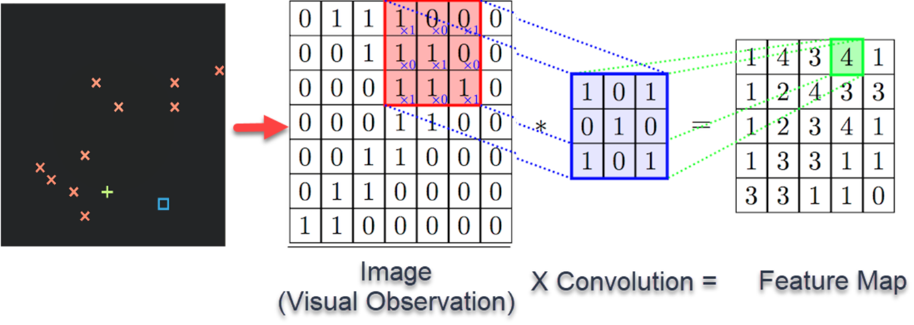
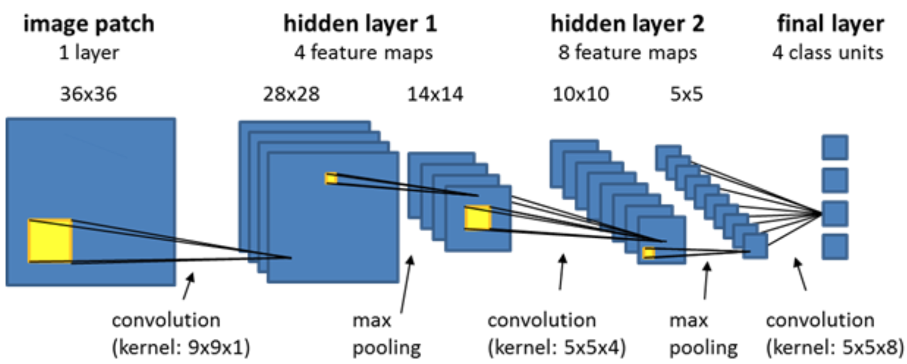
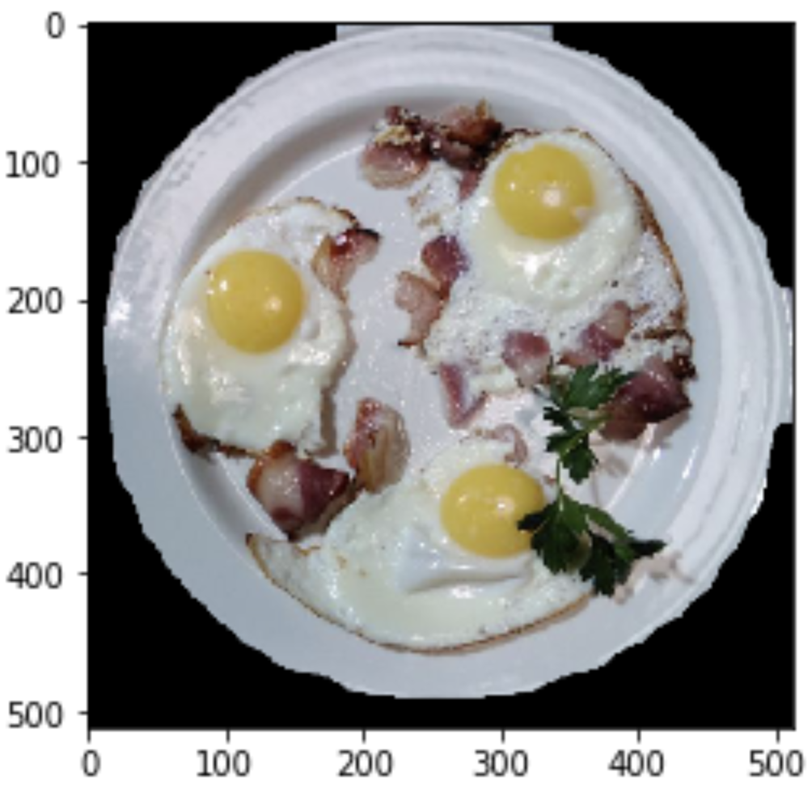
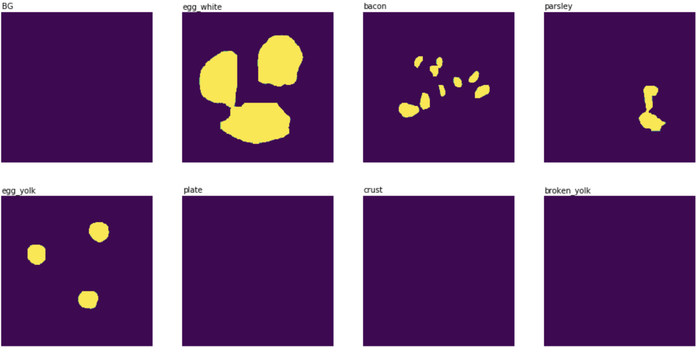

# Fried Eggs

## Fried Eggs Quality Assessment

_Summary:_ This project is an introduction to Deep Learning and computer vision (CNN, instance segmentation, object
detection, data labeling)

## Contents

1. [Chapter I](#chapter-i) \
   1.1. [Preamble](#preamble)
2. [Chapter II](#chapter-ii) \
   2.1. [Introduction](#introduction)
3. [Chapter III](#chapter-iii) \
   3.1. [Goals](#goals)
4. [Chapter IV](#chapter-iv) \
   4.1. [General instructions](#general-instructions)
5. [Chapter V](#chapter-v) \
   5.1. [Mandatory part](#mandatory-part)
6. [Chapter VI](#chapter-vi) \
   6.1. [Bonus part](#bonus-part)
7. [Chapter VI](#chapter-vi) \
   7.1. [Submission and peer-correction](#submission-and-peer-correction)

## Chapter I

### Preamble

Teaching machines to see – what can be more incredible? But before teaching somebody to do something we need to
understand it at first. No understanding – no teaching. It is not an extraordinary fact that the first breakthrough in
computer vision happened after researchers had found out in 1959 how animals (to be specific, cats) perceive visual
information.

During an experiment one of the neurons fired when the researchers were slipping a new slide into the projector. The
neuron was activated by “the movement of the line created by the shadow of the sharp edge of the glass slide”. Later on
they realized that there are simple and complex neurons and the processing of visual information starts from simple
edges and shapes.

In 1982 another researcher found out that we at first see simple edges, then we see simple shapes, then we see how these
shapes are organized in more complex shapes and structures. It means that processing of visual information is
hierarchical. It became the core concept of deep learning.

A little later convolutional layers started being used in computer vision. The main idea of them is that they are
basically rectangular receptive fields that have inside a weight vector (filter). They slide on a picture and create a
new representation of it through this convolutional operation

In 1989 Yann LeCun applied a backprop style learning algorithm that you are already familiar with to convolutional
architecture of neural nets. Since that time it has become a part of the machine learning field. Before that,
researchers tried to create those filters by themselves. But still in terms of quality CNNs (convolutional neural nets)
could not achieve something better than the other approaches and humans themselves.

Only in 2012 a new architecture (AlexNet) was applied to the famous ImageNet com- petition and showed the best result.
Since that time CNNs have become the mainstream in computer vision and deep learning. Approximately during that time a
committee of CNNs showed a better-than-human accuracy in traffic signs recognition.

Nowadays, computer vision is actively used in healthcare, agriculture, entertainment and automotive fields.

## Chapter II

### Introduction

There are several popular tasks in computer vision: image classification, detection and semantic segmentation. What is
the difference?

In image classification tasks we try to get an answer on the question “Does this object exist on the image?”. We do not
care where exactly. In detection tasks we care about it and the answer that we would like to get is a bounding box
around that object. In semantic segmentation tasks we still care about the position and we want to get information
about each pixel of the image – which object does it belong to? Classification is a simpler task and segmentation is
harder. But one way or another in all of them CNNs are widely used.

The central element of CNNs is the kernel.

It “looks” at the image having its own point of view (weights inside) by sliding over the image and making simple
calculations: element-wise product of matrices and sum of the results. You can see the example on the picture above. By
doing this it creates a so-called feature map. That can go to the next convolutional layer or through other processing –
for example, pooling. The role of pooling is to decrease the size of the image. It helps the net to work with more
high-level features and also increases the speed of training. There are different kinds of pooling. For example, max
pooling just takes the maximum element in the frame of the receptive field. Average poling takes the average of those
elements, etc.

The last layers of a CNN are fully-connected layers from a classical neural net architecture that you are already
familiar with. The output from the last convolutional layer is being flattened and sent to a sequence of FCN layers the
output of which is a layer with the number of neurons equal to the number of classes of your classification task.

That is how CNNs work in simple words. Of course, there are more sophisticated architecture and techniques, but you will
get to know them in your own journey of solving the project.

## Chapter III

### Goals

The goal of this project is to give you a first approach to Deep Learning and Computer Vision. You will try to help a
restaurant to maintain good quality of their fried eggs. In order to do this you will also have to work with data
labeling tools and approaches.

## Chapter IV

### General instructions

* This project will only be evaluated by humans. You are free to organize and name your files as you desire.
* Here and further we use Python 3 as the only correct version of Python.
* You can use any framework (TensorFlow, PyTorch, etc.) that you may find useful
* The norm is not applied to this project. Nevertheless, you are asked to be clear and structured in the conception of
  your source code.
* Store the datasets in the subfolder **data**.

## Chapter V

### Mandatory part

#### a. Task

In this project, you will try to analyze photos of fried eggs made in a restaurant to make a judgement whether these
fried eggs are good enough to be served or not. There can be different problems in the cooking process: too few yolks,
too many of them, some of them might be broken, it can be overcooked.

Here are the tasks that you need to do:

1. data labeling with instance segmentation,
2. data preprocessing,
3. fried eggs classification.

#### b. Dataset

You will work with the [dataset](./datasets/P07.%20Fried%20eggs.zip) of fried eggs. It contains 199 unlabeled images of
fried eggs (train) and 65 images from the hidden test sample for which we know classes.

The classes are the following:

0 – good fried eggs (three yolks, parsley in the center, well-cooked, looks like a whole and not several separate
pieces),

1 – overcooked or overturned fried eggs,

2 – fried eggs with two yolks,

3 – fried eggs with a broken yolk,

4 – fried eggs with four yolks,

5 – fried eggs with a wrong position of ingredients or they are missing, wrong placement or composition, undercooked.

#### c. Implementation

You can work in [Google Colab](https://colab.research.google.com/) or Jupyter Notebooks on your computer.

**Data Labeling**

1. You need to label the images from the train sample using 6 classes described above.

2. In order to solve the project with a good quality you will have to solve the instance segmentation task. To make it
   happen you need to annotate your images with in- stances of different objects: to show where on the image you have a
   piece of bacon, yolk or a piece of parsley. Inference annotations as masks to polygons (XMLs)

3. To automate this process use the active learning approach by training a neural net that will learn from you which
   objects are on the image.

**Data Preprocessing**

1. Resize images to 1024x768.

2. You need to learn to crop images: only a plate with fried eggs should go to a CNN.

3. Extract masks of the ingredients. Use them as an input to CNN.

**Classification**

1. Use raw images, masks, the number of different ingredients as input for a CNN.

2. Try different approaches and algorithms. You will need to achieve logloss on the test dataset at most – 9.56.

#### d. Submission

Your repository should contain one or several notebooks with your solutions and visualizations. It should contain a
CSV file with the list of filenames and corresponding classes. You can download the template
from [here](./datasets/fried_eggs.csv).

## Chapter VI

### Bonus part

* Work with data augmentation.

* Achieve a better logloss – 2.66.

## Chapter VII

### Submission and peer-correction

Submit your work on your Git repository as usual. Only the work on your repository will be graded.

Here are the points that your peer-corrector will have to check:

* if images are labeled using classes and instance segmentation,
* if active learning approach was used to automate data labeling,
* if images were resized, cropped,
* if masks were extracted from segmentation,
* if the required logloss was achieved in the classification.
